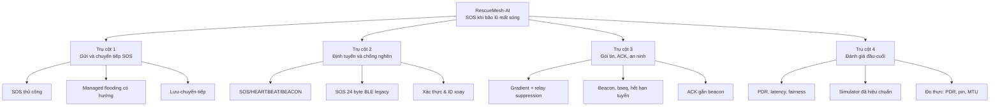

# Cấu trúc đề tài (bản chốt) — RescueMesh-AI

> **Cập nhật thiết kế 2026-09-28:** đặc tả gói 17–21 byte/ATT MTU trong tài liệu
> này đã được thay bởi [Thiết kế hệ thống v1.0](thiet-ke-he-thong-chi-tiet.md):
> BLE legacy advertising, payload ứng dụng tối đa 24 byte, SOS 24 byte, ID 32 bit,
> HMAC 64 bit. Khi viết báo cáo, dùng đặc tả v1.0 làm nguồn chuẩn.

**Tài liệu liên quan:** [Kế hoạch nghiên cứu](ke-hoach-nghien-cuu-rescuemesh-ai.md) · [Xác minh nguồn & tài liệu tham khảo](xac-minh-nguon-va-tai-lieu-tham-khao.md)
**Ngày lập:** 2026-09-28 · **Trạng thái:** cấu trúc chốt, nội dung chờ thực nghiệm

Cấu trúc này dùng cho cả **báo cáo NCKH** (60–80 trang) và **bài báo hội nghị** (8–12 trang). Phần §4 ghi rõ nhánh nào cắt khi rút thành bài báo.

---

## 1. Tên đề tài

Ba phương án, xếp theo mức độ "bảo vệ được" khi phản biện:

| # | Tên tiếng Việt | Tên tiếng Anh | Nhận xét |
|---|---|---|---|
| **A (khuyến nghị)** | RescueMesh-AI: Mạng liên lạc cứu hộ BLE ngoại tuyến cho vùng bão lũ mất sóng — thiết kế, mô phỏng và đánh giá đầu-cuối | RescueMesh-AI: An Offline BLE Emergency Network for Flood and Storm Communication Outages | Đặt bài toán mất sóng và chuyển SOS làm trọng tâm; AI là lớp hỗ trợ |
| B | RescueMesh-AI: hệ thống SOS tự động qua mạng BLE mesh ngoại tuyến | RescueMesh-AI: Automatic SOS over an Offline BLE Mesh | Ngắn, dễ nhớ, nhưng dễ bị hỏi "mới ở đâu" |
| C | Ngân sách bit và độ tin cậy của gói SOS tự động trong mạng BLE mesh cứu hộ | Bit Budget and Reliability of Automatic SOS Packets in a Rescue BLE Mesh | Hẹp, an toàn cho bài báo ngắn; bỏ mất phần học máy |

**Phạm vi một câu:** thiết kế và đánh giá một hệ SOS chạy hoàn toàn ngoại tuyến trên điện thoại Android cho vùng bão lũ mất sóng, trong đó người dân chủ động tạo SOS, các điện thoại chuyển tiếp có kiểm soát về trạm, và AI chỉ hỗ trợ tạo SOS khi người dùng không thể thao tác.

---

## 2. Tóm tắt định vị (bản nháp 200 từ, viết lại sau khi có kết quả)

> Sau bão lũ, hạ tầng viễn thông có thể mất hoặc quá tải trong lúc người dân cần gửi vị trí và nhu cầu cứu hộ. Báo cáo này trình bày một đường liên lạc BLE ngoại tuyến: người dân tạo SOS 24 byte, điện thoại xung quanh chuyển tiếp theo hướng về trạm, và node di động có thể lưu rồi mang tin ra khỏi vùng cô lập. Thiết kế kết hợp managed flooding có kiểm soát, gradient theo trạm, cơ chế chống bản tin trùng và store-carry-forward. Chúng tôi đánh giá PDR, độ trễ, số lần phát, công bằng hàng đợi, pin và khả năng chịu nhiều SOS đồng thời trên mô phỏng được hiệu chuẩn bằng đo điện thoại. AI phát hiện ngã/bất động là tính năng hỗ trợ phụ cho trường hợp người dùng không thể bấm SOS; nó không phải đường chính của hệ thống.

---

## 3. Sơ đồ cấu trúc chủ đề

---

## 4. Cấu trúc chương mục chi tiết

### Chương 1 — Mở đầu và tổng quan (10–12 trang)

| Mục | Nội dung | Bảng/hình |
|---|---|---|
| 1.1 Bối cảnh | Mất hạ tầng sau thảm họa; khoảng thời gian vàng; giới hạn của mạng di động | Hình 1.1 dòng thời gian thảm họa |
| 1.2 Vấn đề | Nạn nhân bất tỉnh không tự gọi cứu; thiết bị không có mạng; pin hạn chế | — |
| 1.3 Các hệ thống liên quan (đã xác minh) | Bảng so sánh 11 dự án: bitchat / bitchat-android, Meshtastic, MeshCore, Briar, Serval, qaul.net, Sideband/Reticulum, Bridgefy, disaster.radio, ATAK-CIV, ResQMesh (fork của bitchat-android) — theo tiêu chí BLE / lưu-và-chuyển-tiếp / SOS tự động do cảm biến / giấy phép / mức trưởng thành. Kết luận định vị: **không dự án nào có SOS tự động do cảm biến**. Nêu ngắn hai trường hợp đáng chú ý: ResqLink chỉ mô phỏng mesh trong trình duyệt, Crisis Mesh Messenger có mesh là khung rỗng | **Bảng 1.1** (bảng định vị, quan trọng nhất chương) |
| 1.4 Khoảng trống | G1–G4 ở kế hoạch §3 | — |
| 1.5 Câu hỏi nghiên cứu | RQ1–RQ4 | Bảng 1.2 |
| 1.6 Đóng góp | C1–C6, ghi rõ loại tuyên bố | Bảng 1.3 |
| 1.7 Cấu trúc báo cáo | Một đoạn | — |

*Nhánh bài báo:* 1.1–1.4 nén thành 1,5 trang; Bảng 1.1 giữ nguyên vì là chỗ định vị.

### Chương 2 — Nền tảng và ràng buộc thiết kế (12–15 trang)

| Mục | Nội dung | Bảng/hình |
|---|---|---|
| 2.1 BLE và giới hạn của nó | Quảng bá/kết nối, ngân sách ứng dụng bảo thủ 24 byte trong BLE legacy advertising, tầm xa, giới hạn chạy nền của Android | Bảng 2.1 ràng buộc nền tảng |
| 2.2 Mạng tùy cơ và DTN | Store-and-forward, khử trùng lặp, TTL, jitter; Trickle và RPL ở mức khái niệm, không sao chép | Hình 2.1 vòng đời một gói SOS |
| 2.3 AI hỗ trợ tại thiết bị | Cảm biến chuyển động, phát hiện ngã/bất động và đếm ngược; nhấn mạnh đây là nhánh phụ sau đường SOS | Bảng 2.2 kho dữ liệu và giới hạn |
| 2.4 An ninh và quyền riêng tư | Mô hình mối đe dọa; so sánh MAC cắt ngắn vs Ed25519; ID xoay theo ngày; điều kiện cấp khóa | Bảng 2.3 ngân sách an ninh |
| 2.5 Yêu cầu hệ thống | Yêu cầu chức năng/phi chức năng, truy vết về RQ | Bảng 2.4 |

*Nhánh bài báo:* giữ 2.1 và 2.2 rút gọn; 2.3 gộp vào related work.

### Chương 3 — Thiết kế hệ thống và phương pháp (18–22 trang)

| Mục | Nội dung | Bảng/hình |
|---|---|---|
| 3.1 Kiến trúc tổng thể | Sơ đồ 3 tầng + mesh + trạm | **Hình 3.1** kiến trúc |
| 3.2 AI hỗ trợ | T1/T2/T3 chỉ tạo SOS thay cho người dùng khi không thể thao tác; không được chặn SOS thủ công | Hình 3.2 máy trạng thái phụ |
| 3.3 Đặc tả gói tin | Header 3 byte; SOS/HEARTBEAT/BEACON; SOS 24 byte; khử trùng lặp bằng tag; ACK gắn trong beacon | **Bảng 3.2** đặc tả gói; **Bảng 3.3** ngân sách v1.0 |
| 3.4 Sửa lỗi thiết kế | SOS vượt MTU; khóa ACK 16 bit; khóa online vs offline — trình bày như quyết định thiết kế có phân tích, kèm Monte Carlo đụng độ | **Bảng 3.4** xác suất đụng độ ID; Hình 3.3 đồ thị đụng độ theo n |
| 3.5 Định tuyến | Gradient theo hop, quy tắc chuyển tiếp, lưu tạm, jitter 10–220 ms, hàng đợi ưu tiên, hết hạn tuyến theo bseq | Hình 3.4 ví dụ gradient; Bảng 3.5 tham số |
| 3.6 Trạm cứu hộ | Kiểm MAC, khử trùng lặp, dựng lại bản đồ, phát beacon ACK | Hình 3.5 giao diện bản đồ (minh họa) |
| 3.7 Simulator | Mô hình nút/kênh/di động, hiệu chuẩn PDR, kiểm soát âm | Bảng 3.6 tham số mô phỏng |

*Nhánh bài báo:* 3.3 + 3.4 là phần giữ nguyên văn; 3.7 nén còn nửa trang + phụ lục.

### Chương 4 — Kết quả và đánh giá (20–25 trang)

| Mục | Nội dung | Bảng/hình |
|---|---|---|
| 4.1 Giao thức và giao thức mạng | Kiểm thử round-trip, MTU thật, chi phí mỗi gói | Bảng 4.1 độ dài & thời gian |
| 4.2 AI hỗ trợ | Chỉ báo cáo như nhánh phụ: recall/FAR, thời gian tạo SOS và tỷ lệ người dùng hủy; không gộp với PDR mạng | **Bảng 4.2** kết quả phụ |
| 4.3 Ablation 3 tầng | B0–B3, có/không tầng 3 | **Bảng 4.3** ablation (đóng góp C2) |
| 4.4 Định tuyến | PDR, P95 trễ, chi phí phát, trùng lặp theo mật độ/độ động; sau khi trạm sập | **Bảng 4.4** so sánh định tuyến; Hình 4.3 PDR theo mật độ; Hình 4.4 tái hội tụ |
| 4.5 ACK và phát lại | Phân bố số lần phát lại; tỉ lệ sai khớp ACK theo khóa 16/24/32 bit | **Bảng 4.5** (đóng góp C5, có thể là kết quả phủ định) |
| 4.6 Đầu-cuối | P50/P95 và phân rã ngân sách độ trễ; tiêu thụ pin theo tầng | **Bảng 4.6** ngân sách độ trễ (đóng góp C6); Hình 4.5 phân rã độ trễ |
| 4.7 Kiểm tra độ bền | Nhiều bộ tham số mất gói; nhiều buổi đo | Bảng 4.7 phụ |

### Chương 5 — Thảo luận, giới hạn, đạo đức (8–10 trang)

| Mục | Nội dung |
|---|---|
| 5.1 Diễn giải | Kết quả nói gì, không nói gì; phân biệt `DS`/`SIM`/`ĐO` |
| 5.2 Mối đe dọa tới tính hợp lệ | Người thử staged; mô hình BLE đơn giản hóa; mật độ mô phỏng; ngắn hạn |
| 5.3 So sánh với công trình khác | Dùng **Bảng 1.1**, không lặp lại |
| 5.4 Đạo đức và an toàn | Không thử trên người thật; không phải thiết bị y tế; quyền riêng tư |
| 5.5 Bài học thiết kế | Ngân sách bit, khóa ACK, đánh đổi độ trễ/độ tin cậy |

### Chương 6 — Kết luận và hướng mở rộng (3–4 trang)

Trả lời từng RQ một câu; liệt kê hướng mở rộng **đã bị loại có lý do** (âm thanh sạt lở, nén ngữ nghĩa, định tuyến bằng ML, LoRa).

### Phụ lục

A. Đặc tả gói byte-by-byte và vector test · B. Siêu tham số mô hình · C. Cấu hình mô phỏng + seed · D. Quy trình đo thực · E. Sổ bằng chứng và sổ tìm kiếm · F. Lệnh tái lập.

---

## 5. Danh mục bảng và hình dự kiến

**Bảng chính (phải có):** 1.1 định vị hệ thống · 3.2 đặc tả gói · 3.3 ngân sách bit · 4.2 phát hiện ngã · 4.3 ablation · 4.4 so sánh định tuyến · 4.6 ngân sách độ trễ.
**Bảng phụ:** 2.2 kho dữ liệu · 2.3 ngân sách an ninh · 3.4 đụng độ ID · 3.5 tham số định tuyến · 4.5 ACK/phát lại · 4.7 độ bền.
**Hình chính:** 3.1 kiến trúc · 3.2 máy trạng thái 3 tầng · 4.1 recall–FAR · 4.3 PDR theo mật độ · 4.5 phân rã độ trễ.

Nếu phải cắt còn 5 bảng + 3 hình cho bài báo: 1.1, 3.3, 4.2, 4.4, 4.6 và hình 3.1, 4.1, 4.4.

---

## 6. Bản đồ câu hỏi → chương → bằng chứng → cổng

| RQ | Chương trả lời | Bằng chứng | Nhãn | Cổng |
|---|---|---|---|---|
| RQ1 | 4.2, 4.3 | Bảng 4.2, 4.3; Hình 4.1, 4.2 | `DS` | G2 |
| RQ2 | 4.4 | Bảng 4.4; Hình 4.3, 4.4 | `SIM` (+`ĐO` hiệu chuẩn) | G3 |
| RQ3 | 3.3, 3.4, 4.1 | Bảng 3.2, 3.3, 4.1 | `SUY`/`ĐO`/`GIẢ ĐỊNH` | G1 |
| RQ4 | 4.5, 4.6 | Bảng 4.5, 4.6; Hình 4.5 | `SIM`/`ĐO` | G3, G4 |

Quy tắc: **không** câu nào trong phần kết luận được phép không có dòng trong bảng này.

---

## 7. Kế hoạch viết theo tuần

| Tuần | Viết gì | Phụ thuộc |
|---|---|---|
| 10 | Chương 1 + 2 (khóa bảng định vị) | Tìm kiếm đã ghi lại |
| 11 | Chương 3 (đặc tả gói + kiến trúc) | G1 đạt |
| 12 | Chương 4 phần phát hiện | G2 đạt |
| 13 | Chương 4 phần mesh + đầu-cuối | G3 đạt |
| 14 | Chương 5, 6, phụ lục, tái lập | G4, G5 |

---

## 8. Checklist trước khi nộp và những gì không đưa vào

**Kiểm tra bắt buộc:** mọi nguồn đã mở và đối chiếu; mọi bảng có nhãn `ĐO`/`DS`/`SIM`/`SUY`/`GIẢ ĐỊNH`; mọi số có đơn vị và số lần lặp; CI có mặt ở mọi so sánh; tên thiết bị/phiên bản Android ghi rõ; mục giới hạn nói thẳng ca staged; một lệnh tái lập chạy được từ máy sạch.

**Không đưa vào báo cáo:**
- Các câu "AI giúp định tuyến thông minh hơn" khi chưa có so sánh.
- Số liệu từ đoạn tài liệu AI tổng hợp chưa xác minh (kể cả tên dự án và giải thưởng).
- Bất kỳ khẳng định nào suy ra từ mô phỏng chưa hiệu chuẩn mà không ghi `SIM`.
- Lời hứa về iOS, về cứu hộ thật, hoặc về "độ chính xác 99 %" khi chưa đo theo chuẩn LOSO.
- Mã hoặc dữ liệu của người khác khi chưa kiểm tra giấy phép (một số kho trong Bảng 1.1 không có giấy phép).
