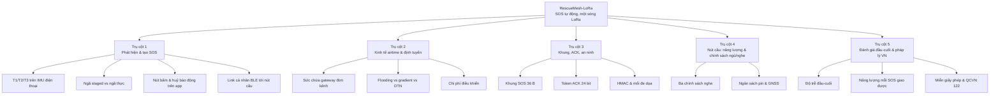

# Cấu trúc đề tài (bản chốt) — RescueMesh-LoRa

**Ngày lập:** 2026-10-01 · **Trạng thái:** cấu trúc chốt, nội dung chờ thực nghiệm
**Kế hoạch:** [Kế hoạch nghiên cứu](ke-hoach-nghien-cuu-rescuemesh-lora.md) · **Thiết kế:** [Thiết kế v2.0](thiet-ke-he-thong-lora-v2.md) · **Nguồn:** [Nhật ký quyết định](xac-minh-nguon-lora-va-quyet-dinh-song.md)

Cấu trúc này dùng cho cả **báo cáo NCKH** (60–80 trang) và **bài báo hội nghị**
(8–12 trang). §4 ghi rõ nhánh nào cắt khi rút thành bài báo.

---

## 1. Tên đề tài

| # | Tên tiếng Việt | Tên tiếng Anh | Nhận xét |
|---|---|---|---|
| **A (khuyến nghị)** | RescueMesh-LoRa: Mạng mesh LoRa một sóng cho SOS tự động ở vùng bão lũ mất sóng — thiết kế, mô phỏng và đánh giá đầu-cuối | RescueMesh-LoRa: A Single-Radio LoRa Mesh with Sensor-Triggered SOS for Flood and Storm Communication Outages | Đặt cả bài toán mất sóng, ràng buộc một sóng, và SOS tự động; bảo vệ được trước câu hỏi "mới ở đâu" |
| B | Kinh tế airtime của mesh LoRa cứu hộ: khi nào gradient thắng flooding, và điều khiển chiếm bao nhiêu kênh | Airtime Economy of a Rescue LoRa Mesh: When Gradient Beats Flooding and How Much Control Plane Steals | Hẹp, an toàn cho bài báo ngắn; bỏ mất phần phát hiện ngã |
| C | Ứng dụng điện thoại tự phát SOS qua nút cầu LoRa: phát hiện ngã và ngân sách độ trễ đầu-cuối | A Phone App with a LoRa Bridge Node: Fall Detection and End-to-End Latency Budget | Tập trung phần cảm biến và link cá nhân; yếu phần mạng |

**Phạm vi một câu:** thiết kế và đánh giá một mạng mesh LoRa **một loại sóng duy
nhất** ở băng 920–923 MHz, trong đó **điện thoại của người dân** tự phát hiện ngã/bất
động, gửi SOS qua **nút cầu LoRa đeo kèm**, chuyển tiếp có kiểm soát về gateway, và
trạm hiển thị vị trí — trong điều kiện mất hoàn toàn hạ tầng di động.

---

## 2. Tóm tắt định vị (bản nháp, viết lại sau khi có kết quả)

> Khi bão lũ làm mất điện và sóng di động, người dân trong vùng ngập vẫn cần báo
> vị trí và nhu cầu cứu hộ, kể cả khi họ không còn tỉnh để thao tác. Báo cáo này
> trình bày RescueMesh-LoRa: một mạng mesh dùng **duy nhất sóng LoRa** ở băng
> 920–923 MHz — băng tần được miễn giấy phép sử dụng tần số tại Việt Nam. Đầu cuối
> là **điện thoại thông dụng** — thứ ai cũng đã có, nên không phải cấp phát thiết bị
> cho từng người — kèm một **nút cầu LoRa nhỏ đeo theo người** (chỉ MCU + chip LoRa +
> pin, không cần GNSS/IMU/màn hình vì điện thoại đã có). Điện thoại nói với nút cầu
> qua **link cá nhân** BLE cự ly 1–2 m; từ đó trở đi mạng **thuần LoRa**. Vì chỉ có
> một kênh dùng chung, thước đo trung tâm của thiết kế **không phải số byte mà là
> airtime**: chúng tôi lượng hoá sức chứa của một gateway, tỉ lệ kênh bị điều khiển
> (beacon/ACK) chiếm, và đánh đổi giữa ngủ tiết kiệm pin với khả năng nhận lệnh
> xuống. Hệ thống được mô phỏng bằng mô hình airtime liên tục có collision, rồi
> **hiệu chuẩn bằng đo thực** ở nhiều môi trường, trước khi báo cáo bất kỳ kết luận
> định tuyến nào.

---

## 3. Sơ đồ cấu trúc chủ đề

---

## 4. Cấu trúc chương mục chi tiết

### Chương 1 — Mở đầu và tổng quan (10–12 trang)

| Mục | Nội dung | Bảng/hình |
|---|---|---|
| 1.1 Bối cảnh | Mất hạ tầng sau bão lũ ở Việt Nam; khoảng thời gian vàng; giới hạn của mạng di động | Hình 1.1 dòng thời gian |
| 1.2 Vấn đề | Nạn nhân bất tỉnh không tự gọi cứu; không có sóng; pin hạn chế; nút thắt là kênh dùng chung | — |
| 1.3 Hệ thống liên quan (đã xác minh) | Bảng so sánh các dự án theo tiêu chí sóng / mesh đa hop / lưu-và-chuyển-tiếp / **SOS tự động do cảm biến** / giấy phép / mức trưởng thành. Kết luận định vị: **không hệ nào có SOS tự động do cảm biến trên mesh LoRa** | **Bảng 1.1** (bảng định vị, quan trọng nhất chương) |
| 1.4 Khoảng trống | G1–G5 của kế hoạch §3 | — |
| 1.5 Câu hỏi nghiên cứu | RQ1–RQ6 | Bảng 1.2 |
| 1.6 Đóng góp | Ghi rõ loại tuyên bố cho từng đóng góp | Bảng 1.3 |
| 1.7 Cấu trúc báo cáo | Một đoạn | — |

*Nhánh bài báo:* nén 1.1–1.4 còn 1,5 trang; **giữ nguyên Bảng 1.1** vì là chỗ định vị.

#### Bảng 1.1 — nội dung đã xác minh (dùng làm cơ sở định vị)

Nguồn: sổ xác minh của dự án, các mục đã mở và đối chiếu API GitHub/Crossref ngày
2026-09-29–30; số sao là tại ngày đó. **Không** dùng số sao làm thước đo chất lượng.

| Dự án | Sóng | Mesh đa hop | Lưu-và-chuyển-tiếp | SOS tự động do cảm biến | Giấy phép | Mức trưởng thành |
|---|---|---|---|---|---|---|
| bitchat / bitchat-android | BLE | Có (tối đa 7 chặng) | Có (courier, spray-and-wait) | **Không** | Unlicense / GPL-3.0 | 36k★ / 7,7k★ |
| Meshtastic firmware | LoRa | Có (managed flood) | Có | **Không** | GPL-3.0 | 8,3k★, 2020– |
| MeshCore | LoRa | Có (định tuyến lai) | Có | **Không** | MIT | 3,7k★, 2025– |
| Briar | BLE | Có | Có (qua Tor) | **Không** | GPL-3.0 | Cao, có bình duyệt |
| Serval batphone | BLE/ad-hoc | Có | Có | **Không** | GPL-3.0 | **Ngừng 2018** |
| qaul.net | BLE | Có | Có | **Không** | AGPL-3.0 | 727★, 2014– |
| Sideband / Reticulum | BLE/LoRa (tuỳ cấu hình) | Có | Có | **Không** | Reticulum | 1,8k★, đang hoạt động |
| Bridgefy SDK | BLE | Có | Một phần | **Không** | Độc quyền | Thương mại |
| disaster.radio | LoRa | Có | Có | **Không** | Không có | Tạm dừng |
| ATAK-CIV | Qua plugin | Qua plugin | Qua plugin | **Không** | — | 494★, dừng 2024 |

**Hai kết luận định vị dùng được:**

1. Trong toàn bộ các dự án so sánh được, **không dự án nào phát SOS tự động do cảm
   biến kích hoạt**. Đây là chỗ RescueMesh-LoRa đứng vững — với điều kiện bộ phát
   hiện phải được đánh giá theo chuẩn (LOSO, ngân sách FAR), không chỉ là ngưỡng.
2. Trên mesh LoRa, **chưa dự án nào công bố đánh giá kinh tế airtime** (sức chứa
   gateway, tỉ lệ điều khiển chiếm kênh, nghịch lý ngủ/nghe) cho bài toán SOS tự
   động. Đây là khoảng trống riêng của RQ2–RQ4 và là phần khác biệt so với Meshtastic.

**Cảnh báo khi viết chương 1:** không trích các chỉ số chất lượng do chính dự án tự
công bố (ví dụ F1, "tăng khả năng sống sót") khi chưa kiểm toán; sổ xác minh đã ghi
rõ một trường hợp chỉ số không được phép trích.

### Chương 2 — Nền tảng và ràng buộc thiết kế (12–15 trang)

| Mục | Nội dung | Bảng/hình |
|---|---|---|
| 2.1 Nguyên lý LoRa | SF/BW/CR, airtime, độ nhạy, quan hệ tầm xa ↔ thời gian chiếm kênh | **Bảng 2.1** thông số LoRa; Hình 2.1 airtime theo SF |
| 2.2 Mạng một kênh | Không có kênh điều khiển riêng; collision, hidden terminal, capture | Hình 2.2 so sánh kênh riêng vs kênh chung |
| 2.3 DTN và lưu-chuyển-tiếp | Store-carry-forward, khử trùng lặp, TTL, courier | Hình 2.3 vòng đời một SOS |
| 2.4 Năng lượng nút | Dòng tiêu thụ các khối; vì sao nghe và GNSS chi phối, không phải phát | **Bảng 2.2** ngân sách năng lượng |
| 2.5 Pháp lý Việt Nam | Miễn giấy phép tần số cho LPWAN 920–923 MHz; QCVN 122:2020; dùng chung phổ tần; nghĩa vụ khi gây nhiễu | **Bảng 2.3** ràng buộc pháp lý |
| 2.6 An ninh | Mô hình mối đe dọa; HMAC cắt ngắn; điều không chống được | Bảng 2.4 ngân sách an ninh |

*Nhánh bài báo:* giữ 2.1 và 2.2 rút gọn; 2.5 nén còn nửa trang.

### Chương 3 — Thiết kế hệ thống và phương pháp (18–22 trang)

| Mục | Nội dung | Bảng/hình |
|---|---|---|
| 3.1 Kiến trúc | Năm vai trò: **điện thoại + nút cầu** ở đầu cuối, nút trung gian, courier, gateway, trạm; mạng vẫn thuần một kênh LoRa | **Hình 3.1** kiến trúc |
| 3.2 Đầu cuối và nút cầu | App điện thoại (máy trạng thái phát hiện, nút bấm không bị chặn, đếm ngược 30 s) và nút cầu LoRa; giao thức link cá nhân | Hình 3.2 máy trạng thái; Bảng 3.2 giao thức link cá nhân |
| 3.3 Phát hiện ngã T1→T2→T3 | Kế thừa thiết kế v1.0 gần nguyên trạng (IMU điện thoại); biến bắt buộc **ngã staged vs ngã thực** | Bảng 3.1 thang baseline |
| 3.4 Đặc tả khung v2.0 | Byte-by-byte cho SOS/HEARTBEAT/BEACON/ACK; vì sao 36 B | **Bảng 3.2** đặc tả khung; Bảng 3.3 chi phí airtime từng khung |
| 3.5 Kinh tế airtime | Sức chứa gateway theo SF và chu kỳ beacon; tỉ lệ điều khiển | **Bảng 3.4** sức chứa; Hình 3.3 sức chứa theo SF |
| 3.6 Định tuyến một kênh | Gradient + `bseq` hết hạn tuyến; managed flooding; ức chế; jitter; courier | Hình 3.4 ví dụ gradient; Bảng 3.5 tham số |
| 3.7 ACK và phát lại | Token 24 bit, ngân sách ACK mỗi beacon | Bảng 3.6 va chạm token theo n |
| 3.8 Trạm và gateway | Cầu nối, kiểm HMAC, khử trùng lặp, bản đồ | Hình 3.5 giao diện bản đồ (minh hoạ) |
| 3.9 Simulator | Mô hình airtime liên tục, collision, duty cycle, ngủ theo lịch; kiểm soát âm | Bảng 3.7 tham số mô phỏng |

*Nhánh bài báo:* 3.4 + 3.5 giữ nguyên văn; 3.9 nén còn nửa trang + phụ lục.

### Chương 4 — Kết quả và đánh giá (20–25 trang)

| Mục | Nội dung | Bảng/hình |
|---|---|---|
| 4.1 Phát hiện ngã trên IMU điện thoại | Recall ở ngân sách FAR đặt trước, LOSO; **kết quả trên ngã thực** (đây là nơi mọi công trình tụt) | **Bảng 4.1**; Hình 4.1 recall–FAR |
| 4.2 Sức chứa một gateway | Số nút theo SF/chu kỳ beacon; điểm sụp; kiểm chứng bằng đo thực | **Bảng 4.2** (RQ3) |
| 4.3 So sánh định tuyến | Flooding vs managed flooding vs gradient vs DTN: PDR, P95 trễ, **airtime mỗi SOS giao được** | **Bảng 4.3**; Hình 4.2 PDR theo tải |
| 4.4 Điều khiển chiếm kênh | Tỉ lệ airtime beacon/ACK; có/không beacon thích ứng | **Bảng 4.4** (H3) |
| 4.5 Chính sách ngủ/nghe | Tỉ lệ nhận ACK, độ trễ nhận lệnh xuống, tuổi thọ pin cho ba chính sách | **Bảng 4.5** (H5); Hình 4.3 đánh đổi pin ↔ nhận ACK |
| 4.6 ACK và phát lại | Tỉ lệ khớp sai token 16/24 bit; số lần phát lại tăng thêm | **Bảng 4.6** (H4, ứng viên kết quả phủ định) |
| 4.7 Đầu-cuối | P50/P95 và phân rã ngân sách độ trễ **tách theo từng chặng, gồm chặng link cá nhân**; năng lượng mỗi SOS giao được | **Bảng 4.7** (RQ4); Hình 4.4 phân rã độ trễ |
| 4.8 Link cá nhân | Độ trễ thiết lập/phát lại, mất kết nối khi tắt màn hình, hành vi khi đông thiết bị BLE | **Bảng 4.8** (RQ6) |
| 4.9 Độ bền | Nhiều bộ tham số suy hao; nhiều buổi đo; thời tiết khác nhau; **có/không dùng dây USB-C thay BLE** | Bảng 4.9 phụ |

### Chương 5 — Thảo luận, giới hạn, đạo đức (8–10 trang)

| Mục | Nội dung |
|---|---|
| 5.1 Diễn giải | Kết quả nói gì, không nói gì; phân biệt `DS`/`SIM`/`SUY`/`ĐO` |
| 5.2 Mối đe dọa tới tính hợp lệ | Mô hình suy hao đơn giản; mật độ mô phỏng; khoảng cách staged ↔ ngã thực; độ tin cậy của link cá nhân; thiếu đo trong điều kiện ngập |
| 5.3 So sánh với công trình khác | Dùng **Bảng 1.1**, không lặp lại |
| 5.4 Đạo đức và an toàn | Không thử trên người thật; không phải thiết bị y tế; chưa hợp quy QCVN 122 |
| 5.5 Triển khai | Nút phải được cấp phát trước thảm họa; đây là thay đổi bài toán, không phải chi tiết nhỏ |
| 5.6 Bài học thiết kế | Airtime thay cho byte; beacon thích ứng; nghịch lý ngủ/nghe |

### Chương 6 — Kết luận và hướng mở rộng (3–4 trang)

Trả lời từng RQ một câu; liệt kê hướng mở rộng **đã bị loại có lý do** (hai sóng,
vệ tinh làm sóng chính, WiFi HaLow, nén ngữ nghĩa, định tuyến bằng học máy) kèm
bằng chứng loại ở [nhật ký quyết định](xac-minh-nguon-lora-va-quyet-dinh-song.md).

### Phụ lục

A. Đặc tả khung byte-by-byte và vector test · B. Siêu tham số mô hình · C. Cấu hình
mô phỏng + seed · D. Quy trình đo thực (thiết bị, địa điểm, ngày) · E. Sổ bằng chứng
và sổ tìm kiếm · F. Lệnh tái lập.

---

## 5. Danh mục bảng và hình dự kiến

**Bảng chính (phải có):** 1.1 định vị · 2.3 ràng buộc pháp lý · 3.2 giao thức link cá
nhân · 3.4 sức chứa gateway · 4.1 phát hiện ngã (staged vs thực) · 4.3 so sánh định
tuyến · 4.5 chính sách ngủ/nghe · 4.7 ngân sách độ trễ (tách theo chặng).
**Bảng phụ:** 2.1 thông số LoRa · 2.2 năng lượng · 2.4 an ninh · 3.3 airtime từng
khung · 3.5 tham số định tuyến · 3.6 va chạm token · 4.2 đặc tả khung · 4.4 điều
khiển chiếm kênh · 4.6 ACK/phát lại · 4.8 link cá nhân · 4.9 độ bền.
**Hình chính:** 3.1 kiến trúc (điện thoại + nút cầu) · 3.2 máy trạng thái · 4.1
recall–FAR · 4.3 đánh đổi pin ↔ nhận ACK · 4.4 phân rã độ trễ theo chặng.

Nếu phải cắt còn 5 bảng + 3 hình cho bài báo: 1.1, 3.4, 4.1, 4.3, 4.5 và hình 3.1,
4.1, 4.4.

---

## 6. Bản đồ câu hỏi → chương → bằng chứng → cổng

| RQ | Chương trả lời | Bằng chứng | Nhãn | Cổng |
|---|---|---|---|---|
| RQ1 | 4.1 | Bảng 4.1; Hình 4.1 | `DS` (staged + ngã thực) | G7 |
| RQ2 | 4.3 | Bảng 4.3; Hình 4.2 | `SIM` (+`ĐO` hiệu chuẩn) | G8, G9 |
| RQ3 | 3.5, 4.2 | Bảng 3.4, 4.2 | `SUY` → `ĐO` | G9 |
| RQ4 | 4.7 | Bảng 4.7; Hình 4.4 | `ĐO` + `SIM` | G9, G10 |
| RQ5 | 3.4, 4.6 | Bảng 3.2, 3.3, 3.6, 4.6 | `SUY` + `SIM` + phân tích | G6 |
| RQ6 | 4.8 | Bảng 4.8 | `ĐO` | G10 |

Quy tắc: **không** câu nào trong phần kết luận được phép không có dòng trong bảng này.

---

## 7. Kế hoạch viết theo tuần

| Tuần | Viết gì | Phụ thuộc |
|---|---|---|
| 1–2 | Chương 1 + 2 (khoá Bảng 1.1 và 2.3) | Sổ tìm kiếm đã ghi; đọc bản gốc QCVN 122 |
| 3–5 | Chương 3 (khung + kinh tế airtime + định tuyến) | G6 đạt |
| 6–8 | Chương 4 phần phát hiện và sức chứa | G7, G8 |
| 9–11 | Chương 4 phần định tuyến, ngủ/nghe, đầu-cuối | G9 |
| 12–14 | Chương 5, 6, phụ lục, tái lập | G10, G11 |

---

## 8. Checklist trước khi nộp và những gì không đưa vào

**Kiểm tra bắt buộc:** mọi nguồn đã mở và đối chiếu (URL/DOI + ngày truy cập); mọi
bảng có nhãn `ĐO`/`DS`/`SIM`/`SUY`/`GIẢ ĐỊNH`; mọi số có đơn vị và số lần lặp; CI
có mặt ở mọi so sánh; ghi rõ SF/BW/CR, thiết bị, anten, thời tiết và địa điểm; mục
giới hạn nói thẳng ca staged và ngã thực, độ tin cậy của link cá nhân; một lệnh tái lập chạy được
từ máy sạch.

**Không đưa vào báo cáo:**

- Các câu "AI giúp định tuyến thông minh hơn" khi chưa có so sánh.
- Số liệu từ tài liệu AI tổng hợp chưa xác minh (kể cả tên dự án và giải thưởng).
- Bất kỳ khẳng định nào suy ra từ mô phỏng **chưa hiệu chuẩn** mà không ghi `SIM`.
- Tầm xa LoRa lấy từ quảng cáo nhà bán hoặc từ mô hình không gian tự do.
- Giá linh kiện không có ngày và nguồn.
- Kết quả `SIM` của hướng BLE cũ trích như kết quả của hướng LoRa.
- Khẳng định quy mô > 1.000 nút khi vẫn dùng token ACK 24 bit.
- Lời hứa về iOS, về cứu hộ thật, hoặc "độ chính xác 99 %" khi chưa đo theo LOSO.
- Mã hoặc dữ liệu của người khác khi chưa kiểm tra giấy phép.
