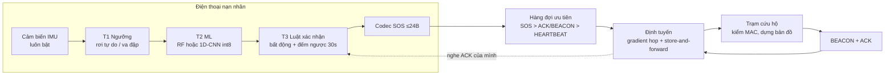
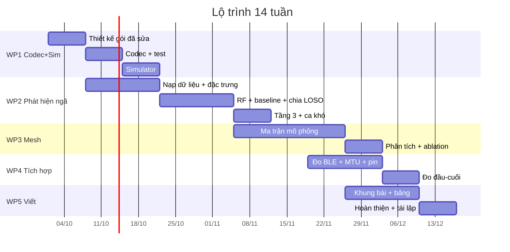

# Kế hoạch nghiên cứu — RescueMesh-AI

> **Cập nhật thiết kế 2026-09-28:** lớp liên kết và codec trong các mục §6, §8,
> §9 của bản kế hoạch này đã được thay thế bởi
> [Thiết kế hệ thống v1.0](thiet-ke-he-thong-chi-tiet.md). Đường chuẩn hiện dùng
> BLE legacy advertising với ngân sách ứng dụng 24 byte, không dùng ATT/GATT MTU;
> SOS v1 dài 24 byte với ID 32 bit và HMAC 64 bit. Kế hoạch thí nghiệm và các RQ
> vẫn có hiệu lực, nhưng mọi con số gói 20/21 byte bên dưới chỉ còn giá trị lịch sử.

**Tên làm việc:** RescueMesh-AI — Mạng liên lạc cứu hộ BLE ngoại tuyến cho vùng bão lũ mất sóng, có AI hỗ trợ tạo SOS khi người dùng không thể thao tác
**Tài liệu liên quan:** [Cấu trúc đề tài](cau-truc-de-tai-rescuemesh-ai.md) · [Xác minh nguồn & tài liệu tham khảo](xac-minh-nguon-va-tai-lieu-tham-khao.md)
**Ngày lập:** 2026-09-28 · **Cập nhật:** 2026-09-29 · **Trạng thái:** v1.0 đã có codec, APK nút mạng và trạm thu laptop; mesh nhiều hop, collision, ACK và tải nhiều SOS còn phải đo

---

## 0. Kết luận ngắn gọn

1. **Định vị phải đổi.** Đóng góp trung tâm là **vòng lặp cứu hộ trong bão lũ mất sóng**: người dân tạo SOS → điện thoại chuyển tiếp → trạm xác nhận; AI cảm biến chỉ là phương án phụ khi người dùng không thể thao tác.
2. **Hướng đã chốt:** ưu tiên managed flooding có kiểm soát, gradient theo trạm và store-carry-forward; không dùng AI định tuyến. Phần phát hiện ngã/bất động là work package phụ, chạy sau khi đường SOS cốt lõi được kiểm chứng.
3. **Ba lỗi thiết kế trong bản nháp gói tin phải sửa trước khi code** (đã kiểm tra số học, §8): SOS 21 byte vượt payload 20 byte của ATT MTU mặc định; ACK định danh nạn nhân bằng `srcID_low16` (16 bit) sụp đổ khi n ≥ 1000 nút; và cơ chế khóa riêng "cấp khi còn mạng" mâu thuẫn với mục tiêu offline hoàn toàn — cả ba đều là **đóng góp thiết kế** nếu xử lý và đo tử tế.
4. **Trình tự đúng:** khóa phạm vi và sổ bằng chứng → codec/APK/trạm tối thiểu (đã có) → hiệu chuẩn đường BLE hai chiều bằng 2 điện thoại + laptop → simulator có collision/tải nhiều SOS → tích hợp đo đầu-cuối → AI phát hiện ngã → viết. Không viết kết luận hiệu năng trước khi qua G3.
5. **Điểm chết về phương pháp luận phải tránh:** chia tập theo cửa sổ ngẫu nhiên (rò rỉ dữ liệu cùng người), tuyên bố "gradient tốt hơn flooding" chỉ từ mô phỏng chưa hiệu chuẩn, và coi kết quả mô phỏng là kết quả thực địa.

---

## 1. Tuyên bố đóng góp và loại tuyên bố

Phân loại theo khung hypothesis-generation: mỗi mục ghi rõ **loại tuyên bố** để không trượt sang ngôn ngữ nhân quả.

| # | Đóng góp dự kiến | Loại tuyên bố | Bằng chứng tối thiểu để được nói |
|---|---|---|---|
| C1 (phụ) | Đường ống 3 tầng (ngưỡng → ML → luật xác nhận) có thể hỗ trợ tạo SOS khi người dùng không thể thao tác hay không | Dự đoán (predictive) | Bảng recall/FAR trên dữ liệu IMU công khai, chia tập theo người; không dùng để thay thế đánh giá mạng |
| C2 (phụ) | Chi phí thật của tầng ML so với chỉ dùng ngưỡng + luật bất động | So sánh | Cùng tập test, cùng ngân sách FAR; chỉ báo cáo như tính năng hỗ trợ |
| C3 | Managed flooding có kiểm soát + gradient theo trạm + store-carry-forward so với flooding/Trickle: tỉ lệ giao, độ trễ, số lần phát, fairness giữa nhiều SOS và thời gian tái hội tụ sau khi trạm sập | So sánh (mô phỏng + đo nhỏ) | Simulator đã hiệu chuẩn theo PDR/collision BLE đo thực; ≥ 30 seed; tải 1/5/20/50/100 SOS; bảng theo mật độ/độ động |
| C4 | Ngân sách bit của gói SOS ≤ 20 byte: đánh đổi giữa độ phân giải vị trí, kích thước ID, MAC cắt ngắn và khả năng xác thực | Mô tả/đo lường | Bảng ngân sách bit + Monte Carlo đụng độ ID + thí nghiệm MTU trên máy thật |
| C5 | Giao thức ACK gắn trong beacon có chấm dứt được phát lại ở quy mô thực tế hay không (kết quả có thể phủ định) | Đo lường | Phân bố số lần phát lại theo n; phân tích không gian khóa ACK 16 bit |
| C6 | Ngân sách độ trễ đầu-cuối (người dân tạo SOS hoặc AI kích hoạt → SOS hiện trên bản đồ trạm), tách theo từng chặng | Đo lường | Nhật ký có mốc thời gian; P50/P95; tách độ trễ xác nhận, mã hóa, hàng đợi, truyền, xử lý trạm |

**Câu định vị một dòng (dùng cho phần mở đầu):** *khi bão lũ làm mất Internet và sóng di động, RescueMesh-AI nghiên cứu cách đưa SOS của người dân tới trạm cứu hộ qua các điện thoại ở gần, với relay có kiểm soát, lưu-chuyển-tiếp và đo được PDR, độ trễ, công bằng hàng đợi và pin; AI chỉ là lớp hỗ trợ khi người dùng không thể bấm SOS.*

---

## 2. Bằng chứng nền và mức độ tin cậy

Chi tiết xác minh từng nguồn (kể cả các nguồn trong đoạn hội thoại do AI tổng hợp) nằm ở [Xác minh nguồn](xac-minh-nguon-va-tai-lieu-tham-khao.md). Ba nguyên tắc áp dụng cho toàn bộ dự án:

1. **Không trích nguồn chưa mở.** Đoạn tài liệu dán vào hội thoại có dấu hiệu do AI tổng hợp, và lần xác minh đã xác nhận: 5/6 mục tồn tại thật **nhưng 4/6 bị mô tả sai**, một mục là công trình không đáng trích, và bài báo trong mục đó còn chứa **trích dẫn bịa** (một tài liệu tham chiếu trỏ tới bài đo sáng sao chổi). Mọi mục phải được mở và đối chiếu trước khi vào bài.
2. **Kho dữ liệu công khai là nguồn chính** cho phần phát hiện ngã; không tự thu dữ liệu ngã trên người.
3. **Số liệu mô phỏng và số liệu đo được ghi tách nhãn** trong mọi bảng; không trộn hai loại trong cùng một cột.
4. **Hai con số nền nay đã có nguồn sơ cấp** (không còn là `SUY`): ATT MTU mặc định 23 ở BlueZ `src/shared/att-types.h:28` (`BT_ATT_DEFAULT_LE_MTU 23`) và MTU tối đa 517 ở AOSP `GattService.java:145` (`GATT_MTU_MAX = 517`); giới hạn quét nền của Android có nguồn ở AOSP `AppScanStats.java` (trọng số duty-cycle theo chế độ quét + `SCAN_MODE_SCREEN_OFF`). Chi tiết: [Xác minh nguồn](xac-minh-nguon-va-tai-lieu-tham-khao.md) §4.6. Còn thiếu: cụm "managed flooding" trong Mesh Profile spec và phần LE privacy/RPA.

Phân loại mức bằng chứng dùng trong bài:

| Nhãn | Nghĩa |
|---|---|
| `ĐO` | Số đo trên thiết bị thật hoặc trên thiết bị phần cứng, có log |
| `DS` | Kết quả trên kho dữ liệu công khai, có script tái lập |
| `SIM` | Kết quả mô phỏng, mô hình đã hiệu chuẩn với `ĐO` |
| `SUY` | Suy ra từ tài liệu chuẩn (spec, RFC), không tự đo |
| `GIẢ ĐỊNH` | Giả định kỹ thuật, phải kiểm tra trước khi dùng để kết luận |

---

## 3. Khoảng trống nghiên cứu

Từ khảo sát ở tài liệu kèm theo, bốn khoảng trống mà dự án nhắm vào:

- **G1 — Thiếu vòng lặp khép kín có đo, và thiếu hẳn SOS tự động.** Kết quả xác minh 11 dự án so sánh được (bitchat, bitchat-android, Meshtastic, MeshCore, Briar, Serval, qaul.net, Sideband/Reticulum, Bridgefy, disaster.radio, ATAK-CIV — xem [Xác minh nguồn](xac-minh-nguon-va-tai-lieu-tham-khao.md) §2.2) cho thấy **không dự án nào phát SOS tự động do cảm biến kích hoạt**; tất cả đều cần người dùng còn tỉnh để thao tác. Các dự án có AI dừng ở "phân loại ưu tiên trong app", và ít nhất hai dự án được nêu trong hội thoại thực chất chỉ **mô phỏng** mesh. Chưa nơi nào công bố ngân sách độ trễ đầu-cuối của một SOS do cảm biến kích hoạt.
- **G2 — Thiếu đánh giá phát hiện ngã theo chuẩn, và khoảng cách staged ↔ thực đời rất lớn.** Bằng chứng đã kiểm: **không tồn tại meta-analysis kiểu PRISMA** gộp sensitivity/specificity/F1 cho phát hiện ngã bằng IMU; các bản demo dùng ngưỡng đơn giản và báo "chính xác cao" mà không nói chia tập theo người, không nói báo động giả/giờ. Quan trọng hơn: khi chuyển từ ngã staged sang **ngã thực**, sensitivity tụt còn **57,0 %** (Bagalà 2012, 29 ca thực) và báo động giả lên tới **3–85 ca/ngày**; ngay cả mô hình sâu tốt nhất cũng chỉ đạt **~8 báo động giả/ngày trên 7 ngày thực địa** (Villa & Casilari 2025). Đây là chỗ tầng xác nhận của đề tài có đất đóng góp. Chi tiết: [Xác minh nguồn](xac-minh-nguon-va-tai-lieu-tham-khao.md) §4.1.
- **G3 — Định tuyến được khẳng định, không được đo.** Trong phạm vi tìm kiếm đã ghi lại **không tìm thấy nguồn nào so sánh flooding với gradient/tree trong mạng không dây công suất thấp có kèm cả tỉ lệ giao và năng lượng**, cũng **không có nghiên cứu đo BLE mesh trên điện thoại thật** công bố PDR/độ trễ/năng lượng theo số nút và độ di động (hai khoảng trống #3 và #4 ở tài liệu xác minh §4.7). Đây là khoảng trống thật, không phải kết quả phủ định.
- **G4 — Ngân sách bit và an ninh dưới ràng buộc BLE legacy advertising.** Thiết kế v1.0 dùng ngân sách ứng dụng bảo thủ 24 byte, giữ ID 32 bit và HMAC 64 bit; không dùng ATT/GATT MTU cho đường SOS.

Giới hạn của tuyên bố "khoảng trống": đây là "không tìm thấy trong phạm vi tìm kiếm đã ghi lại", **không** phải "chưa từng có ai làm". Sổ tìm kiếm (ngày, CSDL, truy vấn) là một phần của tài liệu kèm theo.

---

## 4. Câu hỏi nghiên cứu và giả thuyết

### 4.1 Câu hỏi nghiên cứu

| Mã | Câu hỏi | Loại |
|---|---|---|
| **RQ1** | Với dữ liệu IMU công khai, đường ống 3 tầng đạt recall bao nhiêu ở một ngân sách báo động giả đặt trước, khi chia tập theo người và khi chuyển sang kho dữ liệu khác? | Dự đoán |
| **RQ2** | Trong điều kiện thảm họa (mất gói, di động, mật độ thay đổi, trạm sập), định tuyến gradient cải thiện tỉ lệ giao và chi phí phát so với flooding có kiểm soát ở mức nào, và đến mật độ nào thì khác biệt biến mất? | So sánh |
| **RQ3** | Một gói SOS có xác thực trong ≤ 24 byte mang được những trường nào, và mỗi lựa chọn ngân sách bit gây mất mát gì về độ chính xác vị trí, khả năng xác thực và quyền riêng tư? | Mô tả + đo |
| **RQ4** | Độ trễ đầu-cuối từ lúc va đập đến lúc SOS hiện trên bản đồ trạm là bao nhiêu và phân bố ra sao; ACK gắn trong beacon có chấm dứt được phát lại ở quy mô thực tế không? | Đo |

### 4.2 Giả thuyết, đối thủ cạnh tranh và dự đoán phân biệt

Mỗi giả thuyết phải có **đối thủ** (rival) và một **kết quả không tương thích** — nếu không thì thí nghiệm không phân biệt được gì.

**H1 — Tầng 3 (luật xác nhận) là thứ mang lại độ tin cậy.** *Phát biểu:* thêm tầng xác nhận bất động + đếm ngược làm giảm báo động giả nhiều hơn mức mất recall mà nó gây ra.
- Đối thủ R1a: lợi ích đến từ việc lọc ngưỡng đơn thuần, không cần ML. → **Phép thử phân biệt:** thang baseline (ngưỡng) → (ngưỡng + luật) → (ML + luật). Nếu (ngưỡng + luật) đã đạt gần bằng (ML + luật) thì ML không đóng góp.
- Đối thủ R1b: lợi ích chỉ xuất hiện trên dữ liệu **staged** (người thử nằm yên theo kịch bản); trên ngã thực tầng xác nhận không giúp được gì. → **Phép thử bắt buộc:** chạy thêm trên **ngã thực** (FARSEEING: 143 ca; "Free From Falls": 690 cửa sổ 4 giây) và so với các mốc đã công bố — SE thực đời 57–82 % và báo động giả 3–85 ca/ngày ở Bagalà 2012, 1 ca/40 giờ ở Kangas 2015, 1 ca/46 ngày ở Harari 2021, ~8 ca/ngày ở Villa 2025. Nếu tầng 3 không kéo được báo động giả xuống dưới mức ~8 ca/ngày trên dữ liệu thực thì giả thuyết bị bác.
- Kết quả không tương thích: FAR giảm nhưng recall giảm theo tỉ lệ lớn hơn (mất > 10 điểm phần trăm) ở cùng ngân sách.

**H2 — Gradient tiết kiệm phát ở mật độ trung bình và cao, nhưng không ở mật độ thấp.** *Phát biểu:* ở cùng tỉ lệ giao, gradient dùng ít lần phát trên mỗi gói tới trạm hơn flooding, và khoảng cách thu hẹp khi mật độ giảm hoặc độ động tăng.
- Đối thủ R2a: khác biệt chỉ do beacon overhead bị tính sai (beacon được tính là miễn phí). → **Phép thử:** đếm cả beacon trong tổng phát; quét tần suất beacon.
- Đối thủ R2b: lợi ích là do mô hình mất gói thuận lợi nhân tạo. → **Phép thử:** hiệu chuẩn PDR theo đo BLE thực; chạy lại trên nhiều bộ tham số mất gói.
- Kết quả không tương thích: sau khi tính beacon, gradient không còn ít phát hơn, hoặc tỉ lệ giao thấp hơn flooding ở mật độ trung bình.

**H3 — TTL và gradient cũ gây ra "bóng ma đường" sau khi trạm sập.** *Phát biểu:* sau khi trạm ngừng phát beacon, các nút vẫn chuyển tiếp theo hop cũ trong một khoảng; cần hết hạn tuyến (ví dụ 3 chu kỳ beacon) và bseq để hội tụ lại.
- Đối thủ R3a: mất mát sau khi trạm sập chủ yếu do mất gói, không do định tuyến cũ. → **Phép thử:** so sánh có/không hết hạn tuyến ở cùng mô hình mất gói.
- Kết quả không tương thích: thời gian tái hội tụ không khác nhau có ý nghĩa khi bật/tắt hết hạn tuyến.

**H4 — Khóa ACK 16 bit không định danh được nạn nhân ở quy mô thực tế.** *Phát biểu:* `ack[srcID_low16:16]` va chạm với xác suất ~7% ở 100 nút và ~100% ở 1.000 nút, nên ACK không thể dùng để chấm dứt phát lại một cách đáng tin ở mạng lớn.
- Đối thủ R4a: va chạm khóa không quan trọng vì ACK còn kèm `seq` và `time`. → **Phép thử:** mô phỏng trạm với ngân sách ACK thật (số ACK mỗi beacon có hạn), đo tỉ lệ ACK khớp sai và số lần phát lại tăng thêm.
- Kết quả không tương thích: tỉ lệ khớp sai ≈ 0 và số lần phát lại không tăng khi dùng khóa 16 bit so với khóa 32 bit.

---

## 5. Phạm vi và phi mục tiêu

**Trong phạm vi:** Android là nền tảng tham chiếu (BLE 5); 1 trạm + tối đa ~200 nút trong mô phỏng và ~20–50 nút trong đo thực; dữ liệu IMU công khai; gói SOS/HEARTBEAT/BEACON như bản nháp đã sửa; mô phỏng rời rạc có hiệu chuẩn; phân tích độ trễ và pin.

**Phi mục tiêu (đóng băng, ghi vào bài):**

| Không làm | Lý do |
|---|---|
| Nhận diện tiếng sạt lở / âm thanh thảm họa | Thiếu dữ liệu, mic bật liên tục tốn pin, Android hạn chế chạy nền |
| Nén dữ liệu bằng mô hình học máy | Gói SOS 17–21 byte; nút thắt là nghẽn kênh, số chặng và pin, không phải kích thước gói |
| Định tuyến bằng học máy | Chưa có bằng chứng tái lập rằng nó hơn heuristic chỉnh tốt; để hướng mở rộng |
| Truyền ảnh/giọng nói qua mesh | Vượt băng thông BLE ở quy mô dự án |
| Phần cứng riêng (LoRa, gateway) | Đổi câu hỏi nghiên cứu sang phần cứng; chỉ dùng điện thoại |
| Bảo đảm chạy nền trên iOS | Không kiểm soát được; ghi là giới hạn nền tảng |
| Thử nghiệm trên người thật bị ngã, thử cứu hộ thật | Đạo đức và an toàn; dùng dữ liệu công khai + đo rơi thiết bị vào đệm |

---

## 6. Kiến trúc tham chiếu

Bốn quyết định kiến trúc kèm lý do và cách kiểm chứng:

| Quyết định | Lý do | Cách kiểm chứng |
|---|---|---|
| Giao thức tùy biến trên BLE (không dùng IP) | BLE mesh không có định tuyến IP sẵn; gói phải tự mô tả | Gói nhỏ nhất có thể; test round-trip và MTU |
| Managed flooding có cache/TTL + relay suppression | Phù hợp BLE broadcast, giảm storm mà vẫn giữ đa đường | So sánh số relay, PDR và fairness ở WP3 |
| Gradient theo hop kiểu RPL tối giản | Hướng SOS về một trạm, tránh phát ra mọi hướng | So sánh với flooding có kiểm soát ở WP3 |
| Store-carry-forward kiểu DTN | Giữ tin khi không có đường liên tục hoặc chỉ có node di động | Đo delivery theo thời gian tiếp xúc ở WP3 |
| ACK gắn trong beacon (không có đường xuống riêng) | Tiết kiệm băng thông và pin | Đo số lần phát lại và tỉ lệ ACK khớp (H4) |
| Khóa theo từng máy + MAC cắt ngắn | Chữ ký Ed25519 (64 B) lớn gấp 3 lần cả gói | Bảng ngân sách bit + mô hình mối đe dọa (§9.3) |

---

## 7. Chỉ số và định nghĩa (khóa trước khi chạy)

Định nghĩa trước để không đổi thước đo sau khi thấy kết quả:

- **Recall (Sensitivity):** tỉ lệ ca ngã được phát hiện trong cửa sổ ≤ 60 giây kể từ cú va đập.
- **FAR:** số báo động giả mỗi giờ hoạt động. **Hai ngân sách đặt trước, không đổi sau khi thấy kết quả:** (i) *sơ cấp* trên **ngã thực / dữ liệu đời thường**: **≤ 1 báo động giả/24 giờ** — chặt hơn mức ~8 ca/ngày mà mô hình sâu đạt trên 7 ngày thực địa (Villa & Casilari 2025), và tiệm cận mốc đã công bố 1 ca/40 giờ (Kangas 2015) và 1 ca/46 ngày (Harari 2021); (ii) *thứ cấp* trên chuỗi ADL staged: ≤ 0,2 FP/giờ. Báo cáo cả hai, tách nhãn dữ liệu.
- **Độ trễ phát hiện:** từ đỉnh va đập đến lúc gói SOS được phát lần đầu (gồm đếm ngược 30 giây — đây là đánh đổi có chủ đích, báo cáo riêng phần luật và phần máy).
- **PDR (tỉ lệ giao gói):** số SOS tới được trạm / số SOS phát đi, trong cửa sổ 1 giờ.
- **Độ trễ đầu-cuối:** P50/P95 từ va đập đến khi trạm ghi nhận.
- **Chi phí phát:** tổng số lần phát (SOS + chuyển tiếp + beacon + ACK) trên mỗi SOS tới trạm — đại diện năng lượng.
- **Tỉ lệ trùng lặp:** gói bị bỏ do khử trùng lặp / tổng gói nghe được.
- **Thời gian tái hội tụ:** từ lúc trạm sập đến khi PDR trở lại mức trước sập (hoặc hết hạn 10 phút).
- **Sai khớp ACK:** ACK mà nút nhận nhưng không thuộc về mình / tổng ACK nhận.

---

## 8. Sửa lỗi thiết kế gói tin đã phát hiện (kiểm tra số học + codec)

Các mục dưới đây **đã được kiểm chứng bằng code**, không còn là nhận xét trên giấy: codec tham chiếu `rescuemesh/packets.py` và 21 test (`rescuemesh/test_packets.py`, tất cả qua) mã hoá thiết kế đã sửa và tái tạo đúng các con số này.

**8.1 SOS 21 byte vượt payload mặc định 20 byte.** ATT MTU mặc định 23 byte → 20 byte payload. SOS = 3 + 4 + 2 + 3 + 3 + 1 + 1 + 4 = **21 byte**, dư đúng 1 byte (khớp nhận định trong hội thoại).

**8.2 Nhưng "cắt 1 byte ở srcID" lại tạo ra lỗi nặng hơn — đây là phát hiện quan trọng nhất.** Cách sửa tự nhiên là rút `srcID` 4 → 3 byte (24 bit) để SOS vừa đúng 20 byte. Codec cho thấy cách đó **phá vỡ khả năng mở rộng**; xác suất có ít nhất một cặp trùng ID (nghịch lý ngày sinh):

| n nút | `srcID` 32 bit (SOS 21 B) | `srcID` 24 bit (SOS 20 B) | khoá ACK 16 bit (bản nháp gốc) |
|---:|---:|---:|---:|
| 100 | 0,0001 % | 0,03 % | **7,27 %** |
| 1.000 | 0,012 % | **2,93 %** | **99,95 %** |
| 5.000 | 0,29 % | **52,52 %** | ~100 % |
| 10.000 | **1,16 %** | **94,92 %** | ~100 % |
| 50.000 | 25,3 % | ~100 % | ~100 % |

**Kết luận thiết kế (thay cho khuyến nghị ban đầu):** giữ `srcID` 32 bit (SOS 21 byte) và **thương lượng MTU** là lựa chọn mặc định — vì 1 byte tiết kiệm được đổi lấy việc tụt quy mô từ 10.000 nút xuống khoảng 1.000 nút. Biến thể 24 bit chỉ dùng làm **cấu hình dự phòng có ghi giới hạn** cho thiết bị không thương lượng được MTU, kèm trần quy mô ghi rõ trong tài liệu. Bảng ngân sách bit phải có cả hai cột và cả hai trần quy mô — đây chính là nội dung đóng góp C4.

**8.3 Mã hoá toạ độ 24 bit phải là offset nhị phân trên toàn dải, không phải bù hai theo thang 1e-6 độ.** Nếu mã hoá có dấu với thang 1e-6 (cách hiểu trực tiếp từ "24 bit ≈ 1–2 m"), 24 bit chỉ chứa được **±8,39 độ** — hỏng hoàn toàn. Codec dùng offset nhị phân và cho: **vĩ độ ~1,19 m**, **kinh độ ~2,39 m** (ở xích đạo). Tức "1–2 m" trong bản nháp chỉ đúng cho vĩ độ; kinh độ là ~2,4 m. Test `test_latlon_resolution_is_metre_scale` ghi lại cả hai con số để không tái phạm.

**8.4 Phép tính kích thước gói trong bản nháp có chỗ sai.** HEARTBEAT được ghi "16–44 byte"; công thức gốc 3 + 4 + 2 + 1 + 4 + 5k cho **14 byte** khi k = 0 (không phải 16) và 44 byte khi k = 6. Với `srcID` 32 bit giữ nguyên, HEARTBEAT = **14 + 5k** (14…44) và **vượt payload 20 byte ngay từ k = 2** → phải thương lượng MTU hoặc phân mảnh. BEACON gốc 14 + 3n là đúng; sau khi sửa ACK thành 4 byte (xem 8.5) là **14 + 4n**, tức 46 byte ở n = 8.

**8.5 ACK 16 bit không định danh được nạn nhân.** `ack: [srcID_low16:16][seq:8]` có xác suất đụng khoá 7,27 % ở 100 nút và 99,95 % ở 1.000 nút (bảng 8.2) — hỏng đúng ở quy mô mà hệ thống nhắm tới. Sửa: ACK = `[srcID 32 bit][seq 8 bit]` (5 byte), hoặc `[srcID 24 bit][seq 8]` (4 byte) khi dùng biến thể 24 bit; nút so khớp bằng khoá ghép `srcID<<8 | seq` (hàm `ack_key` trong codec). Đánh đổi: beacon to hơn (14 + 4n hoặc 14 + 5n), phải giới hạn số ACK mỗi beacon và đo lại số lần phát lại (H4).

**8.6 Khóa riêng cần đăng ký online mâu thuẫn với mục tiêu offline.** Chọn một trong ba và viết thành mô hình mối đe dọa: (a) khóa mạng dùng chung, HMAC theo máy, cấp phát offline (đơn giản, chống spam, **không** chống nghe lén/giả mạo thiết bị bị chiếm); (b) cấp khóa riêng khi còn mạng, ghi rõ là điều kiện tiên quyết trước thảm họa; (c) ghép khóa tại chỗ — tốn thời gian và pin. **Đề xuất:** (a) mặc định, (b) là cấu hình tùy chọn có đo chi phí. MAC 4 byte cho xác suất giả mạo ~2^-32 — đủ chống spam, **không** đủ để quy trách nhiệm; phải ghi trong phần giới hạn.

**8.7 Trôi ID theo ngày phá vỡ liên kết lịch sử.** `srcID = HMAC(khóa máy, ngày)` cắt ngắn là ý tưởng tốt cho quyền riêng tư, nhưng trạm không ghép được HEARTBEAT của cùng một nút qua nhiều ngày, và nút trung gian chỉ khử trùng lặp được trong ngày. Ghi rõ: (i) cửa sổ khử trùng lặp 5 phút nằm trong ngày nên an toàn; (ii) phân tích dài hạn nối bằng khóa máy ở phía trạm, không bằng `srcID`; (iii) đo chi phí HMAC mỗi lần xoay ID trên thiết bị.

**8.8 Trạng thái cổng G1.** Codec và test đã có, chạy xanh: `python3 rescuemesh/test_packets.py` → 21/21 test qua. Việc còn lại của G1: chốt biến thể byte mặc định (đề xuất: 32-bit ID + thương lượng MTU), thêm vector test cố định cho hồ sơ nộp bài, và kiểm thử MTU trên máy thật ở WP4.

---

## 9. Phương pháp theo gói công việc

### WP0 — Bản trình diễn tối thiểu (đã hoàn thành một phần)
- APK Android: phát SOS, quét BLE, chống trùng và chuyển tiếp gói mới.
- Trạm laptop: nhận 24 byte, kiểm tra HMAC, chống trùng và ghi JSONL.
- Việc còn thiếu của WP0: kiểm tra chiều điện thoại → trạm trên ít nhất hai máy, đo khoảng cách và xác nhận ACK/beacon.

### WP1 — Codec và simulator (tuần 1–3)
- Viết codec Python (đóng/gói, kiểm thử thuộc tính, fuzz) theo thiết kế đã sửa ở §8; sinh vector test cố định.
- Nâng simulator: nút, hàng xóm theo khoảng cách, PDR/collision theo trace BLE, hàng đợi ưu tiên, fairness, cache, jitter, gradient theo hop, relay suppression, store-and-forward, trạm sập theo lịch.
- **Sản phẩm:** `codec.py`, `sim/`, bộ test, một hình động minh họa lan truyền; tất cả kèm seed.

### WP2 — Phát hiện ngã 3 tầng (tuần 2–6)
- Tầng 1: ngưỡng rơi tự do (|a| < 0,4 g) / va đập (|a| > 2,5–3 g); đo tỉ lệ đánh thức sai.
- Tầng 2: ~20 đặc trưng thủ công trên cửa sổ 2–3 giây (min/max, độ lệch chuẩn, jerk, SMA, đổi hướng máy) → Random Forest/GBDT (~30 cây, sâu ≤ 6) là mặc định; chỉ chuyển sang 1D-CNN int8 nếu RF không đạt recall mục tiêu.
- Tầng 3: bất động 10–20 giây + đếm ngược 30 giây có rung/chuông.
- **Bắt buộc:** chia tập theo người (leave-subject-out) và kiểm tra chuyển miền giữa các kho dữ liệu; lớp ca khó tách riêng.

### WP3 — Thí nghiệm mesh (tuần 5–9)
- Ma trận: thuật toán (flooding, Trickle, managed flooding + suppression, gradient + managed flooding, gradient + store-carry-forward) × mật độ (10/50/100/200 nút) × tải (1/5/20/50/100 SOS đồng thời) × độ động (tĩnh, đi bộ, node courier) × mất gói/collision × trạng thái trạm (ổn định, sập, khôi phục, hai trạm).
- Với tải nhiều SOS, báo thêm: tỷ lệ nguồn được giao, P50/P95/P99 latency, số gói bị drop theo nguyên nhân, số bản sao trên mỗi SOS, Jain fairness giữa nguồn, queue occupancy và thời gian dọn hàng đợi.
- ≥ 30 seed mỗi ô; so sánh ghép cặp theo seed; báo cáo trung bình ± SD và CI.
- **Cổng:** nếu chưa hiệu chuẩn được PDR thì **không** được tuyên bố so sánh định tuyến.

### WP4 — Tích hợp và đo thực (tuần 9–12)
- Đo PDR BLE theo khoảng cách/độ cao/túi xách (hiệu chuẩn cho WP3) bằng 2–5 điện thoại Android.
- Test MTU và phân mảnh trên máy thật; đo thời gian thương lượng MTU và tỉ lệ thiết bị không thương lượng.
- Đo năng lượng: dòng tiêu thụ khi accelerometer luôn bật, khi chạy tầng 2, khi phát quảng cáo/kết nối.
- Đo đầu-cuối: một máy phát SOS (kích hoạt bằng tay hoặc rơi thiết bị vào đệm), 3–10 nút trung gian, trạm ghi log có mốc thời gian.

### WP5 — Viết và tái lập (tuần 10–14)
- Một lệnh tái lập mọi bảng/hình; lưu seed, phiên bản, hash dữ liệu.
- Đối chiếu từng câu khẳng định với bảng/hình cụ thể trước khi nộp.

---

## 10. Thiết kế thực nghiệm chi tiết

### 10.1 Phần phát hiện ngã

| Hạng mục | Quyết định |
|---|---|
| Đơn vị phân tích | **Người tham gia** (không phải cửa sổ) — tránh giả lập lặp |
| Chia tập | Leave-subject-out; chuyển miền SisFall → FARSEEING (tiền lệ: Alizadeh 2021 đạt 93 % accuracy); **bắt buộc** có một lần chạy trên ngã thực |
| Thang baseline | (B0) ngưỡng → (B1) ngưỡng + luật bất động → (B2) RF/GBDT + luật → (B3) CNN-LSTM int8 + luật. **Sửa so với bản nháp:** không mặc định RF trước rồi CNN chỉ khi cần — Villa & Casilari 2025 cho thấy **mô hình sâu hơn mô hình cổ điển một cách nhất quán trên cùng dữ liệu** (CNN-LSTM @20 Hz: 98,9 % acc / 96,7 % SE / 99,6 % SP), nên B2 và B3 là **đồng hạng**, chạy cả hai và so ghép cặp |
| Thước đo chính | Recall ở ngân sách FAR đặt trước; F1; AUROC; phân bố độ trễ phát hiện |
| Ca khó | Ngồi phịch, nhảy, chạy, xe xóc, **điện thoại rơi khỏi túi** (phủ định quan trọng: rơi thiết bị ≠ người ngã) |
| Cửa sổ và tần số | Cửa sổ **4 giây đặt giữa đỉnh va đập 2 g**; tần số **20–50 Hz** (Casilari 2017: kho dữ liệu trải 5–256 Hz, "50 Hz là đủ"; Android thực tế cho 7–200 Hz) |
| Lặp | ≥ 5 seed cho mô hình; bootstrap 10.000 lần cho CI |
| Kiểm định | Ghép cặp theo người giữa các baseline; hiệu chỉnh đa so sánh |

### 10.2 Phần mesh

| Hạng mục | Quyết định |
|---|---|
| Công cụ | Simulator rời rạc tự viết (networkx cho topology) + đo thực để hiệu chuẩn |
| Hiệu chuẩn | Mô hình PDR theo khoảng cách khớp số đo WP4 (báo cáo RMSE) |
| Yếu tố | 5 thuật toán × 4 mật độ × 5 mức tải SOS × 3 độ động × 3 mức mất gói/collision × 4 trạng thái trạm |
| Lặp | ≥ 30 seed/ô; kiểm định Wilcoxon ghép cặp theo seed |
| Thước đo | PDR theo nguồn, P50/P95/P99 trễ, chi phí phát/gói tới trạm, tỉ lệ trùng lặp, fairness, queue occupancy, thời gian tái hội tụ |
| Kiểm soát âm | Kịch bản không có trạm (PDR phải ~0) và kịch bản TTL = 1 (không chuyển tiếp) — xác nhận simulator không "tự giao gói" |

### 10.3 Phần gói tin/an ninh

**Ghi chú lịch sử:** bảng 20/21 byte dưới đây là phân tích của bản nháp cũ, giữ lại để truy vết quyết định. Không dùng nó làm thông số v1.0. Bản v1.0 đã chốt SOS 24 byte trên BLE legacy advertising, ID 32 bit và HMAC 64 bit. Nếu cần so sánh biến thể cũ, phải gắn nhãn `HISTORICAL` và không trộn với kết quả v1.0.

### 10.4 Phân tích thống kê và cỡ mẫu

- Với phần phát hiện ngã, **không** đặt n trước theo công thức: số người trong kho dữ liệu là cố định. Thay vào đó báo cáo **MDE/sensitivity**: với số người hiện có, khác biệt nhỏ nhất phát hiện được ở power 0,80 là bao nhiêu; kèm CI của mọi ước lượng.
- Với mô hình học máy, đơn vị độc lập là người; dùng mô hình hỗn hợp hoặc thống kê theo người rồi tổng hợp.
- Với mô phỏng, đơn vị là seed; so sánh ghép cặp (cùng seed, cùng topology) để giảm phương sai.
- Báo cáo bắt buộc: trung bình ± SD, CI 95 %, số lần lặp, và hiệu chỉnh đa so sánh khi so nhiều baseline.

---

## 11. Lộ trình và cổng quyết định

| Cổng | Điều kiện qua cổng | Nếu không qua |
|---|---|---|
| **G0 — Khóa phạm vi** | Sổ bằng chứng có ngày; phi mục tiêu đã ghi; mô hình mối đe dọa đã chọn | Giữ phạm vi bão lũ/mất sóng, không mở rộng AI |
| **G1 — Codec** | Round-trip 100 %; khung mặc định ≤ 24 byte; test thuộc tính + fuzz qua | Sửa thiết kế, không đi tiếp |
| **G2 — Phát hiện** | Recall ≥ mục tiêu ở ngân sách FAR đặt trước, chia LOSO; có kết quả chuyển miền | Thu hẹp về "ngưỡng + luật" và nói rõ, hoặc đổi kho dữ liệu |
| **G3 — Hiệu chuẩn** | Sai số mô hình PDR so với đo thực trong ngưỡng đã đặt trước | Không tuyên bố so sánh định tuyến |
| **G4 — Tính hợp lệ của khẳng định** | Mỗi câu khẳng định ánh xạ tới một bảng/hình + run + seed | Không nộp |
| **G5 — Tái lập** | Một lệnh sinh lại mọi bảng/hình | Không nộp |

---

## 12. Rủi ro và giảm thiểu

| Rủi ro | Khả năng | Ảnh hưởng | Giảm thiểu |
|---|---|---|---|
| Trùng với dự án công khai | Cao | Trung bình | Định vị theo C1–C6 (số đo + kết quả phủ định), không theo ý tưởng |
| RF không đạt recall mục tiêu | Trung bình | Trung bình | Có đường lui 1D-CNN int8; báo cáo ngân sách FAR chứ không chỉ accuracy |
| Mô hình mô phỏng bị coi là thiên vị | Cao | Cao | Hiệu chuẩn bằng đo thực; công bố script + seed; kiểm soát âm |
| Đo BLE thực khó tái lập (thiết bị, môi trường) | Cao | Trung bình | Ghi rõ thiết bị/phiên bản/môi trường; lặp 3 buổi; báo cáo khoảng biến thiên |
| Không đo được pin chính xác | Trung bình | Trung bình | Dùng cả ước lượng từ spec và đo dòng thô; ghi rõ là ước lượng |
| Android giới hạn chạy nền/quảng cáo | Cao | Cao | Ghi là giới hạn nền tảng; thiết kế cho foreground service; không hứa iOS. **Đã có bằng chứng mã nguồn:** AOSP bóp duty-cycle khi tắt màn hình (`SCREEN_OFF_LOW_POWER_WEIGHT = 5` so với `LOW_LATENCY_WEIGHT = 100`) — dùng con số này để giải thích vì sao phải đo ở WP4 thay vì giả định |
| Khóa online phá mục tiêu offline | Chắc chắn nếu không xử lý | Trung bình | Chọn mô hình (a) làm mặc định, (b) là tùy chọn có đo chi phí |
| Khối lượng quá lớn cho 14 tuần | Cao | Cao | Cắt WP4 field test xuống tối thiểu; ưu tiên G2 rồi G3 |

---

## 13. Đạo đức, dữ liệu và an toàn

- **Không thu dữ liệu ngã trên người.** Chỉ dùng kho dữ liệu công khai đã được phê duyệt; tôn trọng điều khoản truy cập của từng kho và ghi rõ giấy phép.
- **Đo thực chỉ gồm người tình nguyện đi bộ cầm điện thoại**; ca "rơi" dùng thiết bị rơi vào đệm, không dùng người.
- **Không thử nghiệm trên nạn nhân thật, không triển khai cứu hộ thật.** Ghi rõ trong bài: đây là nguyên mẫu nghiên cứu, **không phải thiết bị y tế** và không được dùng thay quy trình cứu hộ.
- **Quyền riêng tư:** không thu thập dữ liệu cá nhân; ID xoay theo ngày; nhật ký chỉ giữ trong thiết bị lab; công bố dữ liệu tổng hợp.
- **Không hứa "cứu mạng".** Mọi kết luận phải nằm trong dữ liệu và thiết kế đã chạy.
- Nếu dự án có phần người tham gia (dù chỉ đi bộ), phải có phiếu đồng thuận và xác nhận của đơn vị trước khi chạy.

---

## 14. Tiêu chuẩn "hoàn thành" và hai lộ trình công bố

**Định nghĩa hoàn thành tối thiểu (báo cáo NCKH cấp trường/khoa):**
1. Codec có test và bảng ngân sách bit (C4); 2. Kết quả phát hiện ngã LOSO trên ≥ 2 kho dữ liệu kèm ablation (C1, C2); 3. So sánh flooding vs gradient có hiệu chuẩn (C3); 4. Ngân sách độ trễ đầu-cuối (C6); 5. Một lệnh tái lập.

**Lộ trình bài quốc tế cần thêm:** một lần đánh giá trên **ngã thực** (FARSEEING / Free From Falls) — vì đây là chỗ mọi công trình đều tụt và là nơi tầng xác nhận chứng minh được giá trị; hiệu chuẩn PDR trên nhiều môi trường; đo thực ≥ 3 nút với log đồng bộ thời gian; phân tích thống kê ghép cặp đầy đủ; phát hành artifact (code + cấu hình + seed); và ít nhất một kết quả phủ định được kiểm chứng độc lập (H4 là ứng viên tốt nhất vì có thể chứng minh bằng giải tích + mô phỏng + đo).

Cần kiểm tra lại điều kiện dự tuyển, hạn nộp và định dạng của từng hội nghị/tạp chí trước khi chọn đích — **không** giả định từ tài liệu dán trong hội thoại.

---

## 15. Ưu tiên hành động (7 ngày tới)

| # | Việc | Kết quả kiểm tra được |
|---|---|---|
| 1 | Chốt thiết kế gói đã sửa §8 (chọn biến thể byte) | Một trang spec + bảng ngân sách bit có số |
| 2 | Mở và xác minh toàn bộ nguồn trong đoạn hội thoại | Sổ bằng chứng có cột "đã mở / đã đối chiếu" |
| 3 | Tải và kiểm kê giấy phép các kho dữ liệu IMU | Danh sách kho + điều khoản truy cập |
| 3b | ~~Lấy nguồn sơ cấp cho ATT MTU 23/517 và giới hạn quét nền Android~~ → **đã xong** (BlueZ `att-types.h:28`; AOSP `GattService.java:145`, `AppScanStats.java`). Việc còn lại: Mesh Profile spec cho cụm "managed flooding", và LE privacy/RPA | Trích dẫn sơ cấp trong Ch. 2.1; bỏ hai nhãn `SUY` |
| 3c | Lấy toàn văn FARSEEING / "Free From Falls" và kiểm điều khoản sử dụng | Xác nhận có được dùng cho kiểm tra ngã thực hay không |
| 4 | Viết codec + test thuộc tính (G1) | `pytest` xanh, có vector test |
| 5 | Dựng khung simulator chạy được một kịch bản | Hình lan truyền + log seed |
| 6 | Khóa ngân sách FAR và mục tiêu recall bằng văn bản | Một đoạn phương pháp viết sẵn (đóng băng trước khi chạy) |
| 7 | Xác nhận có/không cần phê duyệt đạo đức cho đo thực | Trả lời bằng văn bản từ đơn vị |

---

## 16. Phụ lục — thuật ngữ

| Thuật ngữ | Nghĩa trong tài liệu này |
|---|---|
| PDR | Packet Delivery Ratio — tỉ lệ gói tới đích |
| FAR | False Alarm Rate — số báo động giả mỗi giờ |
| LOSO | Leave-One-Subject-Out — chia tập theo người |
| MDE | Minimum Detectable Effect — hiệu ứng nhỏ nhất phát hiện được |
| MTU | Maximum Transmission Unit — kích thước gói tối đa ở tầng ATT của BLE |
| Trickle / RPL | Chuẩn truyền tin tiết kiệm năng lượng và định tuyến cho mạng LLN |
| Store-and-forward | Lưu tạm rồi chuyển tiếp khi gặp nút phù hợp (DTN) |
| Gradient (theo hop) | Chuyển tiếp về phía nút có số chặng tới trạm nhỏ hơn |
