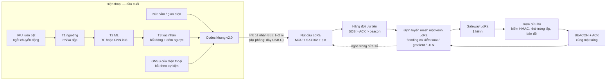
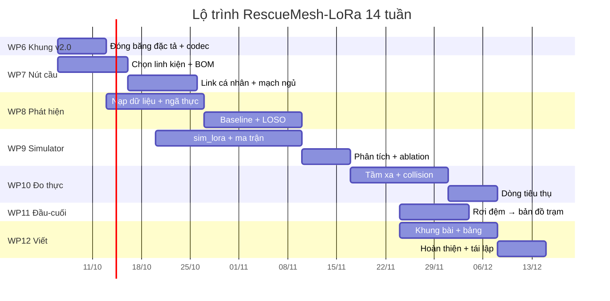

# Kế hoạch nghiên cứu — RescueMesh-LoRa (v2.0, chuyển hướng 2026-10-01)

**Tên làm việc:** RescueMesh-LoRa — Mạng mesh LoRa một sóng cho SOS tự động ở vùng bão lũ mất sóng: thiết kế, mô phỏng và đánh giá đầu-cuối
**Tài liệu liên quan:** [Nhật ký quyết định & nguồn đã xác minh](xac-minh-nguon-lora-va-quyet-dinh-song.md) · [Thiết kế hệ thống v2.0](thiet-ke-he-thong-lora-v2.md) · [Cấu trúc đề tài](cau-truc-de-tai-rescuemesh-lora.md) · [Phụ lục: nghiên cứu vệ tinh](nghien-cuu-ve-tinh-rescuemesh-ai.md)
**Tiền thân (lịch sử):** [Kế hoạch v1.0 dùng BLE](ke-hoach-nghien-cuu-rescuemesh-ai.md) · [Thiết kế BLE v1.0](thiet-ke-he-thong-chi-tiet.md)
**Ngày lập:** 2026-10-01 · **Trạng thái:** hướng đã chốt; codec khung v2.0 xanh
36/36 test, mô hình vật lý xanh 31/31, ngân sách năng lượng xanh 19/19; simulator
đang hoàn thiện; **chưa có kết quả `ĐO` nào**

---

## 0. Kết luận ngắn gọn

1. **BLE bị loại vì tầm quá ngắn**, không đủ cho vùng bão lũ nông thôn. Dự án
   chuyển sang **một loại sóng duy nhất: LoRa** ở băng 920–923 MHz, băng tần mà
   Việt Nam đã đưa vào danh mục **thiết bị vô tuyến được miễn giấy phép sử dụng
   tần số** ([Thông tư 08/2021/TT-BTTTT](xac-minh-nguon-lora-va-quyet-dinh-song.md)).
2. **Điện thoại vẫn là đầu cuối; LoRa là phần vô tuyến gắn kèm.** Điện thoại phổ
   thông không có chip LoRa, nên mỗi người mang theo một **nút cầu LoRa cá nhân**
   (MCU + SX1262 + pin) và điện thoại nối với nút đó bằng **link cá nhân cự ly
   gang tay** (BLE mặc định; cắm dây USB-C là phương án dự phòng). Lý do chọn
   hướng này: ai cũng đã có điện thoại (giải quyết bài toán cấp phát), điện thoại
   đã có sẵn IMU, GNSS, màn hình, loa và pin, còn nhồi chip LoRa vào điện thoại
   là việc khó và không khả thi trong phạm vi đề tài. **Ràng buộc "một loại sóng"
   áp dụng cho MẠNG cứu hộ** — mạng vẫn thuần LoRa; BLE chỉ là dây không dây
   trong tầm 1–2 m, nơi lý do "tầm quá ngắn" không còn ý nghĩa.
3. **Tài nguyên khan hiếm đổi từ "byte" sang "airtime".** Trên BLE, nút thắt là
   ngân sách byte quảng bá; trên LoRa, nút thắt là **tổng thời gian không khí trên
   một kênh dùng chung**. Mọi quyết định thiết kế (SF, payload, chu kỳ beacon, số
   nút, chính sách nghe) phải quy về airtime.
4. **Ba con số thiết kế đã tái lập được** (`rescuemesh/lora.py`,
   `rescuemesh/node_power.py`, 32 + 19 test xanh): khung SOS 36 byte ở SF9 tốn
   **≈ 267 ms** airtime; một gateway đơn kênh ở SF9 phục vụ được **≈ 242 nút** ở
   mức dùng 80 % kênh với beacon 60 s, và **≈ 952 nút** nếu beacon thưa 300 s
   (hệ số chuyển tiếp 3); nút cầu ngủ theo lịch sống **≈ 765 ngày** nhưng
   **nghe kênh liên tục chỉ sống ≈ 9,6 ngày** trên cùng viên pin (dòng Rx/Tx lấy
   từ **datasheet SX1276 đã xác minh**).
5. **Điều khiển là ĐÒN THIẾT KẾ, không phải hằng số của mạng** (đã tự sửa sau khi
   khảo sát hệ thống thật). Ở chu kỳ quảng bá 60–300 s, beacon chiếm **73–95 %**
   airtime; nhưng các hệ thống thật dùng chu kỳ **3–12 giờ** — Meshtastic NodeInfo
   mặc định **10.800 s**, MeshCore flood advert **12 h** — và ở đó chi phí điều khiển
   rơi từ 60,6 khung/nút/giờ (60 s) xuống **0,32 khung/nút/giờ** (10.800 s). Vì vậy
   câu hỏi nghiên cứu **không** phải "beacon có chiếm ưu thế không" mà là **"chu kỳ
   thưa nhất nào vẫn giữ được gradient"**, và có nên giãn theo quy mô như công thức
   Meshtastic `T×(1+0,075·(N−40))` hay không.
6. **Nghịch lý một sóng: ngủ để giữ pin thì không nghe được lệnh xuống.** Nút chỉ
   phát (không nghe) sống rất lâu nhưng không nhận được ACK/beacon; nút nghe liên
   tục nhận đủ nhưng mất khoảng 80 lần tuổi thọ. Đây là **giả thuyết H5**, và là
   đóng góp thiết kế riêng của hướng một sóng.
7. **Không viết kết luận hiệu năng trước G9.** Mọi số từ `sim_lora.py` là `SIM`,
   chưa hiệu chuẩn; mọi số từ `lora.py`/`node_power.py` là `SUY` từ mô hình, chưa
   phải `ĐO`.

---

## 1. Nhật ký chuyển hướng và hệ quả kiến trúc

### 1.1 Quyết định

| Mã | Quyết định | Ngày | Lý do | Bằng chứng |
|---|---|---|---|---|
| D1 | **Bỏ BLE** | 2026-10-01 | Tầm mỗi hop quá ngắn (hàng chục mét), không đủ cho vùng bão lũ nông thôn; mật độ nút cần để phủ một xã là phi thực tế | Người dùng chốt; đo G0 trên Pixel 6 Pro cho thấy khung 24 B chỉ tới được trạm trong tầm gần |
| D2 | **Dùng đúng một loại sóng: LoRa** | 2026-10-01 | Tầm km, không cần hạ tầng, pin lâu, băng tần 920–923 MHz được miễn giấy phép ở Việt Nam | Người dùng chốt; Thông tư 08/2021/TT-BTTTT |
| D3 | **Giữ điện thoại làm đầu cuối**, thêm **nút cầu LoRa cá nhân** | 2026-10-01 | Người dùng chốt: ai cũng mang điện thoại, nhồi chip LoRa vào điện thoại là khó; điện thoại đã có IMU/GNSS/màn hình/pin | Người dùng; và ưu điểm cấp phát được ghi ở §1.3 |
| D4 | Đầu cuối = **điện thoại**, có **nút cầu LoRa** đeo kèm; nút chuyển tiếp thuần LoRa đặt ở nơi khuất hoặc trên xe | 2026-10-01 | Cần một thiết bị nói được LoRa ở mỗi người; nút cầu không cần GNSS/IMU/màn hình nên rẻ | Thiết kế §2 |
| D5 | **WiFi mesh, WiFi HaLow và WiFi vệ tinh bị loại** khỏi đường chuẩn | 2026-10-01 | Xem bảng §1.2 | Tài liệu quyết định §3–§5 |
| D6 | **Link cá nhân mặc định là BLE** (phương án dây USB-C là dự phòng) | 2026-10-01 | Cự ly 1–2 m, không cần tầm xa; điện thoại nào cũng có BLE sẵn. **Đây không phải "đưa BLE trở lại mạng"**: BLE bị loại ở vai trò mạng chuyển tiếp vì tầm ngắn | Thiết kế §2.5 |

### 1.2 Vì sao ba phương án còn lại bị loại (có bằng chứng)

| Phương án | Bằng chứng loại | Kết luận |
|---|---|---|
| WiFi mesh 2.4/5 GHz | Không chạy được trên Android không root ở dạng mesh đa hop (802.11s/BATMAN-adv cần OpenWrt/root); Wi-Fi Direct là hình sao, Wi-Fi Aware là 1 hop; throughput đa hop suy giảm rất mạnh theo số hop (đo testbed: ≈ n⁻¹ tới n⁻¹·⁵) | Cần hạ tầng dày + nút riêng, lại đúng vấn đề tầm ngắn đã loại BLE |
| WiFi HaLow 802.11ah | Là biến thể WiFi duy nhất có tầm xa, nhưng **không có hỗ trợ native trên Android**; số đo thực địa tốt nhất hiện có là một preprint chưa bình duyệt (tới ~1,1 km với relay); module còn hiếm và giá chưa xác minh | Giữ làm phương án dự phòng, không phải đường chuẩn |
| WiFi vệ tinh (Starlink làm điểm truy cập) | Không phải mạng mesh: **một điểm duy nhất**. Số liệu chính thức từ spec sheet Starlink: Mini **112 m², 128 thiết bị, 25–40 W**, cần USB-PD **100 W**; Standard 4X + Router 3 **297 m², 235 thiết bị, 75–100 W**; và ràng buộc chặn: **"không tương thích với hệ mesh bên thứ ba"**. Tại Việt Nam, dịch vụ đã thương mại từ 13/8/2026 nhưng nằm trong **thí điểm có trần 600.000 thiết bị, kết thúc trước 1/1/2031**, và báo Đảng nêu rõ đây là **"giải pháp kết nối tạm thời"** sẽ bị điều chuyển khi có sóng mặt đất | Ngoài phạm vi: không giải quyết bài toán người dân phân tán, không ghép được vào mesh, và chưa có đo rain fade tại Việt Nam |

Chi tiết từng nguồn, DOI đã đối chiếu Crossref/OpenAlex và các con số bị cấm dùng:
[xác minh nguồn & quyết định sóng](xac-minh-nguon-lora-va-quyet-dinh-song.md).

### 1.3 Bốn hệ quả kiến trúc bắt buộc ghi vào báo cáo

1. **Điện thoại ở lại, nhưng phần vô tuyến của nó thì đổi.** App Android (đọc IMU,
   phát hiện ngã, UI, GNSS) được **kế thừa và phát triển tiếp** — kể cả kinh nghiệm
   đo gia tốc 20 Hz trên Pixel 6 Pro và Redmi ở cổng G0. Cái bị bỏ là **BLE
   advertising/scanning trong vai trò mạng**, thay bằng **link cá nhân** tới nút cầu.
   Nói cách khác: bản v1.0 mất phần *mạng*, giữ phần *cảm biến và giao diện*.
2. **Bài toán cấp phát nhẹ đi rất nhiều.** Không phải trang bị một nút LoRa cho mỗi
   người dân, mà chỉ một **nút cầu nhỏ** cho mỗi người hoặc mỗi hộ. Nút cầu **không
   cần GNSS, không cần IMU, không cần màn hình** (điện thoại đã có) → chỉ còn MCU +
   chip LoRa + pin, nên BOM thấp hơn hẳn phương án nút đầy đủ.
3. **Thêm một chặng mới vào ngân sách độ trễ:** điện thoại → **link cá nhân** → nút
   cầu → mesh LoRa → gateway → trạm. Chặng mới có cơ chế hỏng riêng (mất kết nối khi
   tắt màn hình, hàng đợi và tiết kiệm pin của hệ điều hành), nên phải **đo riêng**
   và trở thành RQ6.
4. **Airtime là tài nguyên chung, không phải băng thông riêng.** Mọi nút chia sẻ
   một kênh; một nút phát nhiều làm mọi nút khác mất gói. Vì vậy chỉ số trung tâm
   không còn là "số byte mỗi gói" mà là **tổng airtime mỗi SOS được giao**, và
   **tỉ lệ airtime dành cho điều khiển**.

**Điểm cần nói thẳng trong phần giới hạn:** kiến trúc này dùng **hai công nghệ vô
tuyến** (LoRa cho mạng, BLE cho link cá nhân). Ràng buộc "một loại sóng" của người
dùng được hiểu là **một loại sóng cho mạng cứu hộ** — và mạng đúng là thuần LoRa.
BLE ở đây chỉ là dây không dây 1–2 m, không tham gia chuyển tiếp. Nếu người phản
biện đòi "tuyệt đối một công nghệ vô tuyến", phương án trả lời là **cắm dây USB-C**
(§2.3 của thiết kế), khi đó hệ chỉ còn LoRa trên không.

### 1.4 Kế thừa gì, bỏ gì

| Hạng mục v1.0 (BLE) | Trạng thái | Ghi chú |
|---|---|---|
| Thiết kế phát hiện ngã T1→T2→T3 | **Kế thừa gần nguyên trạng** | Cảm biến vẫn là IMU **điện thoại**, nên kho dữ liệu công khai áp dụng trực tiếp — không còn bài toán chuyển miền do cách gắn |
| APK Android (IMU 20 Hz, foreground service, UI) | **Kế thừa và phát triển tiếp** | Cổng G0 đã chạy trên Pixel 6 Pro và Redmi Note 14 Pro; nay thêm phần gửi SOS sang nút cầu |
| BLE advertising/scanning trong vai trò MẠNG | **Bỏ** | Tầm quá ngắn; thay bằng link cá nhân 1–2 m tới nút cầu |
| Quy tắc chứng cứ `ĐO`/`DS`/`SIM`/`SUY`/`GIẢ ĐỊNH` | **Kế thừa nguyên vẹn** | Áp dụng cho mọi bảng của v2.0 |
| Kỷ luật hiệu chuẩn, kiểm soát âm, cold/warm start, ghép cặp theo seed | **Kế thừa nguyên vẹn** | Đã chứng minh giá trị: cold start từng đảo chiều kết luận H2 trên BLE |
| Codec byte v1 (24 B) | **Bỏ** | Thay bằng khung v2.0 cho LoRa (§8) |
| `rescuemesh/packets.py` | **Giữ một phần** | Tái dùng helper mã hoá toạ độ 24 bit; phần BLE advertising bỏ |
| `rescuemesh/sim_v2.py`, WP3 matrix | **Bỏ khỏi đường chuẩn** | Mô hình khe BLE không mô tả được airtime/collision LoRa |
| `rescuemesh/run_wp3_matrix.py`, H3, R2a | **Giữ làm lịch sử** | Kết quả `SIM` trên BLE **không được trích** như kết quả của hướng LoRa |
| APK Android, `station/receiver.py` (BLE) | **Bỏ** | Thay bằng firmware nút + gateway LoRa → cầu nối serial/MQTT → trạm |
| Logic trạm (khử trùng lặp, kiểm HMAC, ghi JSONL, bản đồ) | **Kế thừa, đổi đầu vào** | Đầu vào không còn là BLE advertisement mà là khung LoRa từ gateway |
| `generate_g0_schedule.py` (lịch factorial có block, random hoá) | **Kế thừa** | Dùng lại cho sàng lọc G0-S của hướng LoRa |
| Nguồn IMU công khai (SisFall, FARSEEING…) | **Kế thừa** | Nhưng phải khai báo sai khác gắn cảm biến |

---

## 2. Bằng chứng nền và mức độ tin cậy

Thang nhãn giữ nguyên như v1.0: `ĐO` (đo trên thiết bị thật) · `DS` (kho dữ liệu
công khai) · `SIM` (mô phỏng, đã/ chưa hiệu chuẩn — phải ghi rõ) · `SUY` (suy từ
công thức/tiêu chuẩn) · `GIẢ ĐỊNH` (giả định kỹ thuật phải kiểm trước khi kết luận).

Ba quy tắc:

1. **Không trích nguồn chưa mở.** Nguồn phải có URL hoặc DOI, ngày truy cập, và
   phân loại: bình duyệt / tiêu chuẩn / tài liệu nhà sản xuất / preprint / blog.
2. **Số `SUY` không được viết như số `ĐO`.** Mọi tầm xa trong tài liệu này cho tới
   WP10 là **giới hạn của một mô hình suy hao**, không phải kết quả đo.
3. **Thông số vật lý phải đối chiếu datasheet trước khi trích.** Bảng độ nhạy
   trong `lora.py` hiện gắn nhãn `GIẢ ĐỊNH` (xem §7.4).

---

## 3. Khoảng trống nghiên cứu

### 3.1 Công trình học thuật gần nhất (đã xác minh tồn tại qua Crossref)

Các mục dưới đây **đã được đối chiếu tự động qua Crossref API** (DOI, tên bài, tạp
chí/hội nghị, năm). **Chưa đọc toàn văn** nên **không trích số liệu** từ chúng; chỉ
dùng để xác định ranh giới của khoảng trống.

| Nhóm | Công trình | DOI | Ý nghĩa cho đề tài |
|---|---|---|---|
| Mô hình suy hao & tầm phủ | "On the coverage of LPWANs: range evaluation and channel attenuation model for LoRa technology" (ITST 2015) | `10.1109/itst.2015.7377400` | Bài kinh điển về tầm phủ LoRa — cơ sở để đối chiếu mô hình suy hao ở WP10 |
| Mô hình suy hao & tầm phủ | "A Study of LoRa Coverage: Range Evaluation and Channel Attenuation Model" (SCCIC 2018) | `10.1109/sccic.2018.8584548` | Bổ sung dữ liệu tầm phủ để hiệu chuẩn |
| Dung lượng LoRaWAN | "Understanding the Limits of LoRaWAN" (IEEE Comm. Mag. 2017) | `10.1109/mcom.2017.1600613` | **Đã nghiên cứu giới hạn dung lượng của LoRaWAN hình sao** — nên khoảng trống của đề tài **không** phải "dung lượng LoRa" nói chung |
| Dung lượng LoRaWAN | "Do LoRa Low-Power Wide-Area Networks Scale?" (ACM MSWiM 2016) | `10.1145/2988287.2989163` | Cùng nhóm trên: khả năng mở rộng của mạng hình sao một ô |
| Dung lượng LoRaWAN | "Capacity limits of LoRaWAN technology for smart metering applications" (IEEE ICC 2017) | `10.1109/icc.2017.7996383` | Ứng dụng cụ thể của giới hạn dung lượng |
| Mesh LoRa nhiều hop | "HEAT Routing Algorithm for Multi-Hop Communication in IoT-Enabled LoRa-Based Wireless Mesh Networks" (ICITISEE 2022) | `10.1109/icitisee57756.2022.10057806` | **Đã có định tuyến cho mesh LoRa nhiều hop** — nên khoảng trống **không** phải "mesh LoRa chưa ai làm" |
| Mesh LoRa nhiều hop | "Self-Organizing Multi-hop LoRa Mesh Network for Wide Area Air Quality Monitoring" (TENCON 2022) | `10.1109/tencon55691.2022.9977930` | Mesh LoRa tự tổ chức đã có tiền lệ |
| Mesh LoRa nhiều hop | "Routing Protocol to Enhance Network Lifetime in Multi-hop LoRa Network" (2025) | `10.6109/jkiice.2024.29.7.956` | Đã có định tuyến tối ưu tuổi thọ mạng |
| Năng lượng nút | "LoRa-Based Sensor Node Energy Consumption with Data Compression" (MetroInd4.0&IoT 2021) | `10.1109/metroind4.0iot51437.2021.9488434` | Tiền lệ đo năng lượng nút LoRa — dùng để so phương pháp đo ở WP10 |
| Truyền qua môi trường nước/băng | "Long Range (LoRa) Transmission Through Ice: Preliminary Results" (I2MTC 2021) | `10.1109/i2mtc50364.2021.9459858` | Bằng chứng hiếm về suy hao qua môi trường nước — liên quan trực tiếp tới **điều kiện ngập** |

**Hai số đo bình duyệt định hình thiết kế** (nhánh nghiên cứu đã đọc PDF nguồn;
vẫn phải tự đối chiếu trước khi trích vào báo cáo):

| Số đo | Điều kiện | Kết quả | Ý nghĩa cho đề tài |
|---|---|---|---|
| Petäjäjärvi et al. 2015 (`10.1109/itst.2015.7377400`, PDF `cc.oulu.fi/~kmikhayl/site-assets/pdfs/2015_ITST.pdf`) | 868 MHz, 14 dBm, SF12, **ăng-ten trên nóc ô tô / cột thuyền**, địa hình Bắc Âu | **> 15 km trên mặt đất**, **≈ 30 km trên mặt nước**; > 80 % gói thành công tới 5 km; mất 74 % gói ở 10–15 km; hệ số suy hao **2,32 (đất) / 1,76 (nước)** | Xác nhận **lớp tầm km là thật** với bằng chứng bình duyệt. Nhưng điều kiện là **ăng-ten nâng cao**, không phải cầm tay ngang đất → mô hình của đề tài (n = 3,0–3,5) **thận trọng hơn**, và đó là lựa chọn có chủ đích |
| Elijah et al. 2021 (`10.1109/ACCESS.2021.3080317`) | **923 MHz — đúng băng Việt Nam**, khoảng cách 916 m, **mưa nhiệt đới 12–180 mm/h** | **Suy hao do mưa = 0 dB**; mọi gói gửi trong mưa đều nhận được; RSSI cao nhất −107 dBm | Trả lời trực tiếp nỗi lo "mưa bão làm mất sóng LoRa": ở sub-GHz, **mưa không đáng kể** (hạt mưa 1–6 mm ≪ bước sóng 0,32 m). **Còn thiếu:** đo trong điều kiện **ngập thực tế**, chỉ có mưa |

**Ba hệ quả cho cách phát biểu khoảng trống (quan trọng để không bị phản biện):**

1. **Không được nói "chưa ai làm mesh LoRa"** — đã có HEAT, mesh tự tổ chức, định
   tuyến tối ưu tuổi thọ.
2. **Không được nói "chưa ai nghiên cứu dung lượng LoRa"** — LoRaWAN hình sao đã
   được nghiên cứu kỹ (Adelantado 2017; Bor 2016).
3. Khoảng trống thật nằm ở **giao nhau**: mesh **một kênh dùng chung** cho cả dữ
   liệu và điều khiển, có **SOS do cảm biến kích hoạt**, và **nút phải ngủ** — ba
   điều mà LoRaWAN hình sao và các mesh LoRa hiện có **không** xử lý cùng lúc.

**Bằng chứng về định tuyến, DTN, hiệu chuẩn và cạm bẫy mô phỏng** (đã xác minh
DOI/URL; nguồn chi tiết ở [bản tổng hợp định tuyến LoRa](ket-qua-tong-hop-lora-mesh-2026-09-30.md)):

| Nhóm | Kết quả đã xác minh | Nguồn |
|---|---|---|
| Dung lượng LoRaWAN (có đo/mô phỏng) | LoRaWAN mặc định (SF12/BW125/CR4-5) chỉ **64 nút / 3,8 ha với DER > 0,9**; tối ưu airtime thì **> 1.100 nút**; capture effect nâng DER **0,51 → 0,64** ở 200 nút. **Cảnh báo:** bản MSWiM gốc ghi 120 nút do lỗi simulator — phải trích bản đã sửa và ghi rõ phiên bản | Bor et al., MSWiM 2016, `10.1145/2988287.2989163` (bản sửa: `eprints.lancs.ac.uk/81674/13/lora_scalability_r338.pdf`) |
| Mất gói ở quy mô lớn | 1.000 nút/gateway mất tới **32 %**; ALOHA thuần mất ~**90 %** | Haxhibeqiri et al., Sensors 2017, `10.3390/s17061193` |
| Nút ẩn và Listen-Before-Talk | Xác suất nút ẩn theo SF/vành (Nakagami-m); **LBT không đáng tin khi có nút ẩn** | IEEE Wireless Comm. Letters 2024, `10.1109/LWC.2024.3453788` |
| DTN trên LoRa — thực địa | Chuỗi 3 nút DTN trên LoRa (rf95modem 868 MHz), RTT **1,7 s**, xuyên **600 m rừng**; phần 1.000 người dùng là **mô phỏng**, tải cao giao ≤ 50 % | Höchst et al. 2023, `10.1007/978-3-031-20939-0_12` |
| Data mule thực địa (nút di động) | Xe Jeep gắn LoRa trong mỏ, 20–40 km/h, chuyển tiếp **180–770 m** dù cua 90° và NLoS, tour 3.500 m, **mất gói < 5 %** | Theissen et al., Sensors 2026, `10.3390/s26082369` |
| Bundle Protocol trên LoRa | BPv7 trên LoRa tôn trọng duty cycle; kịch bản Darmstadt 17 nút: **40–60 %** (quadrant) so với **20–30 %** (random). **Cảnh báo:** con số "~80 % median" thuộc một kịch bản khác, **không** được gán cho Darmstadt | BPoL, GHTC 2023, `10.1109/GHTC56179.2023.10354717` |
| Định tuyến nhiều hop không va chạm | Cây + gán timeslot/kênh cho multi-hop LoRa | Mai & Kim, Energies 2020, `10.3390/en13061368` |
| Đa hop cơ hội | Chuyển tiếp được **dù không có đường end-to-end** | LoRaOpp, WiMob 2022, `10.1109/WIMOB55322.2022.9941716` |
| Chi phí năng lượng của mesh | Mesh **tốn pin hơn** LoRaWAN hình sao | ICCC N 2024, `10.1109/ICCCN61486.2024.10637558` |
| **Tiền lệ SOS do cảm biến qua LoRa** | Cảm biến **rung + nghiêng** phát hiện va chạm/lật xe rồi gửi qua LoRa tới **một máy thu** — **không mesh, không DTN, không bối cảnh bão lũ** | Dhineshkumar et al., ICEAMST 2025, `10.1109/ICEAMST67459.2025.11335748` |
| **Tiền lệ hiệu chuẩn mô phỏng ↔ đo thực** | 5 board thật + 1 gateway ở 50 m: DER mô phỏng/đo thực/giải tích = **0,997 / 0,968 / 0,991** (SF7) và **0,978 / 0,914 / 0,959** (SF10); 10.000 vòng lặp → **mốc tham chiếu cho cổng G8/G9 của đề tài** | LoRaWANSim, Sensors 2021, `10.3390/s21030695` |
| Cạm bẫy mô phỏng mạng | Kinh điển về vì sao mô phỏng mạng dễ sai; **lưu ý DOI hay bị nhầm** (`10.1109/90.929850` **không phải** bài này) | Floyd & Paxson, IEEE/ACM ToN 2001, `10.1109/90.944338`; Paxson 1997, `10.1145/268437.268737` |
| Tái lập trong thí nghiệm vô tuyến | Khuyến nghị công bố artifact và điều kiện đo | Noubir, WiNTECH 2016, `10.1145/2980159.2984738` |
| Cạm bẫy đo năng lượng WSN | Sai số hệ thống khi đo dòng nút cảm biến | Pullwitt et al., WONS 2023, `10.23919/WONS57325.2023.10062282` |
| Duty cycle theo luật (tham chiếu quốc tế) | ETSI EN 300 220-2: 868,0–868,6 MHz ≤ 1 %; 868,7–869,2 ≤ 0,1 %; 869,4–869,65 ≤ 10 %. FCC 15.247: dwell 0,4 s/20 s | `etsi.org/.../en_30022002v030201p.pdf`; 47 CFR 15.247(a)(1)(i) |

**Bằng chứng bổ sung từ các nhánh khảo sát mới (2026-10-01, DOI đã đối chiếu Crossref):**

| Nhóm | Kết quả đã xác minh | Nguồn |
|---|---|---|
| **Dung lượng (bản Bor đã sửa, đọc PDF)** | LoRaWAN mặc định: **64 nút / 3,8 ha** với DER > 0,9; **"well over N = 1100"** khi tối ưu airtime; capture **0,51 → 0,64** ở N = 200; cần **≥ 5 ký tự preamble**; DER = e^(−2N·T·λ). **Cảnh báo:** PDF sửa vẫn sót "120" ở chú thích Figure 4 — **chỉ dùng 64** | `eprints.lancs.ac.uk/81674/13` |
| **Trickle — nền lý thuyết cho beacon thích ứng** | RFC 6206: `I_min`, `I_max`, `k`, suppression khi `c < k`; NSDI 2004: vài gói/giờ, tăng O(log n); **testbed thật 43 nút** (WSN430/IoT-Lab) | `10.17487/rfc6206`; `10.1109/wowmom.2015.7158134` |
| **Khoảng trống Trickle** | **Không tìm thấy nguồn** nào áp Trickle lên LoRa rồi đo ⇒ khoảng trống khai thác được cho beacon hop-count | — |
| **Chu kỳ quảng bá trong hệ thống thật** | Meshtastic **NodeInfo mặc định 10.800 s (3 h)** (fw `Default.h`; dải 3.600 s→MAX), Position 15 min, Telemetry 30 min, NeighborInfo 6 h; **từ fw 2.4.0 giãn theo quy mô** `T×(1+0,075·(N−40))`; MeshCore repeater **flood advert 12 h** (3–168 h). ⚠️ `config.proto` ghi 900 s — **trái** tài liệu/firmware, **không dùng** | `meshtastic.org/docs/...`; firmware `Default.cpp` |
| **Hiệu chuẩn mô phỏng ↔ đo thực** | LoRaWANSim Table 10 (5 nút thật ở 50 m): SF7 **0,968 đo vs 0,997 mô phỏng (+2,9 điểm %)**; SF10 **0,914 vs 0,978 (+6,4 điểm %)** ⇒ **mô phỏng đánh giá cao hơn thực tế** | `10.3390/s21030695` |
| **Năng lượng relay (ĐO THỰC)** | 6 nút Meshtastic 2.7 đo bằng Otii Arc, NLOS 4 tầng: Tx/Rx/**RELAY** gần như giống nhau **125–126 mA, 467–470 mJ/gói, ~25–26 h trên pin 3200 mAh** ⇒ **không có bằng chứng đo** rằng relay tốn pin hơn khi always-on | `10.1049/cmu2.70221` |
| **Vị trí: chuẩn xác nhận 24 bit/trục** | 3GPP **TS 23.032 V19.0.0 (2025-09)** mã hoá vĩ độ 24 bit và kinh độ 24 bit, công bố *"uncertainty of less than 3 metres"*; bước lượng tử hoá trùng codec đề tài | 3GPP TS 23.032 |
| **Ngưỡng sai số của cơ quan cứu hộ** | WEA: overshoot ≤ 0,1 dặm (≈ 161 m), phủ 100 % vùng đích; E911 trong nhà ≤ 50 m cho 80 % cuộc gọi, TTFF ≤ 30 s | 47 CFR §10.450; 3GPP TS 22.071 Annex A |
| **Đích ánh xạ chuẩn** | **CAP v1.2** (OASIS Standard 01-07-2010; CAP 1.1 = ITU-T X.1303); bọc **EDXL-DE v2.0** nếu vào EDXL; Cell Broadcast/PWS chỉ là kênh phát cuối; **không tồn tại "CAP-lite"** | OASIS EMTC; 47 CFR §10.420 |
| **Link cá nhân BLE (AOSP)** | Connection interval là bội số 1,25 ms: HIGH **11,25–15 ms**, BALANCED 30–50 ms, LOW_POWER 100–125 ms, companion **7,5–10 ms**; supervision timeout 5 s; scan duty cycle **5 % khi tắt màn hình**; quota **5 startScan/30 s**; scan timeout **30 → 10 phút (A14/15)**; FGS `connectedDevice` **không** bị timeout 6 h; **kết nối đóng khi process bị kill** | AOSP `Bluetooth/.../config.xml`, `ScanManager`, tài liệu background |

### 3.2 Năm khoảng trống

- **G1 — SOS tự động qua mesh LoRa *một sóng* trong bối cảnh bão lũ.** Đã có tiền lệ
  **điểm-điểm**: cảm biến **rung + nghiêng** phát hiện va chạm/lật xe rồi gửi qua LoRa
  tới **một** máy thu (Dhineshkumar et al. 2025,
  `10.1109/ICEAMST67459.2025.11335748`) — nhưng **không mesh, không store-carry-forward,
  không bối cảnh bão lũ**. Các hệ thống mesh LoRa phổ biến (Meshtastic, MeshCore) đều
  cần người dùng còn tỉnh để soạn tin. **Cách nói an toàn:** *trong phạm vi tìm kiếm đã
  ghi, không tìm thấy công bố nào kết hợp SOS tự động do cảm biến + mesh LoRa một sóng
  + store-carry-forward ở bối cảnh bão lũ nhiệt đới, kèm ngân sách độ trễ đầu-cuối.*
- **G2 — Khoảng cách staged ↔ ngã thực, và thiếu đánh giá theo chuẩn.** Bằng chứng
  đã kiểm: **không tồn tại meta-analysis kiểu PRISMA** gộp sensitivity/specificity/F1
  cho phát hiện ngã bằng IMU; nhiều bản demo dùng ngưỡng đơn giản và báo "chính xác
  cao" mà không nói chia tập theo người, không nói báo động giả mỗi giờ. Quan trọng
  hơn: khi chuyển từ ngã **staged** sang ngã **thực**, sensitivity tụt còn **57,0 %**
  (Bagalà 2012, 29 ca thực) và báo động giả lên tới **3–85 ca/ngày**; ngay cả mô
  hình sâu tốt nhất cũng chỉ đạt **~8 báo động giả/ngày trên 7 ngày thực địa**
  (Villa & Casilari 2025). Tầng xác nhận T3 của đề tài có đất đóng góp chính ở đây.
- **G3 — Kinh tế airtime của mesh một kênh *có điều khiển*, cho bài toán SOS.**
  Dung lượng LoRaWAN hình sao đã được nghiên cứu kỹ và **có số đo** (Bor 2016 mặc
  định chỉ 64 nút/3,8 ha với DER > 0,9; Haxhibeqiri 2017: 1.000 nút/gateway mất tới
  32 %). Nhưng **không tìm thấy** nghiên cứu bình duyệt nào về **công bằng kênh
  (fairness)** trong mesh LoRa một kênh, và **không tìm thấy** số đo **% airtime điều
  khiển** cho mesh một kênh. Điểm mấu chốt về phương pháp: mọi con số quy mô đã công bố
  đều dựa vào **trực giao SF của LoRaWAN** — thứ **không tồn tại** trong mesh một sóng
  một SF. Đây là chỗ H3 và chỉ số fairness của đề tài có đất.
- **G4 — Nghịch lý ngủ/nghe của nút một sóng chưa được phát biểu và đo.** Tài
  liệu LoRaWAN xử lý bằng Class A/B/C với cửa sổ xuống dành riêng; nhưng trong
  **mesh một kênh** không có kênh điều khiển riêng, nên chính sách nghe ảnh hưởng
  trực tiếp tới cả độ trễ nhận lệnh xuống lẫn tuổi thọ pin. Chưa thấy công bố nào
  lượng hoá đánh đổi này cho nút có phát hiện ngã.
- **G5 — Ngân sách byte/khung dưới ràng buộc airtime.** Trên LoRa mỗi byte tăng
  thêm đều làm tăng airtime và giảm số nút một gateway phục vụ được; thiết kế
  khung có xác thực dưới ràng buộc này chưa có tiền lệ công bố cho bài toán SOS.
- **G7 — Ánh xạ sang CAP và trường bất định vị trí.** Không tìm thấy nguồn nào về việc
  ánh xạ một khung SOS byte-cố-định từ mesh LoRa sang **CAP/EDXL**, cũng không có ngân
  sách độ trễ **mesh → PSAP**. Về kỹ thuật, khung v2.0 **thiếu trường bất định/độ tin
  cậy của vị trí**, trong khi CAP (`<circle>` bán kính), PIDF-LO RFC 5491 (`gs:radius`,
  95 %) và TS 23.032 đều mô tả sai số kèm điểm; và CAP yêu cầu `sender` định danh toàn
  cầu trong khi `src_id` xoay theo ngày. **Đã xử lý một phần:** khung v2.1 đề xuất dùng
  2 byte dự trữ cho `net_id` + ba trục CAP + lớp độ chính xác (thiết kế §4.6);
  **việc còn lại** là cài codec v2.1 và đo ngân sách độ trễ tới trạm.
- **G6 — Nút ẩn và Listen-Before-Talk trong mesh *có nút ngủ*.** Đã có nghiên cứu
  xác suất nút ẩn cho LoRa có LBT (IEEE WCL 2024, `10.1109/LWC.2024.3453788`), nhưng
  **chưa ai nối nó vào mesh một kênh có nút ngủ theo lịch** — nơi nút ngủ không nghe
  được kênh nên LBT mất hiệu lực đúng lúc kênh đông nhất. Đây là chỗ H5 gặp G3.

Giới hạn của tuyên bố "khoảng trống": đây là "**không tìm thấy trong phạm vi tìm
kiếm đã ghi lại**", không phải "chưa từng có ai làm". Sổ tìm kiếm nằm trong tài
liệu quyết định. **Việc còn thiếu:** đọc toàn văn 10 công trình ở §3.1 trước khi
trích bất kỳ số liệu nào từ chúng.

---

## 4. Câu hỏi nghiên cứu và giả thuyết

### 4.1 Câu hỏi nghiên cứu

| Mã | Câu hỏi | Loại |
|---|---|---|
| **RQ1** | Với dữ liệu IMU công khai thu bằng **điện thoại**, đường ống 3 tầng đạt recall bao nhiêu ở ngân sách báo động giả đặt trước khi chia tập theo người, và mất bao nhiêu khi chuyển sang kho dữ liệu khác? | Dự đoán |
| **RQ2** | Trong mesh LoRa **một kênh**, đến mức tải nào thì định tuyến gradient bắt đầu thắng flooding có kiểm soát, và ngưỡng đó khác ngưỡng đo trên BLE thế nào? | So sánh |
| **RQ3** | Một gateway đơn kênh phục vụ được bao nhiêu nút ở mỗi cặp (SF, chu kỳ beacon), và điểm sụp nằm ở đâu dưới ràng buộc duty cycle và collision? | Mô tả + đo |
| **RQ4** | Ngân sách độ trễ đầu-cuối từ lúc va đập đến lúc SOS hiện trên bản đồ trạm — **tách theo từng chặng, gồm cả chặng link cá nhân** — là bao nhiêu, và **năng lượng mỗi SOS được giao** là bao nhiêu? | Đo |
| **RQ5** | Một khung SOS có xác thực trên LoRa cần tối thiểu bao nhiêu byte, và mỗi byte tăng thêm làm mất bao nhiêu airtime và sức chứa? | Mô tả + đo |
| **RQ6** | **Link cá nhân** điện thoại ↔ nút cầu (BLE) có đủ tin cậy và đủ nhanh để không phá vỡ ngân sách độ trễ: độ trễ thiết lập và phát lại, tỉ lệ mất kết nối khi màn hình tắt, và hành vi khi xung quanh có nhiều thiết bị BLE khác? | Đo |

### 4.2 Giả thuyết, đối thủ và phép thử phân biệt

Mỗi giả thuyết phải có **đối thủ** và một **kết quả không tương thích**.

**H1 — Tầng xác nhận (T3) là thứ mang lại độ tin cậy.**
- *Phát biểu:* thêm luật bất động + đếm ngược làm giảm báo động giả nhiều hơn mức
  recall bị mất. (Cảm biến là **IMU điện thoại**, nên các kho dữ liệu công khai
  áp dụng trực tiếp — đây là lợi thế của kiến trúc điện thoại + nút cầu.)
- *Đối thủ R1a:* lợi ích đến từ lọc ngưỡng đơn thuần, không cần ML. → **Thử:**
  thang (ngưỡng) → (ngưỡng + luật) → (ML + luật); nếu bậc hai đã gần bằng bậc ba
  thì ML không đóng góp.
- *Đối thủ R1b:* lợi ích chỉ xuất hiện trên dữ liệu **staged** (người thử nằm yên
  theo kịch bản); trên **ngã thực** tầng xác nhận không giúp được gì. → **Thử bắt
  buộc:** chạy thêm trên **ngã thực** (FARSEEING: 143 ca; "Free From Falls": 690
  cửa sổ 4 giây) và so với các mốc đã công bố: SE thực đời tụt còn **57,0 %**
  (Bagalà 2012, 29 ca thực), báo động giả **3–85 ca/ngày**, và mô hình sâu tốt nhất
  chỉ đạt **~8 báo động giả/ngày trên 7 ngày thực địa** (Villa & Casilari 2025).
  Nếu tầng 3 không kéo được báo động giả xuống dưới ~8 ca/ngày trên dữ liệu thực
  thì H1 bị bác.
- *Không tương thích:* FAR giảm nhưng recall giảm nhiều hơn ở cùng ngân sách.

**H2 — Ngưỡng đảo chiều của gradient dịch xuống tải thấp hơn nhiều trên LoRa.**
- *Phát biểu:* trên BLE, gradient chỉ thắng flooding ở tải cao (kết quả `SIM` cũ);
  trên LoRa, vì mỗi lần phát chiếm kênh lâu hơn hàng trăm lần, gradient phải
  thắng ngay từ tải thấp — nếu không thì mô hình "gradient tiết kiệm kênh" là sai.
- *Đối thủ R2a:* khác biệt chỉ là sản phẩm của cách tính beacon overhead. →
  **Thử:** quét chu kỳ beacon 30/60/300/900 s; dấu của khác biệt phải giữ nguyên.
- *Đối thủ R2b:* lợi ích do mô hình mất gói thuận lợi nhân tạo. → **Thử:** hiệu
  chuẩn PDR theo đo thực ở WP10; chạy lại trên nhiều bộ tham số suy hao. *Đối thủ
  mạnh nhất, chưa giải quyết được cho tới G9.*
- *Đối thủ R2c:* khác biệt chỉ là hệ quả trạng thái khởi động. → **Thử:** mọi bảng
  phải ghi rõ **cold start** (SOS phát ngay khi bật) hay **warm start**; chạy cả hai.
- *Không tương thích:* gradient vẫn thua ở tải thấp và trung bình sau khi tính đủ
  airtime điều khiển. → **ĐÃ QUAN SÁT ĐÚNG ĐIỀU NÀY ở kết quả `SIM` đầu tiên**;
  xem §7.5. Dự đoán "gradient thắng ngay từ tải thấp" **hiện không được ủng hộ**,
  nhưng chưa đủ để bác vì mô hình chưa hiệu chuẩn (cổng G9).
- **KẾT QUẢ `SIM` v2.1 (phân tích theo ô) — SỬA LẠI H2: biến quyết định là AIRTIME
  MỖI KHUNG, không phải tải SOS.** Trên 24 ô (3 mật độ × 2 tải × 2 SF × cold/warm,
  mỗi ô 20 seed):

  | SF (BW125) | Airtime SOS 36 B | ΔPDR (gradient − flood) | Số ô gradient thắng |
  |---:|---:|---:|---:|
  | 7 | ≈ 77 ms | **−0,246** | **0/12** |
  | 9 | ≈ 267 ms | −0,020 | **6/12** |

  Nghĩa là: **khi airtime mỗi khung còn rẻ (SF7), flooding thắng ở MỌI mật độ và
  MỌI mức tải** — độ dự trữ đa đường đáng giá hơn chi phí va chạm. **Khi airtime
  đắt (SF9), hai thuật toán gần như ngang nhau về PDR** (gradient thắng 6/12 ô) và
  gradient rẻ hơn ~8 lần về số lần phát. Ở vùng rộng 3 km (E1b, SF9), gradient
  **thắng rõ** flooding (0,597 so với 0,352).
- **Phát biểu H2 đúng phải là:** *"Gradient chỉ cạnh tranh được về PDR khi airtime
  mỗi khung đủ đắt (SF ≥ 9 ở BW125) và mạng đủ thưa/rộng; ở SF7 nó thua flooding ở
  mọi tải, và ở mọi cấu hình nó rẻ hơn khoảng một bậc độ lớn về số lần phát."*
  Đây là bản sửa có thể bị bác bằng thực nghiệm: chỉ cần một bộ tham số hiệu chuẩn
  khác làm đảo dấu ở SF9 là H2 sai.

**H3 — Điều khiển (beacon) là chi phí trội của mesh LoRa, gần như độc lập mật độ.**
- *Phát biểu:* ở chu kỳ beacon 60–300 s, beacon chiếm **73–93 %** airtime của mỗi
  nút (SF9/beacon 60 s: **93,3 %**) vì tần suất beacon áp đảo tần suất SOS; tỉ lệ
  này **gần như không phụ thuộc số nút**, vì cả hai thành phần đều tỉ lệ với số nút
  (mô hình `SUY` §7.2–7.3).
- *Đối thủ R3a:* dữ liệu SOS mới là phần chiếm ưu thế, beacon chỉ là chi tiết phụ.
  → **Thử:** tách airtime theo loại khung trong `sim_lora.py` ở 25/50/100/200 nút.
- *Đối thủ R3b:* tỉ lệ cao chỉ vì mô hình bỏ qua việc nút ngủ theo lịch nên không
  phát beacon. → **Thử:** mô hình hoá tường minh lịch ngủ + cửa sổ nghe, đếm lại.
- *Đối thủ R3c:* tăng tần suất SOS (sự kiện lớn) sẽ đảo tỉ lệ. → **Thử:** quét tải
  SOS 1/5/20/50 khung mỗi nút mỗi giờ và tìm điểm đảo chiều.
- *Không tương thích:* ở 200 nút với beacon 60 s, tỉ lệ airtime điều khiển dưới 30 %.
- **KẾT QUẢ `SIM` v2.1 (E1/E1b) — H3 đúng về chi phí, nhưng đối thủ mới R3d thắng:**
  ba chế độ điều khiển cho kết quả rất khác nhau ở vùng 1 km, 100 nút (PDR | điều khiển):
  `node_hello` 0,523 | 46,6 %; `gateway_beacon` **0,762 | 1,9 %**; `gateway_beacon_relay`
  0,719 | 31,8 %. Nghĩa là **relay beacon tốn 17 lần airtime điều khiển mà giao ít
  hơn** (dù học hop tốt hơn: 92,8 % so với 69,3 %). Ở vùng 3 km (E1b) hướng này giữ
  nguyên: `gateway_beacon`+gradient 0,597 | 3,5 % so với có relay 0,547 | 49,9 %.
- *Đối thủ R3d (mới, đang thắng):* chỉ gateway phát, **không relay**, là đủ cho gradient
  trong các kịch bản đã thử. → **Thử tiếp:** tăng số hop (vùng >5 km, 1 gateway ở rìa)
  và giảm mật độ để tìm điểm mà hop count lan qua relay trở nên cần thiết. Nếu không
  tìm được điểm đó, kết luận phải là **bỏ relay beacon** trong thiết kế v1.

**H4 — Token ACK 24 bit là ngưỡng tối thiểu dùng được; 16 bit sụp ở quy mô thật.**
- *Phát biểu:* với token 16 bit, xác suất khớp sai đủ lớn để ACK chấm dứt sai phát
  lại khi mạng có ≥ 1.000 nút; token 24 bit kéo xác suất này xuống dưới ngưỡng dùng được.
- *Đối thủ R4a:* va chạm token không quan trọng vì ACK còn kèm `seq` và thời gian.
  → **Thử:** mô phỏng trạm với ngân sách ACK thật mỗi beacon, đo tỉ lệ khớp sai và
  số lần phát lại tăng thêm.
- *Không tương thích:* tỉ lệ khớp sai ≈ 0 ở cả hai độ dài token. **Ứng viên kết
  quả phủ định** của đề tài.

**H5 — Nút một sóng không thể vừa tiết kiệm pin vừa nhận lệnh xuống.**
- *Phát biểu:* nút chỉ phát và ngủ sống hàng trăm ngày nhưng bỏ lỡ gần hết ACK;
  nút nghe liên tục nhận gần đủ ACK nhưng tuổi thọ pin giảm khoảng **80 lần**
  (mô hình `SUY` §7.4, dùng dòng Rx **đã xác minh từ datasheet SX1276**:
  ≈ 765 ngày so với ≈ 9,6 ngày trên pin 18650).
- *Đối thủ R5a:* cửa sổ nghe theo lịch vừa đủ để nhận ACK mà không mất nhiều pin.
  → **Thử:** so ba chính sách — (i) chỉ phát, (ii) cửa sổ nghe sau khi phát,
  (iii) nghe liên tục — trên ba chỉ số: tỉ lệ nhận ACK, độ trễ nhận lệnh xuống,
  tuổi thọ pin. Nếu (ii) đạt > 90 % tỉ lệ nhận của (iii) với tuổi thọ gần (i) thì
  R5a thắng và H5 bị bác.
- *Không tương thích:* ba chính sách cho tỉ lệ nhận ACK như nhau → bài toán không
  tồn tại, và thiết kế có thể bỏ ACK hoàn toàn.
- **KẾT QUẢ `SIM` v2.1 (E1) — H5 được xác nhận, và hệ quả còn NẶNG HƠN phát biểu:**
  `continuous` giữ 100 % thời gian thức; `windowed` chỉ 1,5–7,4 % nhưng **PDR rơi từ
  0,762 xuống 0,029**; `tx_only` cho **PDR = 0** ở mọi chế độ điều khiển. Nguyên nhân
  không chỉ là bỏ lỡ ACK/beacon: **nút ngủ thì không chuyển tiếp được dữ liệu của
  người khác**, nên mạng mất luôn các đường relay. Đây là phát biểu đúng phải đưa vào
  báo cáo: *"chính sách ngủ quyết định cả tuổi thọ pin lẫn khả năng chuyển tiếp, và
  đánh đổi này khắc nghiệt hơn dự kiến ban đầu"*. Việc phải làm ở WP9/WP10 là tìm
  **cửa sổ nghe tối thiểu** giữ được PDR chấp nhận được (quét `sync_window_s`,
  `rx_window_s`, chu kỳ đồng bộ) — chưa làm ở đợt này.

**H6 — Lợi ích của lưu-chuyển-tiếp đến từ nút di động, không từ flooding bên trong cụm.**
- *Phát biểu:* `store_carry_forward` giao nhiều hơn flooding **nhờ courier tạo tiếp
  xúc mới**; nếu bỏ hết courier thì lợi ích biến mất. Đây là cơ chế đã có tiền lệ
  thực địa: data mule gắn LoRa trên xe, 20–40 km/h, chuyển tiếp 180–770 m dù NLoS,
  mất gói < 5 % (Theissen et al. 2026, `10.3390/s26082369`).
- *Đối thủ R6a:* lợi ích chỉ do managed flooding + ức chế chuyển tiếp, courier không
  đóng góp. → **Thử:** quét `n_couriers` = 0 / 1 / 3 / 10 ở cùng seed; nếu lợi ích
  giữ nguyên khi courier = 0 thì R6a thắng.
- *Đối thủ R6b:* lợi ích là sản phẩm của mô hình di động đơn giản hoá (bước 5 s,
  1,4 m/s). → **Thử:** quét tốc độ và mẫu di động; đối chiếu biên với tiền lệ Theissen.
- *Không tương thích:* PDR của `store_carry_forward` không khác `managed_flood` khi
  `n_couriers = 0`.
- **KẾT QUẢ `SIM` v2.1 (E2/E2b) — phát biểu phải có ĐIỀU KIỆN KỊCH BẢN:**
  - 1 km, 240 s, người đi bộ 1,4 m/s: PDR 0,463 (0 courier) → 0,500 (10 courier) ở
    100 nút, và 0,573 → 0,568 ở 50 nút ⇒ **courier gần như không đóng góp**.
  - 3 km, 900 s, **xe 10 m/s**, 100 nút: PDR 0,267 → **0,325**, và **phát/giao giảm
    25 %** (45,78 → 34,24) ⇒ **courier có đóng góp thật nhưng nhỏ**.
  - **Bài học phương pháp:** nếu chỉ chạy kịch bản nhỏ thì sẽ **bác bỏ H6 một cách sai
    lầm**. Vì vậy H6 phải được phát biểu là *"lưu-chuyển-tiếp chỉ có lợi khi vùng đủ
    rộng, thời gian đủ dài và có phương tiện di chuyển nhanh"*, kèm con số ngưỡng cần
    tìm ở WP9 (quét `area_m` × `duration_s` × tốc độ courier).

---

## 5. Phạm vi và phi mục tiêu

**Trong phạm vi:** **điện thoại Android làm đầu cuối** (IMU, GNSS, màn hình, phát
hiện ngã T1→T2→T3); **nút cầu LoRa cá nhân** (MCU + SX1262 + pin, không GNSS/IMU/màn
hình) nối với điện thoại bằng **link cá nhân** BLE — dự phòng là dây USB-C; mạng
mesh LoRa 920–923 MHz (SF7–SF12, BW125) **một kênh** tới 200 nút trong mô phỏng và
10–30 nút trong đo thực; nút chuyển tiếp thuần LoRa và nút courier; một tới hai
gateway; mô phỏng rời rạc có mô hình airtime; dữ liệu IMU công khai; phân tích độ
trễ, airtime, năng lượng; khung v2.0 có xác thực.

**Phi mục tiêu (đóng băng, ghi vào bài):**

| Không làm | Lý do |
|---|---|
| **BLE trong vai trò MẠNG chuyển tiếp** (BLE mesh giữa các điện thoại) | Tầm mỗi hop quá ngắn — đây là lý do gốc đã loại BLE. BLE **chỉ** được dùng làm link cá nhân 1–2 m giữa điện thoại và nút cầu của chính nó |
| WiFi mesh / WiFi HaLow | Tầm mỗi hop và ràng buộc nền tảng; xem §1.2 |
| Vệ tinh làm sóng của mạng | Không phải mesh, một điểm, chi phí và sky view |
| Nhồi chip LoRa vào trong điện thoại | Không khả thi trong phạm vi đề tài (phần cứng, chứng nhận, quyền truy cập modem) |
| Truyền ảnh/giọng nói qua LoRa | Băng thông 0,3–37 kbps; airtime là tài nguyên khan hiếm |
| Định tuyến bằng học máy | Chưa có bằng chứng tái lập rằng nó hơn heuristic chỉnh tốt |
| Nhận diện âm thanh sạt lở | Thiếu dữ liệu, tốn pin, không có nguồn tham chiếu |
| Thử trên người thật bị ngã, thử cứu hộ thật | Đạo đức và an toàn |
| Sản phẩm thương mại, chứng nhận QCVN | Ngoài phạm vi NCKH; nhưng ràng buộc kỹ thuật của QCVN 122:2020 vẫn được ghi |

---

## 6. Kiến trúc tham chiếu



Tám quyết định kiến trúc kèm lý do và cách kiểm chứng:

| Quyết định | Lý do | Cách kiểm chứng |
|---|---|---|
| **Điện thoại là đầu cuối, mang theo nút cầu LoRa** | Ai cũng có điện thoại (giải quyết cấp phát); điện thoại đã có IMU/GNSS/màn hình/pin; nhồi LoRa vào điện thoại là không khả thi | RQ1 (ngã trên IMU điện thoại), RQ6 (link cá nhân) |
| **Link cá nhân mặc định BLE, dự phòng dây USB-C** | Cự ly 1–2 m nên không cần tầm xa; BLE có sẵn trên mọi điện thoại | RQ6: độ trễ, mất kết nối khi tắt màn hình, đông thiết bị BLE |
| Giao thức tùy biến trên LoRa, không dùng LoRaWAN | LoRaWAN là hình sao-of-sao, không phải mesh; dự án cần nhiều hop và lưu-chuyển-tiếp | So sánh với flooding ở WP9 |
| Managed flooding có cache/TTL + relay suppression | Kênh dùng chung; phát thừa làm mọi nút mất gói | Đo airtime mỗi SOS giao được |
| Gradient theo hop tới gateway | Giảm phát về mọi hướng — nhưng phải chứng minh trên LoRa | H2, WP9 |
| Lưu-chuyển-tiếp bằng nút di động | Vùng ngập chia cắt, không có đường liên tục | H6, kịch bản courier ở WP9 |
| ACK gắn trong beacon trên cùng kênh | Không có kênh xuống riêng khi chỉ dùng một sóng | H4, H5 |
| Nút cầu ngủ theo lịch + cửa sổ nghe | Nghe liên tục làm mất ~80 lần tuổi thọ (dòng Rx đã xác minh từ datasheet) | H5, đo dòng ở WP10 |

---

## 7. Kinh tế airtime: các con số thiết kế tái lập được

> Tất cả số trong §7 là `SUY`, sinh bằng `python3 rescuemesh/lora.py` và
> `python3 rescuemesh/node_power.py`. **Không** phải `ĐO`, **không** phải kết quả
> mô phỏng mạng. Dùng để chọn tham số, không để kết luận hiệu năng.

### 7.1 Đánh đổi SF (BW125, CR 4/5, payload 40 byte, Tx 14 dBm)

| SF | bitrate (bps) | airtime 40 B | độ nhạy (dBm) `GIẢ ĐỊNH` | tầm theo mô hình n=3 (`SUY`) | tầm theo mô hình n=3,5 (`SUY`) |
|---:|---:|---:|---:|---:|---:|
| 7 | 5.469 | 82,2 ms | −126,0 | 4,7 km | 1,4 km |
| 9 | 1.758 | 287,7 ms | −132,0 | 7,5 km | 2,1 km |
| 12 | 293 | 1.974,3 ms | −140,0 | 13,9 km | 3,6 km |

Đọc bảng này rất quan trọng để không ngộ nhận: tầm xa **lý thuyết** tăng theo SF,
nhưng airtime tăng nhanh hơn (SF12 tốn **24 lần** airtime của SF7 để chở cùng
payload). Trong mạng nhiều nút, chọn SF12 vì tầm là **tự bắn vào chân**: kênh sập
trước khi tầm phát huy tác dụng.

**Đối chiếu với đo thực đã công bố:** Petäjäjärvi 2015 đo được hệ số suy hao **2,32**
trên mặt đất với ăng-ten nâng cao; bảng trên dùng n = 3,0 (ngoại ô) và 3,5 (đô thị)
nên **thận trọng hơn** — con số trong bảng là **giới hạn dưới**, không phải dự đoán
tầm xa. Mọi tuyên bố tầm xa phải là `ĐO` ở WP10.

### 7.2 Sức chứa một gateway đơn kênh (mô hình `gateway_capacity_mixed`, chưa tính collision)

Giả định: 1 SOS/nút/giờ, hệ số chuyển tiếp 3, SOS 36 byte, beacon 18 byte, SF9 nếu
không ghi khác.

| SF | chu kỳ beacon | duty cycle mỗi nút | 100 nút dùng | nút ở mức 80 % kênh | nút ở bão hoà | beacon chiếm |
|---:|---:|---:|---:|---:|---:|---:|
| 7 | 60 s | 0,092 % | 9,2 % | 868 | 1.085 | 93,0 % |
| 9 | 60 s | 0,331 % | 33,1 % | **242** | 302 | 93,3 % |
| 12 | 60 s | 2,363 % | 236,3 % (sập) | 34 | 42 | 93,0 % |
| 9 | 300 s | 0,084 % | 8,4 % | **952** | 1.190 | 73,5 % |
| 12 | 300 s | 0,604 % | 60,4 % | 132 | 166 | 72,8 % |

Đọc bảng này: **duty cycle của từng nút rất nhỏ (dưới 1 %) nên luật duty cycle
không phải nút thắt; nút thắt là tổng airtime trên kênh dùng chung.** Đây là lý do
`max_nodes` phải tính theo tổng, không theo từng nút.

**Kiểm tra hợp quy (từ QCVN 122:2020/BTTTT đã xác minh: đầu cuối ≤ 1 %, gateway
≤ 10 % mỗi giờ):** ở beacon 60 s, SF7 (0,092 %) và SF9 (0,331 %) **hợp quy**; còn
**SF12 với beacon 60 s là 2,363 % — vượt giới hạn 1 %** và do đó **không được phép
dùng**. Muốn dùng SF12 thì chu kỳ beacon phải thưa đi (≥ ~150 s mới về dưới 1 %).
Đây là ràng buộc luật, không phải lựa chọn kỹ thuật.

### 7.3 Dự đoán về điều khiển (cơ sở của H3)

Beacon chiếm **73–95 %** airtime ở chu kỳ 60–300 s, vì với 1 SOS/giờ thì số khung
beacon (60 hoặc 12 mỗi giờ) áp đảo số khung SOS (3 mỗi giờ sau khi nhân hệ số
chuyển tiếp). **Nhưng đây KHÔNG phải thuộc tính của mạng — nó là hệ quả của việc
chọn chu kỳ quá dày.**

**Tự sửa sau khi khảo sát hệ thống thật (E4 + nhánh khảo sát beacon):** các hệ thống
triển khai thật dùng chu kỳ thưa hơn rất nhiều — **Meshtastic NodeInfo mặc định
10.800 s (3 h)** (firmware `Default.h`), **MeshCore flood advert mặc định 12 h**
(dải 3–168 h); LoRaWAN Class B có beacon 128 s nhưng do **gateway** phát trong hình
sao, không phải nút. Với chu kỳ 3–12 h, chi phí điều khiển mỗi nút rơi còn
**0,32–1,36 khung/giờ** — không đáng kể so với 3 khung dữ liệu/giờ. Meshtastic còn
**tự giãn chu kỳ khi mạng > 40 nút** theo `T×(1+0,075·(N−40))` (fw ≥ 2.4.0) — đây là
cơ chế thích ứng thật, và đề tài đã cài nó làm chế độ `adaptive_gateway` để so sánh.

**Kết luận đúng:** điều khiển là **đòn thiết kế**, và câu hỏi nghiên cứu là **chu kỳ
thưa nhất nào vẫn giữ được gradient** (và có nên giãn theo quy mô không), chứ không
phải "điều khiển có chiếm ưu thế không". **Cảnh báo:** không tìm thấy nguồn nào **đo**
tỉ lệ airtime beacon trong mesh LoRa một kênh có relay — con số 73–95 % là **mô hình
của đề tài**, không phải số đo, và không được trích như một phát hiện về LoRa nói chung.
Mâu thuẫn nguồn cần tránh: `meshtastic/config.proto` ghi mặc định 900 s, **trái** với
tài liệu và firmware (10.800 s) — **không dùng 900 s**.

**Giả định then chốt phải nói rõ (nếu không sẽ bị coi là mâu thuẫn với thiết kế):**
mô hình tính **một khung beacon cho mỗi nút mỗi chu kỳ**, nghĩa là giả định **mỗi nút
chuyển tiếp beacon một lần** để lan hop count — đúng như khung BEACON có trường
`hop_limit`. Nếu thay vào đó nút học hop count từ chính lưu lượng SOS (không relay
beacon), chi phí điều khiển sụp từ 73–93 % xuống còn **một khung beacon mỗi chu kỳ
cho toàn mạng**. Đây là **đòn thiết kế lớn nhất** của đề tài và chính là đối thủ R3b
cần thử ở WP9.

### 7.4 Năng lượng **nút cầu** (pin 18650 3.000 mAh, dùng 80 %, tự xả 2 %/tháng)

Nút cầu **không có GNSS và không có IMU** — hai khối đó nằm ở điện thoại. Bảng dưới
là mô hình nút cầu (`node_power.py` chạy với IMU = 0 và GNSS = 0):

| Cấu hình | Điện lượng/ngày | Tuổi thọ | mAh mỗi SOS | Khối chi phối |
|---|---:|---:|---:|---|
| SF7, beacon 5 phút, chỉ phát | 2,84 mAh | ≈ 846 ngày | 56,7 | tự xả pin |
| SF9, beacon 5 phút, chỉ phát | 3,14 mAh | ≈ 765 ngày | 62,7 | tự xả pin |
| SF12, beacon 5 phút, chỉ phát | 5,68 mAh | ≈ 423 ngày | 113,5 | phát beacon |
| SF9, **nghe liên tục** | 250,3 mAh | **≈ 9,6 ngày** | — | nghe kênh |

Dòng nhận (10,3 mA) và phát (28 mA ở 13 dBm) lấy từ **datasheet SX1276 Rev.4 đã
xác minh** (`NC`); các dòng còn lại của MCU/IMU/GNSS/mạch nguồn là `GIẢ ĐỊNH` và
phải đo ở WP10. Lưu ý pháp lý: mức PA_BOOST 17 dBm / 90 mA của SX1276 **vượt giới
hạn 14 dBm e.r.p.** của QCVN 122:2020 nên không dùng được hợp pháp ở Việt Nam.

**Kết luận thiết kế (`SUY`):** radio không phải thứ ăn pin; **nghe kênh** mới là.
Đây là cơ sở của H5 và là lý do chính sách ngủ/cửa sổ nghe là một chương của đề tài
chứ không phải chi tiết phụ. Với dòng Rx đã xác minh từ datasheet, khoảng cách giữa
"ngủ theo lịch" và "nghe liên tục" là **≈ 80 lần** (765 ngày so với 9,6 ngày).

### 7.5 Kết quả `SIM` đầu tiên (chưa hiệu chuẩn — không được trích như kết quả)

`sim_lora.py` + `analyze_sim_lora.py` đã chạy ma trận 5 thuật toán × 25/50/100 nút
× 5/20 SOS × SF 7/9 × cold/warm, 20 seed mỗi ô (2.400 lượt), so sánh **ghép cặp
theo seed**. Bảng dưới là số thô, **nhãn `SIM`**, chưa qua cổng G9:

| Đối thủ so với flooding | Tải 5 SOS | Tải 20 SOS | Δ PDR (tải 5) | Δ PDR (tải 20) | Δ phát/giao | Δ điều khiển |
|---|---:|---:|---:|---:|---:|---:|
| `managed_flood` | 56 thắng / 39 thua | 94 / 81 | +0,023 | +0,014 | −28,7 | +15 % |
| `gradient` | **35 / 123** | **42 / 177** | **−0,141** | **−0,126** | **−51,7** | +43 % |
| `trickle` | 33 / 93 | 33 / 188 | −0,059 | −0,102 | −22,0 | +14 % |
| `store_carry_forward` | 84 / 43 | 107 / 87 | **+0,051** | +0,026 | −29,2 | +14 % |

Bảng này được **chạy lại sau khi thay bảng độ nhạy bằng giá trị datasheet SX1276 đã
xác minh** (SF7 −123, SF9 −129, SF12 −136 dBm), nên khác bản trước ở mức ±0,015 PDR.

**Ba đọc hiểu từ bảng ghép cặp (đều là `SIM`):**

1. **Gradient thua flooding về PDR ở *cả hai* mức tải** (−0,141 và −0,126) nhưng
   chỉ tốn **≈ 8 lần phát mỗi SOS giao được** thay vì ≈ 60. Đánh đổi thật trên LoRa
   là **PDR ↔ airtime**, không phải "gradient thắng khi tải cao" như trên BLE.
2. **`store_carry_forward` vừa giao nhiều hơn vừa tốn ít hơn flooding** ở cả hai
   mức tải.
3. **Tỉ lệ airtime điều khiển tăng khi dữ liệu ít đi** (gradient 76–80 % so với
   flooding 31 %) — củng cố H3: tối ưu định tuyến mà không tối ưu điều khiển thì
   không đi tới đâu.

#### Biên Pareto trên ma trận chính (thay cho "ai thắng")

| Thuật toán | PDR | phát/giao | Trên biên Pareto |
|---|---:|---:|---|
| `store_carry_forward` | **0,741** | 29,77 | **CÓ** |
| `managed_flood` | 0,721 | 29,93 | bị trội |
| `flood` | 0,702 | 58,20 | bị trội |
| `trickle` | 0,621 | 34,23 | bị trội |
| `gradient` | 0,569 | **7,13** | **CÓ** |

**Kết quả so sánh định tuyến phải trình bày như một đường Pareto, không phải một
người thắng duy nhất.** Chỉ `store_carry_forward` (giao nhiều nhất) và `gradient`
(rẻ nhất) là không bị trội.

#### Phân tích theo ô — chỗ H2 được sửa lại

Số gộp ở trên che mất biến thật. Khi tách theo ô (3 mật độ × 2 tải × 2 SF × cold/warm,
20 seed mỗi ô):

| SF | Airtime SOS | ΔPDR (gradient − flood) | Ô gradient thắng | Kết luận |
|---:|---:|---:|---:|---|
| 7 | ≈ 77 ms | **−0,246** | **0/12** | Flooding thắng ở mọi ô |
| 9 | ≈ 267 ms | −0,020 | **6/12** | Ngang nhau về PDR; gradient rẻ hơn ~8 lần |

Ở SF7, ΔPDR xấu nhất là **−0,430** (25 nút, tải 5, cold start) — cold start vẫn là
điều kiện bất lợi nhất cho gradient, đúng như phát hiện trên BLE. Ở SF9, các ô
gradient thắng đều là mật độ ≥ 50 nút và tải ≥ 5 SOS.

**Vì sao quan trọng:** phát hiện trên BLE nói "biến quyết định là **tải**"; phát hiện
trên LoRa nói "biến quyết định là **airtime mỗi khung**". Hai kết luận khác nhau, và
bản LoRa có cơ chế rõ ràng hơn: airtime dài làm mỗi lần phát đắt và dễ va chạm, nên
đa đường trở thành gánh nặng thay vì bảo hiểm.

#### E1 — mặt phẳng điều khiển × chính sách nghe (H3/R3b, H5)

Vùng 1 km, 100 nút, 20 SOS, SF9, warm start, 20 seed; ô = trung bình trên hai thuật
toán (flood, gradient) và ba mật độ.

| Chế độ điều khiển | Chính sách nghe | PDR | Điều khiển | Học được hop | Thức | Bỏ lỡ vì ngủ |
|---|---|---:|---:|---:|---:|---:|
| `node_hello` (mỗi nút tự phát) | continuous | 0,523 | 46,6 % | 73,8 % | 100 % | 0 |
| `gateway_beacon` (chỉ gateway) | continuous | **0,762** | **1,9 %** | 69,3 % | 100 % | 0 |
| `gateway_beacon_relay` (có relay) | continuous | 0,719 | 31,8 % | **92,8 %** | 100 % | 0 |
| `node_hello` | windowed | 0,069 | 72,4 % | 4,4 % | 7,4 % | 10.903 |
| `gateway_beacon` | windowed | 0,029 | 12,2 % | 69,3 % | 1,5 % | 1.152 |
| `gateway_beacon_relay` | windowed | 0,003 | 78,0 % | 72,5 % | 5,0 % | 1.370 |
| mọi chế độ | `tx_only` | **0,000** | 12,2–86,4 % | 0 % | 0 % | 1.380–11.610 |

**Phát hiện phủ định quan trọng (R3b thắng):** trong kịch bản này, **relay beacon làm
tốn 17 lần airtime điều khiển (1,9 % → 31,8 %) và giao *ít hơn* (0,762 → 0,719)** dù
học được hop tốt hơn (69,3 % → 92,8 %). Nghĩa là **cơ chế "mỗi nút chuyển tiếp beacon"
mà H3 giả định là cần thiết thì ở đây lại có hại**: chi phí va chạm lớn hơn lợi ích
định tuyến. Đây là ứng viên kết quả phủ định thứ hai của đề tài, bên cạnh H4.

**E1b — kiểm tra phụ thuộc kịch bản (vùng 3 km, 100 nút):**

| Ô | PDR | Điều khiển | Học hop | phát/giao |
|---|---:|---:|---:|---:|
| `gateway_beacon` + gradient | **0,597** | **3,5 %** | 21,0 % | **6,69** |
| `gateway_beacon_relay` + gradient | 0,547 | 49,9 % | 66,8 % | 13,88 |
| `node_hello` + gradient | 0,275 | 83,8 % | 44,5 % | 11,21 |
| `gateway_beacon` + flood | 0,352 | 0,5 % | 21,0 % | 87,32 |
| `flood` với `node_hello` | 0,182 | 49,2 % | 44,5 % | 90,75 |

Kết luận **vẫn giữ hướng cũ ở vùng rộng** (chỉ gateway phát là tốt nhất và rẻ nhất),
nên phát hiện không phải sản phẩm của một kịch bản hẹp. Đồng thời **flood tệ hơn
gradient ở mọi chế độ** — trái với kỳ vọng thông thường, và là điều phải giải thích
bằng va chạm trong phần thảo luận.

#### E2/E2b — lưu-chuyển-tiếp có thật sự nhờ nút di động? (H6)

| Kịch bản | 0 courier | 1 | 3 | 10 | Kết luận |
|---|---:|---:|---:|---:|---|
| 1 km, 240 s, người đi bộ 1,4 m/s, 100 nút (PDR) | 0,463 | 0,470 | 0,463 | 0,500 | Gần như không khác |
| 1 km, 240 s, người đi bộ 1,4 m/s, 50 nút (PDR) | 0,573 | 0,588 | 0,578 | 0,568 | **Không khác** |
| 3 km, 900 s, **xe 10 m/s**, 100 nút (PDR) | 0,267 | 0,297 | 0,283 | **0,325** | **+0,058 PDR** |
| 3 km, 900 s, xe 10 m/s (phát/giao) | 45,78 | 41,49 | 37,37 | **34,24** | **−25 % lần phát** |

**Bài học phương pháp quan trọng:** nếu chỉ chạy kịch bản 1 km/240 s thì kết luận là
"courier không đóng góp" — tức **bác bỏ H6 một cách sai lầm**. Khi cho cơ chế một
kịch bản công bằng (vùng rộng, thời gian dài, tốc độ xe), **H6 được ủng hộ một phần**:
lợi ích thật nhưng **nhỏ** (+0,058 PDR) và thể hiện rõ hơn ở **chi phí** (−25 % lần
phát mỗi SOS giao được). Đối thủ R6a thắng ở kịch bản nhỏ và thua ở kịch bản rộng.
Đây là lý do H6 phải được phát biểu **có điều kiện kịch bản**, không phải "courier
luôn giúp".

#### E3 — link cá nhân điện thoại → nút cầu (RQ6)

| Độ trễ link | Tỉ lệ mất | PDR | p50 (s) | Trễ link TB (s) | Số lần mất link |
|---:|---:|---:|---:|---:|---:|
| 0 | 0 | 0,685 | 0,267 | 0 | 0,00 |
| 0 | 0,01 | 0,685 | 0,267 | 0 | 0,20 |
| 0 | 0,10 | 0,662 | 0,267 | 0 | 2,35 |
| **0,015** (1 connection event, MTU lớn) | 0 | 0,685 | **0,282** | 0,015 | 0,00 |
| **0,045** (3 gói ATT, MTU 23 B) | 0,01 | 0,685 | **0,312** | 0,045 | 0,20 |
| **0,160** (đuôi trễ đám đông, CCDF 10⁻⁴) | 0,10 | 0,667 | **0,427** | 0,179 | 2,35 |

Ba giá trị độ trễ ở trên **không phải số đoán**, chúng suy ra từ nguồn: một connection
event ở mức HIGH của AOSP là **11,25–15 ms** (AOSP `Bluetooth/.../config.xml`, bội số
1,25 ms); một trao đổi ATT đo được **676,7 µs** (Gomez 2012, `10.3390/s120911734`);
khung 36 B cần **2–3 gói** ATT khi MTU mặc định 23 B; và đuôi trễ trong cấu hình đông
(44 piconet) là **140–160 ms ở CCDF 10⁻⁴** (`10.1109/vtc2023-spring57618.2023.10200332`).
Mất khung 1 % là mức **đo được** khi có nhiễu (`10.3390/bios11100350`); 10 % là kịch bản xấu.

**Kết quả then chốt cho thiết kế:** mất khung trên link cá nhân **chỉ làm tăng độ trễ
và giảm PDR chút ít (0,685 → 0,662 ở mức 10 %), không làm mất SOS** — đúng như thiết
kế "nút cầu đệm bền" (§2.2 quy tắc 4 của thiết kế). Độ trễ link cộng thẳng vào p50
(0,267 → 0,282 → 0,312 → 0,427 s). Nghĩa là **link cá nhân đóng góp một lượng trễ bị
chặn trên rõ ràng (15–160 ms)**, nhỏ so với ngân sách đầu-cuối, và **không phải nút
thắt**. Việc còn lại: **đo BLE thật** ở WP10 để thay ba giá trị suy ra này.


**Cảnh báo bắt buộc:** mô hình chưa mô phỏng hidden terminal, fading, năng lượng,
CSMA thật hay capture theo từng nút thu; các tham số PDR logistic, suy hao n=4,
duty cycle 1 %, độ trễ/mất link cá nhân đều là `GIẢ ĐỊNH`. **Không câu nào ở trên
được vào phần kết luận của báo cáo trước khi G9 đạt.**

---

## 8. Đặc tả khung v2.0 và an ninh

Khung v2.0 cho LoRa (đặc tả byte-by-byte ở [thiết kế v2.0](thiet-ke-he-thong-lora-v2.md);
codec `rescuemesh/packets_lora.py`):

| Khung | Kích thước | Trường chính | Airtime SF9 (`SUY`) |
|---|---:|---|---:|
| SOS | 36 B | srcID 32 bit, seq 16 bit, hop, TTL, lat/lon 24 bit, pin, mức độ, thời gian, gia tốc va đập, số giây bất động, tag 64 bit | ≈ 267 ms |
| HEARTBEAT | 14 B | srcID, pin, hop, thời gian, tag 32 bit | ≈ 165 ms |
| BEACON | 18 B | gwID, bseq 8 bit, hop limit, thời gian, tải, tag 64 bit | ≈ 185 ms |
| ACK | 12 B | bseq, **token 24 bit**, tag 40 bit | ≈ 144 ms |

**Bài học kế thừa bắt buộc:** bản BLE dùng token ACK 16 bit và bị chứng minh sụp ở
quy mô ≥ 1.000 nút; v2.0 dùng **24 bit**. Monte Carlo trong `packets_lora.py` cho
kết quả định lượng (`SIM`): ở 1.000 nút, token 16 bit khớp sai **≈ 99,95 %** còn
token 24 bit **≈ 2,8 %**; nhưng ở 10.000 nút token 24 bit đã lên **≈ 94 %**. Nghĩa
là **24 bit chỉ đủ tới khoảng 1.000 nút** — mọi tuyên bố quy mô lớn hơn phải nâng
lên 32 bit hoặc thêm trường phân biệt (ngoài đặc tả đóng băng hiện tại).

**Ngân sách an ninh:** HMAC-SHA256 cắt ngắn; tag 64 bit cho SOS và BEACON, 40 bit
cho ACK, 32 bit cho HEARTBEAT. Không dùng chữ ký số (64 B) vì airtime quá đắt trên
kênh dùng chung. Mô hình mối đe dọa: kẻ tấn công trong tầm sóng có thể nghe và
phát lại; không chống được phân tích lưu lượng.

**Giới hạn đã biết, phải ghi vào phần giới hạn của báo cáo:** byte định tuyến
(`hop_count`, `ttl`) **được miễn xác thực** để relay sửa được mà không phải ký lại.
Hệ quả: kẻ tấn công trong tầm sóng có thể sửa `ttl` để chặn chuyển tiếp **mà HMAC
vẫn hợp lệ** (đã kiểm chứng độc lập trên codec). Giảm thiểu là một hạng mục thiết kế
mở, phải cân với chi phí airtime.

---

## 9. Phương pháp theo gói công việc

### WP6 — Khoá khung v2.0 và codec (tuần 1–2)
- Đóng băng đặc tả §8; viết `packets_lora.py` + test (round-trip, tamper, biên,
  fuzz, Monte Carlo token). **Sản phẩm:** codec + test xanh + bảng ngân sách byte.
- **Trạng thái: XONG (2026-10-01)** — `packets_lora.py` 931 dòng, `test_packets_lora.py`
  36/36 test xanh; đã có bảng airtime và bảng va chạm token 16/24 bit.
- **Cổng G6:** codec round-trip 100 %, mọi khung đúng kích thước, tamper bị chặn. **Đạt.**

### WP7 — Nút cầu LoRa, link cá nhân và chính sách ngủ/nghe (tuần 2–4)
- Chọn MCU + chip LoRa **SX1262 băng 920–923 MHz**; thiết kế mạch ngủ; **định nghĩa
  và cài link cá nhân BLE** (kèm đường dây USB-C dự phòng); định nghĩa ba chính sách
  nghe của H5; ước lượng pin bằng `node_power.py`.
- **Sản phẩm:** sơ đồ khối nút cầu, BOM có giá + nguồn, bảng dự toán năng lượng, ba
  chính sách nghe, và **giao thức link cá nhân** (khung, ACK, phát lại, hàng đợi bền
  để mất link ngắn không làm mất SOS).

### WP8 — Phát hiện ngã trên điện thoại (tuần 3–7)
- Kế thừa thiết kế T1/T2/T3 của v1.0 **gần như nguyên trạng**: cảm biến là IMU điện
  thoại nên các kho dữ liệu công khai **áp dụng trực tiếp**, không còn bài toán chuyển
  miền do cách gắn. Bổ sung bắt buộc: chạy trên ≥ 2 kho dữ liệu **và một lần trên
  ngã thực**.
- Tầng 1: ngưỡng rơi tự do/va đập. Tầng 2: RF/GBDT hoặc CNN int8. Tầng 3: bất động
  + đếm ngược 30 giây có còi/rung để người dùng huỷ.
- Android: foreground service đọc IMU 20–50 Hz (**kế thừa mã G0 đã chạy trên Pixel 6
  Pro và Redmi Note 14 Pro**) rồi gửi khung SOS sang nút cầu qua link cá nhân.
- **Cổng G7:** recall đạt mục tiêu ở ngân sách FAR đặt trước, chia tập theo người,
  **và** có kết quả trên ngã thực.

### WP9 — Simulator airtime và ma trận định tuyến (tuần 4–9)
- `sim_lora.py`: kênh đơn theo thời gian liên tục, collision thật, capture tuỳ chọn,
  duty cycle, ngủ theo lịch, 5 thuật toán, cold/warm start, courier.
- Ma trận: thuật toán × mật độ (25/50/100/200 nút) × tải (1/5/20/50 SOS) × SF (7/9/12)
  × chu kỳ beacon (30/60/300/900 s) × độ động × trạng thái gateway; ≥ 30 seed mỗi ô,
  so sánh ghép cặp theo seed.
- Chỉ số bắt buộc: PDR theo nguồn, P50/P95 trễ, **airtime mỗi SOS giao được**,
  **tỉ lệ airtime điều khiển**, tỉ lệ trùng lặp, Jain fairness, số lần hoãn vì duty
  cycle, thời gian tái hội tụ.
- Kiểm soát âm: không gateway → PDR 0; TTL = 1 → không chuyển tiếp; duty cycle 0 →
  không phát được.
- **Trạng thái: simulator XONG và đã mở rộng v2.1 (2026-10-01)** — `sim_lora.py` có
  thêm **ba chế độ mặt phẳng điều khiển**, **ba chính sách nghe**, **mô hình link cá
  nhân** và các chỉ số mới (học hop, tỉ lệ thức, bỏ lỡ vì ngủ, mất link);
  `test_sim_lora.py` **41/41 test xanh**; đã chạy ma trận chính 2.400 lượt và **năm
  thí nghiệm trọng tâm** E1/E1b/E2/E2b/E3 (`run_lora_experiments.py`), sinh CSV trong
  `results/`; `analyze_sim_lora.py` cho **ghép cặp theo seed, đường Pareto và phân
  tích theo ô**. Kết quả ở §7.5. **Chưa hiệu chuẩn — mọi số là `SIM`.**
- **Một lệnh tái lập (cổng G11):** `cd rescuemesh && ./reproduce_all.sh` chạy mọi test,
  sinh mọi bảng thiết kế, ma trận, thí nghiệm, phân tích và ghi
  `results/REPRODUCE-REPORT.md` kèm hash tệp.
- **Cổng G8:** mô hình airtime khớp số đo airtime thực trong sai số đặt trước.

### WP10 — Đo thực (tuần 8–12)
- **Tầm xa theo môi trường** (đồng bằng, đô thị, có/không cây, trên mặt nước): đo
  PDR theo khoảng cách ở SF7/9/12 → dữ liệu hiệu chuẩn cho WP9.
- **Collision nhiều nút**: 5–20 nút phát đồng thời, đo tỉ lệ mất gói theo tải.
- **Airtime thực**: đo thời gian phát và số gói mỗi giây thực tế so với `SUY`.
- **Dòng tiêu thụ**: đo bằng INA219/otii cho ba chính sách H5 (chỉ phát, cửa sổ nghe,
  nghe liên tục).
- **Cổng G9 — hiệu chuẩn:** sai số mô hình PDR/airtime so với đo thực nằm trong
  ngưỡng đặt trước. *Không qua G9 thì không được tuyên bố so sánh định tuyến.*

### WP11 — Tích hợp và đo đầu-cuối (tuần 10–13)
- Nút rơi vào đệm → T3 → khung SOS → mesh → gateway → bản đồ trạm, có mốc thời gian.
- 3–10 nút trung gian; đo phân rã độ trễ (phát hiện, đếm ngược, hàng đợi, airtime,
  xử lý trạm) và năng lượng mỗi SOS giao được.

### WP12 — Viết, artifact, tái lập (tuần 11–14)
- Một lệnh tái lập mọi bảng/hình; lưu seed, phiên bản, hash; đối chiếu từng câu
  khẳng định với một bảng/hình cụ thể.

---

## 10. Thiết kế thực nghiệm chi tiết

### 10.1 Phát hiện ngã

| Hạng mục | Quyết định |
|---|---|
| Đơn vị phân tích | Người tham gia (không phải cửa sổ) |
| Chia tập | Leave-subject-out; bắt buộc có một lần chạy trên ngã thực |
| Thang baseline | (B0) ngưỡng → (B1) ngưỡng + luật bất động → (B2) RF/GBDT + luật → (B3) CNN int8 + luật |
| Thước đo chính | Recall ở ngân sách FAR đặt trước; F1; AUROC; độ trễ phát hiện |
| **Biến mới bắt buộc** | **Loại ngã: staged vs ngã thực** (FARSEEING: 143 ca; "Free From Falls": 690 cửa sổ 4 giây) — đây là nơi mọi công trình đều tụt mạnh |
| Ca khó | Ngồi phịch, nhảy, chạy, xe xóc, thiết bị rơi khỏi túi |
| Lặp | ≥ 5 seed mô hình; bootstrap 10.000 lần cho CI |

### 10.2 Mesh LoRa

| Hạng mục | Quyết định |
|---|---|
| Công cụ | `sim_lora.py` (airtime, collision, duty cycle, ngủ) + đo thực hiệu chuẩn |
| Hiệu chuẩn | PDR và airtime khớp đo WP10 (báo cáo RMSE) |
| Yếu tố | 5 thuật toán × 4 mật độ × 5 tải × 3 SF × 4 chu kỳ beacon × độ động × trạng thái gateway |
| Lặp | ≥ 30 seed/ô; Wilcoxon ghép cặp theo seed |
| Thước đo | PDR theo nguồn, P50/P95/P99 trễ, **airtime mỗi SOS giao được**, tỉ lệ airtime điều khiển, trùng lặp, fairness, hoãn duty cycle, tái hội tụ |
| Kiểm soát âm | không gateway, TTL = 1, duty cycle = 0 |

### 10.3 Khung và an ninh

Bảng ngân sách byte phải trình bày từng trường của khung 36 B, kèm **chi phí
airtime của từng trường** ở SF7/9/12 (đây là phần mới so với v1.0: trên LoRa, mỗi
byte có giá bằng airtime). Kèm Monte Carlo va chạm token 16/24 bit (H4).

### 10.4 Thống kê và cỡ mẫu

- Phát hiện ngã: số người trong kho dữ liệu là cố định → báo cáo **MDE** ở power 0,80
  và CI của mọi ước lượng, không đặt n trước theo công thức.
- Mô phỏng: đơn vị là seed; ghép cặp cùng seed và cùng topology.
- Báo cáo bắt buộc: trung bình ± SD, CI 95 %, số lần lặp, hiệu chỉnh đa so sánh.
- **Mốc hiệu chuẩn có tiền lệ (dùng cho G8/G9):** LoRaWANSim (Sensors 2021,
  `10.3390/s21030695`) đạt chênh lệch DER mô phỏng ↔ đo thực **0,029** (SF7) và
  **0,064** (SF10) trên 10.000 vòng lặp. Đề tài đặt mục tiêu **|ΔDER| ≤ 0,06** giữa
  mô hình và đo thực ở WP10, và phải ghi rõ đây là **mốc tham chiếu từ tài liệu**,
  không phải thành tích của đề tài.
- **Cạm bẫy phải nêu trong phần giới hạn:** Floyd & Paxson 2001
  (`10.1109/90.944338`) về khó khăn khi mô phỏng mạng — **lưu ý DOI hay bị nhầm**:
  `10.1109/90.929850` **không phải** bài này; Paxson 1997 (`10.1145/268437.268737`);
  Noubir, WiNTECH 2016 (`10.1145/2980159.2984738`) về tái lập trong thí nghiệm vô
  tuyến; Pullwitt et al., WONS 2023 (`10.23919/WONS57325.2023.10062282`) về cạm bẫy
  đo năng lượng nút cảm biến.

---

## 11. Lộ trình, cổng quyết định, phần cứng và pháp lý

### 11.1 Lộ trình 14 tuần



### 11.2 Cổng quyết định

| Cổng | Điều kiện qua cổng | Nếu không qua |
|---|---|---|
| **G6 — Khung** | Codec round-trip 100 %, tamper bị chặn, bảng byte + airtime đầy đủ | Sửa đặc tả, không đi tiếp |
| **G7 — Phát hiện** | Recall mục tiêu ở ngân sách FAR đặt trước, chia LOSO, **và có kết quả trên ngã thực** | Thu hẹp về "ngưỡng + luật" và nói rõ |
| **G8 — Simulator** | Airtime mô hình khớp đo thực trong sai số đặt trước; kiểm soát âm đạt | Không tuyên bố so sánh định tuyến |
| **G9 — Hiệu chuẩn** | PDR và airtime mô hình khớp đo thực, mục tiêu **\|ΔDER\| ≤ 0,06** (mốc tham chiếu LoRaWANSim, ghi rõ là tham chiếu) | Giữ mọi kết luận ở mức `SIM` |
| **G10 — Hợp lệ khẳng định** | Mỗi câu khẳng định ánh xạ tới một bảng/hình + run + seed | Không nộp |
| **G11 — Tái lập** | Một lệnh sinh lại mọi bảng/hình từ máy sạch | Không nộp |

### 11.3 Phần cứng tham chiếu và dự toán

| Khối | Ứng viên | Ghi chú |
|---|---|---|
| MCU + radio | ESP32-S3 + SX1262 (Heltec WiFi LoRa 32 V3, LilyGO T-Beam/T-Echo, RAK WisBlock) | Có sẵn GNSS và khe pin trên một số board |
| Cảm biến | LIS3DH / MPU-6050 / BMI270 | Ưu tiên loại có ngắt chuyển động và dòng thấp |
| GNSS | u-blox MAX-M10S hoặc ATGM336H | Bắt theo sự kiện, không bật liên tục |
| Anten | 920 MHz que 2–3 dBi hoặc dipole | Phải khớp băng 920–923 MHz |
| Nguồn | 18650 + mạch sạc/bảo vệ, tuỳ chọn pin mặt trời | §7.4 là cơ sở dự toán |
| Gateway | RAK7268 hoặc ESP32 + SX1262 nối laptop | Một kênh; chưa cần 8 kênh |
| Trạm | Laptop + cầu nối serial/MQTT + bản đồ | Kế thừa logic trạm v1.0 |

> **Giá tham khảo do người dùng cung cấp ngày 2026-10-01 — CHƯA xác minh độc lập.**
> Khi đưa vào báo cáo phải ghi rõ ngày và nguồn, và không dùng như giá chào thầu.
>
> | Linh kiện | Giá tham khảo | Nguồn | Ghi chú kỹ thuật |
> |---|---:|---|---|
> | Mạch **MKE-M24 Ra-01SH (SX1262)** | ~135.000 ₫ | Hshop.vn | SX1262 phủ 150–960 MHz → **ứng viên cho băng 920–923 MHz**; phải kiểm mạng phối hợp RF của module có phủ băng không |
> | Mạch MKE-M23 Ra-02 (SX1278, 410–525 MHz) | ~185.000 ₫ | Hshop.vn | **SAI BĂNG** cho 920–923 MHz |
> | Module LoRa Ra-01 SX1278 433 MHz | ~145.000 ₫ | Lazada VN | **SAI BĂNG** cho 920–923 MHz; muốn dùng thì phải chuyển cả thiết kế sang băng 433,05–434,79 MHz |
> | UC100 Modbus RTU → LoRaWAN | ~2.592.000 ₫ | Cytron VN | Thiết bị lớp gateway công nghiệp — **tham khảo giá**, không dùng trực tiếp |
> | iNode-LoRa-ARGI (cảm biến đất + LoRa) | ~3.190.000 ₫ | HBQ Technology | Nút cảm biến nông nghiệp — **tham khảo giá**, không dùng trực tiếp |
>
> **⚠️ Cảnh báo băng tần — quan trọng hơn giá:** hai module rẻ nhất trong danh sách
> là **SX1278 ở 433 MHz hoặc 410–525 MHz**, và chúng **không phát được ở 920–923 MHz**.
> Phải chốt một trong hai đường:
>
> - **(a) Băng 920–923 MHz** (đã có QCVN 122:2020 rõ ràng): dùng module **SX1262**
>   như Ra-01SH. Anten nhỏ gọn, băng ít nhiễu hơn; module đắt và hiếm hơn một chút.
> - **(b) Băng 433,05–434,79 MHz**: **cũng nằm trong danh mục LPWAN được miễn giấy
>   phép** theo Thông tư 08/2021, và module SX1278 **rẻ, sẵn có**. Đổi lại: anten dài
>   hơn (λ/4 ≈ 17 cm), băng ISM đông đúc hơn, và **còn câu hỏi kỹ thuật mở**: QCVN
>   122:2020 chỉ viết cho 920–923 MHz, nên phải xác định quy chuẩn nào áp cho băng 433.
>
> **Khuyến nghị:** giữ **(a)** làm đường chuẩn (đã có quy chuẩn đọc được), và mua
> thêm **một bộ (b)** nếu ngân sách cho phép — so sánh tầm xa 433 MHz vs 920 MHz là
> một thực nghiệm rẻ và đáng làm ở WP10.
>
> **Cảnh báo công suất:** các board Meshtastic/Heltec bán sẵn phát +20/+22 dBm, tức
> **vượt giới hạn 14 dBm e.r.p.** của QCVN 122:2020. Mọi thí nghiệm phải hạ công
> suất phát; đây cũng là biến cần ghi lại khi đo tầm xa ở WP10.

### 11.4 Pháp lý tần số (đã xác minh)

| Nội dung | Kết luận | Nguồn |
|---|---|---|
| LPWAN 920–923 MHz có cần giấy phép tần số? | **Không** — nằm trong danh mục thiết bị vô tuyến được **miễn giấy phép sử dụng tần số**, kèm điều kiện kỹ thuật | Thông tư 08/2021/TT-BTTTT (ký 14/10/2021). **Ngày hiệu lực có mâu thuẫn giữa hai nguồn: 18/11/2021** (trang Cục Tần số VTĐ) **so với 28/11/2021** (bản tin cổng pháp luật Bộ TT&TT) — phải tra bản công báo gốc trước khi trích |
| Điều kiện kỹ thuật là gì? | **QCVN 122:2020/BTTTT** quy định chỉ tiêu phổ tần, điều kiện kỹ thuật và phương pháp đo cho thiết bị LPWAN 920–923 MHz, xây dựng trên ITU-R SM.2423-0/SM.329-12, ETSI EN 300 220-1/-2 và tiêu chuẩn ASEAN | Thông tư 38/2020/TT-BTTTT (16/11/2020, hiệu lực 01/07/2021) |
| **Giới hạn công suất** | **≤ 14 dBm e.r.p.** (≈ 25 mW e.r.p.; ≈ 16,2 dBm EIRP) cho cảm biến/đầu cuối | Đã đọc **bản công báo gốc 61 trang** (QCVN 122:2020, mục 2.4.3.2) |
| **Giới hạn duty cycle** | **Đầu cuối/cảm biến ≤ 1 %**; **gateway/access station ≤ 10 %**; chu kỳ quan sát `Tobs` = 1 giờ | Đã đọc bản công báo gốc (QCVN 122:2020, mục 2.4.4.2) |
| **Hệ quả thiết kế bắt buộc** | Mức PA_BOOST 17 dBm và các board Meshtastic bán sẵn (+20/+22 dBm) **vượt giới hạn QCVN** → phải hạ công suất phát xuống ≤ 14 dBm e.r.p. trong mọi thí nghiệm tại Việt Nam; và cấu hình SF12 + beacon 60 s (2,36 %) **không hợp quy** | QCVN 122:2020 + mô hình `SUY` của đề tài |
| Băng 920–923 MHz dùng chung với thiết bị cự ly ngắn khác | Có — quy chuẩn nêu rõ dùng chung phổ tần | Thông tư 38/2020/TT-BTTTT |
| Cơ quan quản lý hiện hành | Thông tư 08/2021 và 38/2020 do **Bộ TT&TT** ban hành; từ 2025 đầu mối quản lý tần số/viễn thông chuyển về **Bộ KH&CN** (Cục Tần số VTĐ, Cục Viễn thông). Khi trích văn bản 2026 **không** gán cho Bộ TT&TT | Cổng pháp luật (nay thuộc Bộ KH&CN); các văn bản cấp phép vệ tinh 2026 |
| Cơ quan quản lý hiện hành | Thông tư 08/2021 và 38/2020 do **Bộ TT&TT** ban hành; từ 2025 đầu mối quản lý tần số/viễn thông chuyển về **Bộ KH&CN** (Cục Tần số VTĐ, Cục Viễn thông). Khi trích văn bản 2026 **không** gán cho Bộ TT&TT | Cổng pháp luật (nay thuộc Bộ KH&CN); các văn bản cấp phép vệ tinh 2026 |

Ba việc pháp lý phải làm trước WP10: (i) đọc bản gốc QCVN 122:2020/BTTTT và ghi
lại giới hạn EIRP/duty cycle; (ii) xác nhận nghĩa vụ khi thiết bị miễn giấy phép
gây nhiễu; (iii) ghi rõ trong báo cáo rằng nguyên mẫu **chưa được chứng nhận hợp quy**.

---

## 12. Rủi ro và giảm thiểu

| Rủi ro | Khả năng | Ảnh hưởng | Giảm thiểu |
|---|---|---|---|
| Nút LoRa không đạt tầm mong đợi trong địa hình ngập/cây | Trung bình | Cao | Đo tầm ở WP10 là điều kiện của G9; có phương án tăng anten/độ cao |
| Kênh sập khi mạng đông (airtime) | Cao | Cao | H3/H5 là trọng tâm nghiên cứu; beacon thích ứng và relay suppression |
| Phát hiện ngã sụp trên **ngã thực** (không phải staged) | Cao | Cao | Ngã thực là biến bắt buộc của WP8; đường lui "ngưỡng + luật"; báo cáo ngân sách FAR chứ không chỉ accuracy |
| **Android bóp chạy nền / tắt màn hình làm đứt link cá nhân** | Cao | Cao | Rủi ro đã biết từ v1.0 (AOSP bóp duty-cycle khi tắt màn hình); đo ở RQ6/WP10; foreground service + **hàng đợi bền trên nút cầu** để mất link ngắn không làm mất SOS |
| Không mua được đúng module SX1262 ở Việt Nam | Trung bình | Trung bình | Hai nhà cung cấp dự phòng; mô phỏng không phụ thuộc phần cứng cụ thể |
| Giá linh kiện bị trích sai nguồn | Cao nếu vội | Trung bình | Chỉ dùng giá có ngày + nguồn; nêu khoảng, không nêu số chính xác |
| Pháp lý: chưa đọc QCVN 122 bản gốc | Chắc chắn | Trung bình | Việc bắt buộc trước WP10, ghi vào §11.4 |
| Đo thực khó tái lập (thời tiết, địa hình) | Cao | Trung bình | Ghi rõ điều kiện/ngày/thiết bị; lặp 3 buổi; báo cáo khoảng biến thiên |
| Khối lượng quá lớn cho 14 tuần | Cao | Cao | Ưu tiên G7 rồi G9; cắt đo thực xuống tối thiểu cần cho hiệu chuẩn |
| Trùng với dự án công khai (Meshtastic…) | Cao | Trung bình | Định vị theo **SOS tự động + kinh tế airtime + kết quả phủ định**, không theo ý tưởng mesh |
| **Nút ẩn làm LBT mất hiệu lực** | Cao | Cao | Simulator hiện **chưa mô hình hoá hidden terminal** — đã ghi là giới hạn; bằng chứng cho thấy LBT không đáng tin khi có nút ẩn (`10.1109/LWC.2024.3453788`); phải đo ở WP10 và báo cáo như một giới hạn, không phóng đại thành "LBT vô dụng" |
| Hiệu chuẩn không đạt mốc 0,06 DER | Trung bình | Cao | Nếu không đạt thì **hạ mọi kết luận về mức `SIM`** và nói rõ, không nới ngưỡng sau khi thấy kết quả |

---

## 13. Đạo đức, dữ liệu và an toàn

- **Không thu dữ liệu ngã trên người.** Chỉ dùng kho dữ liệu công khai đã được phê
  duyệt; ghi rõ giấy phép và điều khoản truy cập.
- **Đo thực chỉ gồm người tình nguyện đi bộ mang điện thoại + nút cầu**; ca "rơi"
  dùng thiết bị/điện thoại rơi vào đệm, không dùng người.
- **Dữ liệu trên điện thoại là dữ liệu cá nhân.** App chỉ đọc IMU/GNSS cục bộ, không
  gửi ra ngoài vùng mesh, không thu thập danh bạ/vị trí lịch sử; phải có phiếu đồng
  thuận và xác nhận của đơn vị trước khi chạy đo thực trên người tình nguyện.
- **Không thử trên nạn nhân thật, không triển khai cứu hộ thật.** Nguyên mẫu
  nghiên cứu, **không phải thiết bị y tế**, chưa hợp quy theo QCVN 122:2020.
- **Quyền riêng tư:** không thu dữ liệu cá nhân; ID xoay theo ngày; log chỉ trong lab.
- **Không hứa "cứu mạng".** Mọi kết luận nằm trong dữ liệu và thiết kế đã chạy.
- **Tần số dùng chung:** thiết bị miễn giấy phép phải dừng khi gây nhiễu có hại;
  ghi rõ nghĩa vụ này khi có kết quả đo.

---

## 14. Tiêu chuẩn "hoàn thành" và hai lộ trình công bố

**Hoàn thành tối thiểu (báo cáo NCKH):**
1. Codec khung v2.0 có test + bảng byte/airtime (RQ5);
2. Kết quả phát hiện ngã LOSO trên ≥ 2 kho dữ liệu, **có một lần trên ngã thực** (RQ1);
3. So sánh flooding vs gradient trên mô hình airtime đã hiệu chuẩn (RQ2);
4. Ngân sách sức chứa một gateway (RQ3) và ngân sách độ trễ + năng lượng đầu-cuối (RQ4);
5. Một lệnh tái lập.

**Lộ trình bài quốc tế cần thêm:** đo tầm xa ở ≥ 3 môi trường; đo thực ≥ 10 nút với
log đồng bộ thời gian; hiệu chuẩn airtime và PDR đầy đủ; phát hành artifact; và
**ít nhất một kết quả phủ định được kiểm chứng độc lập** (H4 hoặc H5 là ứng viên).

---

## 15. Ưu tiên 7 ngày tới

| # | Việc | Kết quả kiểm tra được |
|---|---|---|
| 1 | ~~Đọc bản gốc QCVN 122:2020/BTTTT~~ → **XONG 2026-10-01**: đã lấy **14 dBm e.r.p.** và **duty cycle 1 %/10 %**, đưa vào §11.4 | Bảng pháp lý §11.4 đã có số, không còn ô "còn thiếu" |
| 1b | ~~Chốt ngày hiệu lực của Thông tư 08/2021~~ → **người dùng quyết định không theo đuổi (2026-10-01)**: ghi nhận mâu thuẫn nguồn và đi tiếp, không chặn tiến độ | Đã ghi quyết định vào §11.4 và nhật ký quyết định |
| 2 | Mua/lấy 2 nút LoRa + 1 gateway, dựng link point-to-point đầu tiên **ở ≤ 14 dBm e.r.p.** | Log RSSI/SNR và PDR theo khoảng cách (bản đầu của `ĐO`), ghi rõ công suất |
| 3 | ~~Đóng băng codec~~ → **XONG**: `test_packets_lora.py` 36/36 PASS | — |
| 4 | ~~Chạy `sim_lora.py`, ghi nhãn `SIM`~~ → **XONG**: CSV có cột `evidence=SIM`, kiểm soát âm đạt | Đã có `results/sim-lora-*.csv` |
| 5 | Đo dòng tiêu thụ thô của nút ở chế độ ngủ | Số `ĐO` đầu tiên để thay `GIẢ ĐỊNH` trong `node_power.py` (dòng Rx/Tx đã là `NC` từ datasheet) |
| 6 | Lấy toàn văn và điều khoản sử dụng của FARSEEING / Free From Falls | Xác nhận dùng được cho kiểm tra ngã thực |
| 7 | Lấy giá linh kiện có ngày + nguồn cho bảng dự toán | Bảng BOM có cột nguồn giá |
| 8 | Đọc toàn văn 10 công trình ở §3.1 trước khi trích số liệu | Sổ bằng chứng có cột "đã đọc toàn văn" |

---

## 16. Phụ lục

### A. Lệnh tái lập

```bash
cd rescuemesh
./reproduce_all.sh             # MỘT lệnh: mọi test + mọi bảng + mọi CSV + báo cáo hash

python3 test_lora.py           # 32 test vật lý LoRa
python3 test_node_power.py     # 19 test ngân sách năng lượng
python3 test_packets_lora.py   # 36 test codec khung v2.0
python3 test_sim_lora.py       # 41 test simulator (gồm 3 chế độ điều khiển, 3 chính sách nghe, link cá nhân)
python3 lora.py                # bảng đánh đổi SF + sức chứa gateway
python3 node_power.py          # tuổi thọ pin và chi phí mỗi SOS
python3 packets_lora.py        # bảng khung + airtime + va chạm token
python3 sim_lora.py            # ma trận chính → results/sim-lora-*.csv
python3 run_lora_experiments.py all   # E1/E1b/E2/E2b/E3 → results/sim-lora-e*.csv
python3 analyze_sim_lora.py    # ghép cặp + Pareto + theo ô
python3 -m pytest -q           # nếu có pytest
```

### B. Thuật ngữ

| Thuật ngữ | Nghĩa trong tài liệu này |
|---|---|
| Mặt phẳng điều khiển | Lưu lượng giúp nút học hop count tới gateway. Ba chế độ đã cài trong simulator: `node_hello` (mỗi nút tự phát), `gateway_beacon` (chỉ gateway, **không** relay), `gateway_beacon_relay` (gateway phát + mỗi nút relay một lần) |
| Chính sách nghe | Cách nút ngủ/nghe kênh: `continuous` (luôn nghe), `windowed` (cửa sổ sau khi phát + cửa sổ đồng bộ theo pha beacon), `tx_only` (chỉ phát, không nghe). Quyết định **cả** tuổi thọ pin **lẫn** khả năng chuyển tiếp |
| Biên Pareto | Tập thuật toán không bị trội về hai mục tiêu PDR và số lần phát mỗi SOS giao được |
| Đầu cuối | Thiết bị của người dân: **điện thoại** (cảm biến + giao diện) cộng **nút cầu LoRa** đeo kèm |
| Nút cầu (bridge node) | Thiết bị nhỏ gồm MCU + chip LoRa + pin, nhận khung SOS từ điện thoại qua link cá nhân rồi phát vào mesh LoRa; cũng làm nút chuyển tiếp |
| Link cá nhân | Đường 1–2 m giữa điện thoại và nút cầu của chính nó (mặc định BLE; dự phòng dây USB-C). **Không** tham gia chuyển tiếp trong mạng |
| Airtime (ToA) | Thời gian một khung chiếm kênh, tính bằng giây |
| SF | Spreading Factor, 7–12; lớn hơn = xa hơn nhưng chậm hơn |
| Duty cycle | Phần thời gian một nút được phát, theo luật hoặc theo thiết kế |
| Control plane | Lưu lượng điều khiển: beacon, ACK, heartbeat |
| PDR | Packet Delivery Ratio — tỉ lệ gói tới đích |
| DTN | Delay-Tolerant Networking — mạng chịu được đứt kết nối dài |
| Store-carry-forward | Lưu tin rồi mang đi khi gặp nút/gateway |
| Capture effect | Khung mạnh đến trước có thể sống sót khi chồng lấn |
| LOSO | Leave-One-Subject-Out — chia tập theo người |
| MDE | Minimum Detectable Effect — hiệu ứng nhỏ nhất phát hiện được |
