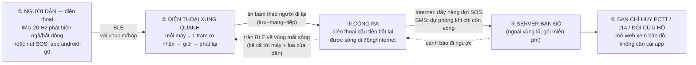

# Kế hoạch nghiên cứu — RescueSOS-Phone: SOS đi theo người trên mạng điện thoại thuần BLE (2026-10-05)

**Ngày lập:** 2026-10-05 · **Trạng thái:** chốt hướng, chờ thực thi
**Thay thế:** phần mạng của [kế hoạch LoRa](ke-hoach-nghien-cuu-rescuemesh-lora.md) (đóng băng, giữ làm hướng dài hạn) ·
[Nghiên cứu chuyển hướng bản 2](nghien-cuu-chuyen-huong-wifi-ve-tinh-2026-10-05.md) (sáng ra kế hoạch này)

---

## 0. Chốt hướng

**D13 (người thực hiện chốt 2026-10-05):** đề tài là **một chuỗi SOS hoàn toàn chạy
trên điện thoại thường, 0 đồng phần cứng**: phát hiện tự động bằng IMU → tin nhảy
BLE từ điện thoại này sang điện thoại kia, **đi theo người di chuyển** (lưu–mang–tiếp)
→ điện thoại đầu tiên bắt lại được sóng tự đẩy tin lên server bản đồ và SMS dự phòng
→ Ban chỉ huy PCTT/đội cứu hộ mở web xem → **cảnh báo chảy ngược lại** qua đúng con
đường đó.

**Một câu định vị:** *"một mạng SOS thiết bị-free cho vùng lũ Việt Nam, trong đó
mỗi chiếc điện thoại là một trạm rơ, SOS tự động do cảm biến sinh ra, và tin đi tới
người cứu hộ bằng cách bám theo chuyển động của chính người dân — được đánh giá
đầu-cuối bằng mô phỏng có hiệu chuẩn và drill thực địa"*. Điểm khác biệt so với
mọi dự án đã sàng lọc (Bảng 1.1, đã xác minh 2026-09-30): **không dự án nào có SOS
tự động do cảm biến**; và chưa ai công bố đánh giá "tin đi theo người nhanh tới đâu"
cho bối cảnh lũ Việt Nam.

**Quy tắc "TÌM ĐÃ, TỰ LÀM SAU" (do người thực hiện đặt):** ưu tiên số một là dùng
thuật toán và mã nguồn **đã có người làm tốt**; chỉ nghiên cứu cái còn trống. Sàng
lọc §3 cho thấy: **thuật toán định tuyến DTN đã có chuẩn học thuật, mã nguồn mở đã
có app chạy thật** → công việc của đề tài là **chọn, hiệu chỉnh cho bối cảnh VN,
đo thật và ghép chuỗi đầu-cuối** — không phát minh lại định tuyến.

---

## 1. Chuỗi đầu-cuối (kiến trúc chốt)

Vai trò từng khâu (mỗi câu một dòng, để giữ đơn giản):

- **① Nạn nhân:** app đã có (`android-g0/`) — IMU phát hiện ngã, nút SOS, toạ độ
  GNSS, đếm ngược 30 s huỷ báo động. Không đổi.
- **② Trạm rơ:** mọi điện thoại cài app trong vùng. Nhận SOS (BLE), lưu bền, phát
  lại cho máy gặp tiếp theo, chống trùng bằng ID khung (thừa kế ý tưởng codec v2.x).
- **③ Cổng ra:** không phải máy chủ — chỉ là điện thoại đầu tiên có sóng. App tự
  động đẩy hàng đợi: Internet khi có, **SMS 1 khung ≤ 160 ký tự khi chỉ còn sóng**.
- **④ Server:** bảng dữ liệu + bản đồ web (gói miễn phí Firebase/Supabase, `SUY`
  về dung lượng đủ demo — kiểm khi dựng).
- **⑤ Người nhận:** Ban chỉ huy PCTT xã/huyện, 114/115, đội cứu hộ — mở trình duyệt.
- **Chiều ngược:** nguồn cảnh báo miễn phí có sẵn — **Google FloodHub (API miễn phí,
  dự báo 7 ngày, phủ cả Mekong — xác minh 2026-10-05)** — server gom → tràn BLE về.

---

## 2. Câu hỏi nghiên cứu và giả thuyết (đặt trước, có đối thủ)

| RQ | Câu hỏi | Loại bằng chứng cần |
|---|---|---|
| **RQ1** | Phát hiện ngã/bất động trên IMU điện thoại: recall bao nhiêu ở ngân sách FAR đặt trước, chia theo người, trên ngã thực? | `DS` + `ĐO` — **kế thừa nguyên trạng** thiết kế T1→T3 và kho dữ liệu đã xác minh (§10.1 kế hoạch LoRa) |
| **RQ2** | Trong 5 thuật toán chuyển tiếp có sẵn (Epidemic, PRoPHET, Spray&Wait, FirstContact, single-copy), thuật toán nào cho PDR/trễ/pin tốt nhất **trên mạng người-mang** với mật độ xóm làng VN? | `SIM` (The ONE + mobility) → `ĐO` hiệu chuẩn |
| **RQ3** | Một tin SOS **rời khỏi xóm trong bao lâu** theo mật độ người và tỉ lệ người di chuyển (đi bộ/xe)? | `ĐO` drill + `SIM` |
| **RQ4** | Khâu cổng ra tốn bao lâu: từ khi có sóng → SOS hiện trên dashboard (Internet) và tới đầu bên (SMS)? | `ĐO` |
| **RQ5** | Trên máy Android phổ biến tại VN (Xiaomi/OPPO/Samsung), app nền BLE sống sót bao lâu và ăn bao nhiêu pin/giờ? | `ĐO` drill — giả thuyết xuất phát: dontkillmyapp ghi Xiaomi/OPPO/vivo giết app hung hãn nhất |
| **RQ6** | Cảnh báo tràn ngược về tới bao nhiêu máy trong bao lâu ở cùng mật độ? | `ĐO` + `SIM` |

**Giả thuyết có đối thủ:**

- **H1 — BLE đủ cho SOS, WiFi không cần.** BLE ~1 Mbps và SOS ≤ vài chục byte ⇒
  nghẽn băng thông không phải vấn đề; nghẽn thật là **sự gặp nhau giữa người**.
  Đối thủ: WiFi Direct/Aware 1 hop nhanh hơn nhưng không đa hop ⇒ chỉ BLE giữ được
  chuỗi trên máy không root. Kiểm bằng drill D1/D2.
- **H2 — Nhiều bản sao giúp PDR nhưng đốt pin; Spray&Wait cân bằng hơn Epidemic.**
  Chuẩn học thuật đã ghi nhận đánh đổi này (IEEE Network 2016, `10.1109/mnet.2016.7437024`).
  Kiểm trên trace drill + mô phỏng; đo pin trên máy thật.
- **H3 — "Người đi chợ" là con đường chính, không phải "hàng xóm đứng gần".**
  Tin rời xóm chủ yếu nhờ người có lý do di chuyển; mật độ đứng yên tăng PDR nội xóm
  nhưng gần như không đổi trễ ra ngoài. Kiểm bằng drill D3 + mobility model.
- **H4 — Nút thắt thực sự là Android nền, không phải sóng BLE.** Trên Xiaomi/OPPO,
  service bị giết làm mạng tê liệt từ nguồn; technical BLE không phải giới hạn
  quyết định. Kiểm bằng đo D4.
- **H5 — SMS là cổng ra tin cậy nhất khi Internet chập chờn; 1 khung SOS đủ 160 ký tự.**
  Kiểm bằng D5 (tỉ lệ giao, độ trễ đầu bên).
- **H7 — (lớp bổ trợ, có điều kiện) phát hiện "chìm/bị cuốn" bằng barometer + IMU.**
  Áp suất nước tăng +9,8 kPa/m (`SUY` vật lý) tạo chữ ký khác hẳn mọi sinh hoạt; cơ chế
  đo sâu dưới nước bằng barometer đã được chứng nhận thương mại ở chuẩn thước lặn
  EN13319 (Apple/Samsung Watch Ultra — xác minh 2026-10-05). **Điều kiện bắt buộc:**
  chỉ chạy trên máy có barometer — **Redmi Note 14 Pro KHÔNG có barometer** (GSMArena,
  xác minh 2026-10-05); máy không có chỉ dùng chữ ký IMU hỗn loạn (yếu hơn, dễ nhầm).
  Kiểm bằng thí nghiệm bồn/bể với máy buộc dây, log áp suất + IMU; chưa qua cổng
  G-H7 thì bỏ khỏi đề tài, không ảnh hưởng phần chính. Đối thủ cạnh: bài báo "người
  trôi trong lũ qua điện thoại" **không tồn tại** (đã tra OpenAlex 4 nhánh — khoảng
  trống thật, nhưng cũng nghĩa là phải tự xây toàn bộ).

**Bài học từ kế hoạch cũ áp nguyên trạng:** mỗi khẳng định phải có nhãn
`DS/SIM/SUY/ĐO/GIẢ ĐỊNH`; so sánh phải ghép cặp theo seed; phát hiện phải báo cáo
theo LOSO và ngân sách FAR (chuẩn y văn: < 9 báo động giả/24 h — Kangas 2012,
`10.1016/j.gaitpost.2011.11.016`, đã xác minh trong sổ cũ).

---

## 3. Sàng lọc "đã có người làm" — mã nguồn & thuật toán (bước đầu tiên của dự án)

Xác minh ngày 2026-10-05 bằng `raw.githubusercontent.com` (HTTP code ghi kèm).
Số sao chỉ là chỉ dấu hoạt động, không phải thước đo khoa học.

| Repo (HTTP) | Là gì | Giấy phép | Dùng cho đề tài |
|---|---|---|---|
| `permissionlesstech/bitchat-android` (200) | App Android BLE mesh, relay đa hop, courier, dual-transport BLE + Nostr khi có Internet | LICENSE.md (200) — GPL-3.0 theo Bảng 1.1 | **Nền vận chuyển**: fork/đọc mã để cài SOS-frame + IMU; GPL-3.0 ⇒ sản phẩm phải mở nguồn tương tự (ghi rõ khi nộp) |
| `permissionlesstech/bitchat` (200) | Bản iOS + kiến trúc "BLE mesh khi offline, Internet khi online" | LICENSE (200) | Tham chiếu kiến trúc cổng ra — đúng mô hình khâu ③ |
| `briar/briar` (200) | App nhắn tin P2P, sync Bluetooth khi mất Internet | LICENSE.txt (200) — GPL-3.0 | Tham chiếu kỹ thuật sync + bảo mật |
| `markqvist/Reticulum` (200) | Stack mạng Python chạy nhiều PHY, có BLE interface | LICENSE (200) | Dùng phía **server/trạm** (không cần app) |
| `akeranen/the-one` (200) | **The ONE — simulator cơ hội chuẩn học thuật**, có sẵn Epidemic/PRoPHET/Spray&Wait/MaxProp + mobility model | LICENSE.txt (200) — kiểm lại điều khoản khi nộp | **Công cụ mô phỏng chính** — không viết simulator mới |
| `NordicSemiconductor/Android-BLE-Library` (200) | Thư viện BLE Android cấp sản xuất, xử lý hàng loạt bug nền | LICENSE (200) | Thư viện BLE cho app thay vì tự xử lý GATT |

**Thuật toán — đã có chuẩn, không phát minh lại:**

| Thuật toán | Bằng chứng nền | Ghi chú |
|---|---|---|
| So sánh toàn diện các giao thức DTN | `10.1109/mnet.2016.7437024` (IEEE Network 2016, 93 trích dẫn) | Khung so sánh RQ2 mượn từ đây |
| Routing xã hội (Bubble Rap) | `10.1145/1288107.1288113` (1160 trích dẫn) | Đối thủ "thông minh" cho H3 |
| Spray & Wait / biến thể thích ứng | `10.1109/access.2019.2904750`; `10.1007/978-3-642-35606-3_8` | Ứng viên chính vì tiết kiệm pin |
| Mạng cơ hội bằng thiết bị người mang | `10.1155/2019/6359806` | Định nghĩa đúng mô hình "tin đi theo người" |

**Mã phát hiện ngã có sẵn (RQ1 — quy tắc "TÌM ĐÃ"):** đã xác minh 2026-10-05 qua
raw.githubusercontent.com:

| Repo (README) | Có gì | Giấy phép | Cách dùng |
|---|---|---|---|
| `kajal1106/Elderly-Fall-Detection-Using-Deep-Learning-Models-LSTM-CNN-Bi-LSTM-and-GRU` (200) | LSTM/CNN/Bi-LSTM/GRU trên MobiAct; README ghi thư mục `/models` **chứa kiến trúc + trọng số đã huấn luyện** | **MIT** (LICENSE 200, đọc bản gốc) | **Baseline khởi động — được cài thử ngay**: tải kiểm file weights thật có tồn tại, fine-tune trên SisFall (±16 g), chấm lại LOSO + FAR budget mới được đưa vào báo cáo |
| `1saifj/Fall-Detection-System-SisFall-Dataset-Raspberry-Pi` (200) | LSTM/CNN-LSTM trên SisFall, triển khai Raspberry Pi | Không thấy file LICENSE (404) | Tham khảo kiến trúc; liên hệ tác giả/xin phép trước khi tái dùng |
| `mandavi-singh/fall-detection-cnn-lstm` (200) | So sánh CNN-LSTM có kiểm soát trên hai kho wearable-IMU | Chưa rõ (LICENSE 404) | Tham khảo phương pháp |

**Quy tắc trung thực cho "cài vào thôi":** trọng số có sẵn là **điểm khởi phát,
không phải kết quả** — (i) các kho huấn luyện đều là ngã diễn tập (tụt 15–40 điểm
trên ngã thật, §1 kế hoạch dữ liệu ngã); (ii) MobiAct dùng điện thoại ±2 g bão hoà
— lệch miền với điện thoại hiện đại ±8/±16 g; (iii) không repo nào công bố đánh
giá LOSO + ngân sách FAR ⇒ phải chấm lại mới được nêu. Mọi "99%" trong README
các repo **cấm trích**.

**Và đây là khoảng trống đề tài nhắm (kiểm lại bằng sổ tìm kiếm trước khi viết):**
1. Chưa có đánh giá công bố của chuỗi **SOS tự động do cảm biến** trên **BLE điện
   thoại thường** ở **Việt Nam** (Bảng 1.1 + sổ cũ).
2. Preprint 2026 `10.2139/ssrn.6428398` (AI ưu tiên tin trên BLE mesh cứu hộ) cho
   thấy hướng AI đang được khai thác — **định vị khác biệt**: bài đó là preprint,
   0 trích dẫn, không có SOS tự động, không có đo thực địa VN; đề tài của ta có cả
   ba. Ghi nhãn preprint, không trích số của nó.
3. Chưa ai đo **tốc độ tin rời khỏi xóm** bằng chuyển động người thật ở VN (RQ3).

---

## 4. Khái quát hệ thống (chương 3 của báo cáo — viết theo thứ tự này)

1. **Kiến trúc 5 khâu + chiều ngược** (§1) — hình gốc của báo cáo.
2. **Khung SOS trên BLE:** kế thừa codec v2.x (toạ độ 24 bit/trục theo 3GPP TS
   23.032 — đã xác minh; HMAC cắt ngắn) nhưng **nới ràng buộc airtime**: BLE MTU
   tới ~244 B nên khung 36 B cũ giữ được và còn dư chỗ trường ưu tiên. Trên BLE
   tài nguyên khan hiếm đổi từ airtime kênh sang **pin + tần suất scan**.
3. **Ngân sách độ trễ 6 chặng** (tính trong §8) — mỗi chặng một mục tiêu số đặt trước.
4. **Bảo mật:** HMAC khung + chống phát lại (nonce/token — kế thừa v2.x); mối đe dọa:
   tin giả SOS, spam vị trí; luật: dữ liệu vị trí cá nhân (§7).
5. **Chính sách pin nền:** foreground service + chế độ tiết kiệm theo % pin; hành
   vi từng hãng (RQ5) là biến nghiên cứu, không phải giả định.

---

## 5. Phương pháp: mô phỏng có sẵn + huấn luyện thực địa

### 5.1 Giai đoạn mô phỏng (0 đồng, thuật toán dùng sẵn)

- **Công cụ:** The ONE (đã cài sẵn 5 thuật toán). **Mobility:** bản đồ xóm thật từ
  OpenStreetMap (miễn phí) — chọn 1 xóm mẫu miền Trung + 1 ấp ĐBSCL; mô hình người
  đi chợ/đi làm bằng `ShortestPathMapBasedMovement` + lịch theo giờ.
- **Đầu ra:** PDR + P95 trễ + số bản sao cho 5 thuật toán × 3 mật độ người/km²
  (20/60/150) × 3 tỉ lệ người di chuyển (10/30/60 %), ghép cặp theo seed ≥ 30 lượt.
- **Quy tắc cũ giữ nguyên:** mọi bảng `SIM`, không hiệu chuẩn thì không kết luận.

### 5.2 Giai đoạn huấn luyện / drill thực địa (0 đồng phần cứng, 6–10 điện thoại)

Chuỗi drill **theo khoảng cách có log** (đóng luôn thiếu sót D1 của nhật ký cũ):

| Drill | Câu hỏi | Số đo |
|---|---|---|
| **D1 — Tầm hop** | BLE thực giữa 2 máy: ngoài trời/nhà/người cản/máy ướt (mưa giả lập) | PDR theo khoảng cách, log đầy đủ → biến `SUY` thành `ĐO` |
| **D2 — Truyền đứng yên** | 1 máy bấm SOS, 5–9 máy quanh: tin tới hết mạng trong bao lâu? | PDR, P50/P95 trễ, số bản sao |
| **D3 — Người mang tin** | 1 người cầm SOS đi bộ/xe máy ra khỏi xóm tới điểm có sóng | **Thời gian rời xóm** — số RQ3, chưa ai công bố cho VN |
| **D4 — Nền Android** | App nền chạy 12 h trên Xiaomi + OPPO + Pixel/Samsung, màn hình tắt | Tỉ lệ sống sót service, pin/giờ (H4, RQ5) |
| **D5 — Cổng ra** | Có sóng: đẩy hàng đợi qua Internet và SMS thật tới đầu bên | Độ trễ, tỉ lệ giao (RQ4, H5) |
| **D6 — Tràn ngược** | Đăng cảnh báo, đo thời gian tới hết mạng | RQ6 |

Kết quả drill dùng **hiệu chuẩn simulator** (G2-S) rồi mới chạy ma trận lớn.

---

## 6. AI — chỉ vào sau khi chuỗi đạt (đúng yêu cầu "trước khi qua bước AI")

| # | AI | Điều kiện vào | Đối thủ bắt buộc |
|---|---|---|---|
| **A1** | **Triage SOS:** gom trùng theo vị trí/thời gian, xếp ưu tiên (số máy cùng khu = độ tin cậy), phát hiện bất thường (SOS dồn ảo) | Chuỗi đạt G3-S | So với không-gom và so với ngưỡng cứng; nhãn `SIM`→`ĐO` |
| **A2** | **Chọn người mang tin học theo lịch người dùng** (ai hay đi chợ giờ nào) → tin ưu tiên chờ ở máy đó | Drill D3 có dữ liệu | So với PRoPHET/Spray&Wait trên cùng trace — không có so sánh thì không được nêu (quy tắc báo cáo hiện hành) |
| **A3** | Phần IMU (RQ1) là AI có sẵn của đề tài — giữ nguyên lộ trình T1→T3 | — | LOSO + FAR budget |
| **A4** | **H7 — phân lớp "chìm/bị cuốn"** (barometer + IMU), chạy trên máy có barometer | Cổng G-H7: thí nghiệm bồn/bể máy buộc dây phản ánh đúng độ sâu | So với chữ ký IMU-churn đơn thuần; FAR budget như RQ1 |

Định vị trung thực: A1 đã có preprint (§3) — khác biệt của ta là **SOS tự động +
đo thực địa VN + đánh giá đầu-cuối**, và mọi đối thủ phải chạy lại trên **dữ liệu
của ta**.

---

## 7. Riêng Việt Nam (bằng chứng xác minh 2026-10-05, truy cập qua WebSearch)

| Số liệu | Giá trị | Nguồn | Ghi chú trích |
|---|---|---|---|
| Smartphone | **80,3 % dân số**; di động 87,3 % (2025) | Bộ TT&TT, qua An ninh Thủ đô / Baomoi | Mở bài gốc trước khi trích chính thức |
| Mục tiêu nhà nước | 100 % người trưởng thành có smartphone (QĐ 805/QĐ-TTg 2024) | Công báo QĐ 805 | Đọc bản gốc khi viết |
| Hệ điều hành | Android ~66 % / iOS ~34 % | StatCounter (qua tổng hợp) | Kiểm lại số tháng cụ thể trên `gs.statcounter.com` khi nộp |
| App nền bị giết | Xiaomi/OPPO/vivo hung hãn nhất; Pixel/Nokia tốt nhất | dontkillmyapp.com (nguồn cộng đồng) | Dùng làm **giả thuyết H4**, chấm bằng drill D4 |
| Cảm biến máy | **Redmi Note 14 Pro không có barometer** (sensor: vân tay, gia tốc, con quay, la bàn, tiệm cận); Pixel 6 Pro có — kiểm lại trên GSMArena khi nộp | GSMArena (mở trang spec) | H7/A4 chỉ bật trên máy có barometer; app phải **giảm cấp mượt** khi thiếu |
| Cảnh báo lũ miễn phí | **Google FloodHub**: API miễn phí, dự báo 7 ngày, phủ Mekong | blog.google + trang FloodHub | Chiều ngược ④→① không tốn tiền |
| Khí hậu/địa cư | Mưa nhiệt đới: suy hao 2,4 GHz nhỏ nhưng **da/máy ướt** giảm tầm BLE (`SUY` — phải `ĐO` ở D1); xóm làng đông người ⇒ lợi thế mật độ cho mạng người-mang | Phân tích đề tài | Không trích "BLE tầm 100 m" từ blog |
| Văn bản neo | Thông tư 14/2025/TT-BKHCN — khi mất mạng công cộng, liên lạc cấp xã dựa vệ tinh + vô tuyến (đã xác minh 2026-10-01) | Bản gốc | Đề tài bổ sung lớp "vô tuyến = BLE của người dân" |
| Tổng đài | 113/114/115 + số Ban chỉ huy xã cấu hình được; nghi có hợp nhất về 112 | Cần kiểm lại khi nộp | Không trích số hợp nhất chưa xác minh |
| Dữ liệu cá nhân | Vị trí là dữ liệu cá nhân — **Nghị định 13/2023/NĐ-CP `chưa đọc bản gốc`** — đọc trước WP dashboard | Việc còn thiếu | Bắt buộc trước khi demo thu vị trí thật |

---

## 8. HIỆU QUẢ CUỐI CÙNG (bảng KPI — mục tiêu đặt trước, chấm bằng `ĐO`)

> Đây là bảng người thực hiện yêu cầu thấy rõ. Cột "mục tiêu" là `TK` (thiết kế,
> đặt trước khi đo); sau drill sẽ có cột "đạt/DOI" điền bằng `ĐO`. **Không đạt mục
> tiêu nào → thu hẹp phạm vi tuyên bố tương ứng, không bỏ bảng.**

**Ngân sách độ trễ đầu-cuối (kịch bản chuẩn: xóm ~60 máy trong bán kính 500 m,
1 ca ngã, 1 người đi chợ sau 15 phút):**

| Chặng | Đo gì | Mục tiêu | Nhãn đích |
|---|---|---|---|
| ① Phát hiện | ngã → SOS tạo | ≤ 10 s (kể cả đếm ngược huỷ) | `ĐO` (T1–T3) |
| ② Truyền nội xóm | SOS tới ≥ 80 % máy xóm | ≤ 5 phút | `ĐO` D2 |
| ③ Rời xóm | SOS tới điểm có sóng | ≤ 30 phút (người đi bộ/xe) | `ĐO` D3 + `SIM` |
| ④ Cổng ra | SOS hiện trên dashboard | Internet ≤ 1 phút; SMS ≤ 5 phút | `ĐO` D5 |
| **Tổng** | **ngã → Ban chỉ huy thấy** | **≤ 45 phút** ở kịch bản chuẩn; **≤ 15 phút** khi xóm có ≥ 1 máy đã có sóng | `ĐO` |

**KPI hệ thống:**

| KPI | Mục tiêu | Đối chiếu |
|---|---|---|
| PDR 1 giờ (kịch bản chuẩn) | ≥ 0,80 | `SIM` + drill D2/D3 |
| Báo động giả phát hiện ngã | ≤ 1/ngày/người (chuẩn y văn < 9/24 h — Kangas 2012) | `ĐO` T1–T3, LOSO |
| Pin tiêu hao app nền | ≤ 5 %/giờ trên máy tham chiếu; service sống ≥ 12 h trên Xiaomi/OPPO | `ĐO` D4 |
| Cảnh báo tràn ngược | ≥ 90 % máy nhận trong ≤ 10 phút | `ĐO` D6 |
| Số bản sao trung bình mỗi SOS giao | tối ưu giữa Epidemic và single-copy (Spray&Wait N=4 làm điểm neo) | `SIM` |
| Chi phí thêm cho người dân | **0 ₫ phần cứng; chỉ cài app** | Thiết kế |

---

## 9. Lộ trình và cổng (không mua bất cứ thứ gì)

| WP | Việc | Cổng | Nếu không đạt |
|---|---|---|---|
| **WP0** | Đọc mã bitchat-android + The ONE; dựng pipeline The ONE với map xóm OSM | **G0-S:** simulator chạy, 5 thuật toán xuất bảng | Học thêm 1 tuần, thử lại |
| **WP1** | App: fork transport, cài SOS-frame + foreground service + hàng đợi cổng ra | **G1-S:** 2 máy bấm SOS → nhận nhau thật | Dùng thư viện Nordic, tái thử |
| **WP2** | Drill D1+D2+D4 (tầm hop, truyền, pin nền) | **G2-S:** có số `ĐO` đầu tiên + hiệu chuẩn sim | Thu hẹp phạm vi (nói rõ) |
| **WP2b** *(tuỳ chọn)* | Thí nghiệm bồn/bể H7: máy buộc dây, log áp suất + IMU, đo qua túi chống nước | **G-H7:** barometer phản ánh đúng độ sâu + FAR đạt ngân sách | **Bỏ H7/A4 khỏi đề tài** — phần chính không phụ thuộc |
| **WP3** | Drill D3+D5+D6 (người mang tin, cổng ra, tràn ngược) + RQ1 T1–T3 | **G3-S:** chuỗi đầu-cuối chạy trên ≥ 6 máy | Giữ báo cáo ở mức mô phỏng |
| **WP4** | Ma trận mô phỏng lớn + hiệu chuẩn bằng drill | **G4-S:** bảng RQ2/RQ3 hoàn chỉnh, nhãn đúng | — |
| **WP5** | **AI (A1, A2)** — chỉ vào đây | G5-S: có đối thủ trên cùng dữ liệu | Bỏ A2, giữ A1 đơn giản |
| **WP6** | Viết báo cáo + tái lập một lệnh | G-G11 kế thừa | — |

**Chi phí:** 0 ₫ phần cứng. Tốn duy nhất thời gian + (tuỳ chọn) VPS/server khi cần
chạy thật liên tục.

---

## 10. Sổ tìm kiếm (2026-10-05)

**Công cụ:** WebSearch (harness, hoạt động phiên này), `research_tools/oa.py`
(OpenAlex), Crossref, `curl raw.githubusercontent.com`.

**Truy vấn chính:** "epidemic spray and wait PRoPHET routing delay tolerant network
comparison" · "Bluetooth Low Energy smartphone disaster communication offline mesh" ·
"human mobility trace opportunistic network routing evaluation real" · "Việt Nam tỷ
lệ sử dụng smartphone dân số 2025" · "dontkillmyapp Xiaomi OPPO vivo kill background
apps" · "Vietnam Android iOS mobile OS market share 2025" · "Google FloodHub flood
forecasting Vietnam Mekong coverage free" · "barometer smartphone water depth
measurement flood" · "drowning detection wearable sensor IMU accelerometer" ·
"avalanche buried victim barometer detection" (không kết quả liên quan) ·
"github fall detection SisFall CNN LSTM pretrained weights model code release" ·
"Redmi Note 14 Pro barometer sensor specifications" · "Apple Watch Ultra depth
gauge barometer water EN13319". Repo GitHub xác minh bằng README+LICENSE
qua raw (7 repo mesh/DTN + 3 repo phát hiện ngã; qaul không tìm thấy đường dẫn
đúng — kiểm lại).

**CRAWDAD (`crawdad.org`) HTTP 000 — không mở được** ⇒ trace Haggle/Cambridge chỉ
nêu là "chuẩn ngành", không trích link tới khi mở được.

**Số liệu CẤM dùng:**

| Số liệu | Vì sao cấm |
|---|---|
| "BLE tầm 100 m" hoặc bất kỳ tầm nào từ blog | Chỉ nhận `ĐO` drill D1 của đề tài |
| Số sao GitHub làm thước đo chất lượng | Quy tắc cũ — chỉ chỉ dấu hoạt động |
| KPI/số từ preprint SSRN 2026 (`10.2139/ssrn.6428398`) | Chưa bình duyệt, 0 trích dẫn — chỉ dùng định vị |
| Android/iOS 66/34 % lấy cứng | Tổng hợp qua kết quả tìm kiếm; phải mở StatCounter lấy tháng cụ thể |
| "FloodHub phủ 100 % VN" | Chỉ khẳng định theo trang/blog Google đã mở; kiểm sông cụ thể khi dùng |
| Độ trễ/băng thông SMS "tiêu chuẩn 160 ký tự" | Đúng với GSM 7-bit; **tiếng Việt có dấu** là UCS-2 ⇒ 70 ký tự — phải đo, không trích |
| Giá VPS/server | Không có ngày + nguồn thì không ghi |
| Bất kỳ KPI nào ở §8 | Là mục tiêu `TK` đặt trước — tuyệt đối không viết lại thành "kết quả" trước khi có `ĐO` |
| Accuracy/trong README các repo phát hiện ngã (kể cả repo có weights) | Chia tập theo cửa sổ trên ngã diễn tập — không so sánh được với LOSO; trọng số có sẵn chỉ là baseline |
| H7 trước cổng G-H7 | Cấm đưa vào tóm tắt đề tài/tuyên bố trước khi thí nghiệm bồn đạt; bài "avalanche + barometer" không tồn tại — không trích |

---

## 11. Bản đồ với tài liệu cũ

| Tài liệu | Trạng thái |
|---|---|
| Kế hoạch LoRa (RQ1–RQ6, codec, simulator, cổng) | **Kế thừa RQ1 nguyên trạng** (IMU/T1–T3/kho ngã); phần mạng đóng băng; codec v2.x tái dùng ý tưởng khung; sổ xác minh + quy tắc báo cáo giữ nguyên hiệu lực |
| Chuyển hướng bản 2 (ESP-NOW) | ESP-NOW chuyển thành **mở rộng tuỳ chọn sau WP6** (nút nút đỏ cố định) — không phải đường chuẩn nữa |
| Phụ lục vệ tinh | Chiều ngược có thể dùng nguồn cảnh báo FloodHub; terminal vệ tinh vẫn là mở rộng dài hạn |
| `android-g0/` + `station/` | **Kích hoạt lại làm trung tâm** — app là cả cảm biến lẫn trạm rơ |
| Bảng 1.1 (10 dự án so sánh) | Vẫn chuẩn định vị; thêm bitchat đã có SOS? — **không** (chat thủ công), kiểm lại khi viết chương 1 |
