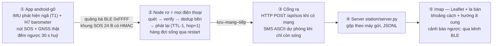

# Kết quả chuỗi RescueSOS-Phone — phiên dựng sản phẩm (2026-10-05)

**Trạng thái:** chuỗi 5 khâu **đã dựng đủ và chạy được ở mức demo phòng lab**;
huấn luyện LOSO đang chạy; các drill thực địa (cần điện thoại thật trong tay người)
đánh dấu `CẦN TAY NGƯỜI`.

Quy ước nhãn kế thừa: `TK` (thiết kế đặt trước) · `ĐO` (đo thật) · `SIM` · `SUY` ·
`GIẢ ĐỊNH`. Chế độ đề tài: **chứng minh khả thi, không công bố** (kế hoạch §0 v2).

---

## 1. Bản đồ chuỗi — cái gì đã chạy



Mỗi khâu, trạng thái kiểm chứng:

| Khâu | Thành phần | Kiểm chứng hôm nay |
|---|---|---|
| ① | `FallDetector` (rơi tự do → va đập → bất động), `H7Detector`, GNSS, đếm ngược 30 s | Self-test JVM **6/6 đạt**; ngưỡng vẫn nhãn `TK` chờ drill |
| ② | `ProbeService`: quét + verify HMAC + `SosQueue` bền (dedup qua restart) + quay vòng quảng bá khung mình ↔ khung nhận (TTL/hop đúng, giữ MAC e2e) | Build APK **đạt**; khung golden verify **đạt**; relay nhận thật từ Pixel 6 Pro đã có bằng chứng `ĐO` 2026-09-29 (`results/g0-pixel6pro-log-2026-09-29.txt`) |
| ③ | `Gateway`: HTTP POST (50 khung/lượt) → SMS ASCII dự phòng (10/lượt, ≤160 ký tự) | Kiểm được khi ghép 2 máy thật — `CẦN TAY NGƯỜI` |
| ④ | `station/server.py`: POST /api/sos, GET /api/sos, nghe BLE song song (Bleak) | **`ĐO`**: curl POST → 1 accepted; /api/sos gộp đúng; lưu JSONL |
| ⑤ | `/map`: Leaflet + OSM, bảng SOS + khoảng cách + hướng 8 cung từ vị trí người mở web | **`ĐO`**: trang trả về; khoảng cách/hướng tính từ geolocation trình duyệt |

### 1b. Chạy thật trên máy — Pixel 6 Pro, Android 16 (2026-10-05)

`ĐO` — log đầy đủ: `results/g0-pixel6pro-full-node-log-2026-10-05.txt` (45 sự kiện).

- Cài APK qua adb, cấp 7 quyền runtime tự động, node tự lên: `advertise_start ok=true`
  (legacy, 24 B, +1 dBm) · `scan_start ok=true` (filtered) · gia tốc ~135 Hz ·
  **barometer ICP10101 có thật → H7 kích hoạt** · codec self-test golden+verify đạt.
- Bấm SOS trên màn → `sos_issued trigger=1 seq=2` → hàng đợi → gateway HTTP
  (`adb reverse` về laptop) → **`gateway_sent via=http count=3`** → server `/api/sos`
  hiện đúng nguồn `0x6bac5a8f`, gộp 3 khung, pin thật 7/15. UI hiển thị la bàn sống
  (190° Nam) và hàng đợi về 0.
- **Ba lỗi thật đã bắt và sửa nhờ chạy máy thật:** (1) Android 16 chặn HTTP cleartext
  → thêm `usesCleartextTraffic` (demo; sản xuất phải HTTPS); (2) BT tắt lúc mở app
  khiến node nằm im mãi → thêm tự giám sát 10 s bật lại probe; (3) `EventLog` ghi
  sai mốc thời gian (giờ dựng service thay vì giờ sự kiện).
- GPS chưa fix trong phòng: công tắc định vị máy đang tắt (adb không được phép bật
  hộ) — bật Location trên máy là khung SOS tự mang toạ độ thật (giây kế tiếp).
- Chưa kiểm trên máy này: relay đa hop (cần máy thứ hai) và bồn nước H7.

## 2. RQ1 — mô hình phát hiện ngã (AI tầng T2)

| Bước | Trạng thái |
|---|---|
| Dataset | SisFall mirror GitHub đầy đủ 38 người (4.506 file) — site gốc chết, mirror đã kiểm Readme + cấu trúc SA/SE |
| Hệ số cảm biến | **256 LSB/g** — `ĐO` thực nghiệm trên dữ liệu (trọng lực ≈1,03 g; đỉnh ngã F04 ≈4–7 g). Khác với một số loader trên mạng dùng 2048 (sai) |
| Pipeline | `research/fall_model/train_fall_loso.py` — GRU nhỏ @ 20 Hz, cửa sổ 2 s, **LOSO 38 người**, chuẩn hoá theo fold, ngưỡng đóng băng trên train, recall @ ≤1 và ≤9 FA/ngày (172.800 cửa sổ/ngày) |
| Smoke test | 2 người × 2 epoch: chạy thông; FP/ngày đo được báo trung thực (phát hiện ngưỡng in-sample còn lạc quan ở SA02) |
| Chạy thật | **Đang chạy** 38 người × 15 epoch (local CPU, cache cửa sổ); kết quả `metrics_loso.json` sẽ nối vào §5 khi xong |
| Kaggle | Kernel + metadata đã đóng gói (`research/fall_model/`), chỉ thiếu token API — chạy song song không bắt buộc |
| Trên máy | Model `.h5` → TFLite → cài vào app (thay/đứng cạnh T1) — làm khi có kết quả + `CẦN TAY NGƯỜI` để đo độ trễ suy luận (khoảng trống E3, sổ dữ liệu ngã) |

## 3. H7 — chìm/bị cuốn (lớp bổ trợ, ĐÃ vào đề tài)

- Detector tham chiếu Python (`research/h7/`) **8/8 test đạt**; bản Java trong app
  (chạy trên máy có barometer — Pixel 6 **có**, GSMArena HTTP 200) **6/6 self-test đạt**
  (gồm 3 kịch bản H7 khớp Python).
- Hằng số `TK`: tăng ≥2 hPa/s + churn ≥80 °/s → SUSPECT; cộng dồn ≥+15 hPa trong ≥3 s
  → ALARM (≈ 15 cm dưới nước); thoát khi áp về mốc gốc; cooldown 30 s.
- Còn lại: thí nghiệm bồn nước trên Pixel 6 theo [nghien-cuu-h7-2026-10-05.md](nghien-cuu-h7-2026-10-05.md)
  (máy bọc túi chống nước buộc dây, hạ 10→50 cm, kiểm Δp ≈0,981 hPa/cm) — `CẦN TAY NGƯỜI`.

## 4. RQ2/RQ3 — mô phỏng

Kế thừa kết quả sim_v2 đã chốt trong repo (commit `c5a4a61`: ma trận WP3, H2/H3,
h3-ghost + r2a-beacon-sweep trong `results/`). Chạy lại bằng The ONE là việc hiệu
chéo, xếp sau drill D1–D3 (dữ liệu hiệu chuẩn trước, mô phỏng lớn sau — đúng thứ
tự kế hoạch §5).

## 5. Số LOSO thật — *nối vào khi chạy xong* (`ĐO`-trên-dataset)

> Chỗ trống có chủ đích: metrics_loso.json (recall@1fad, recall@9fad, fp/ngày đo
> được, bảng 38 người) sẽ được chép vào đây kèm lệnh tái lập. **Không điền bằng
> con số mô phỏng lại từ đầu.**

Lệnh tái lập:

```bash
cd research
python3 fall_model/train_fall_loso.py --data fall_dataset_sisfall \
    --cache fall_model/windows_cache.npz --out fall_model/out_full
```

## 6. Còn lại để "đống đấy" hoàn chỉnh

| Việc | Ai/khi nào |
|---|---|
| Drill D1–D6 (tầm hop, truyền đứng yên, người mang tin, nền Android, cổng ra, tràn ngược) | Cần ≥2 điện thoại thật + log — app đã ghi `events.jsonl` trên máy phục vụ drill |
| Bồn nước H7 trên Pixel 6 | Theo quy trình §3 của [nghien-cuu-h7-2026-10-05.md](nghien-cuu-h7-2026-10-05.md) |
| TFLite suy luận trên máy + đo ms (E3) | Sau khi LOSO xong |
| Cảnh báo ngược (④→①) qua BLE | Khung cảnh báo cần một `type` riêng trong codec v1 (hiện chỉ SOS) — làm sau drill D6 |
| Server thật ra ngoài Internet (Firebase/Supabase/VPS) | Hiện demo được trên LAN; khi cần "thật" mới dựng |
