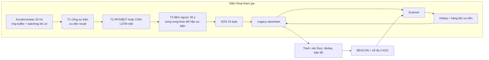

# Thiết kế hệ thống chi tiết — RescueMesh-AI v1.0

> ## ⚠️ TÀI LIỆU LỊCH SỬ — ĐÃ CHUYỂN HƯỚNG NGÀY 2026-10-01
>
> Thiết kế v1.0 dưới đây dùng **BLE legacy advertising**. BLE đã bị loại vì tầm
> quá ngắn; dự án nay dùng **một loại sóng duy nhất là LoRa** và không còn điện
> thoại trong vòng lặp. Đặc tả khung, lớp liên kết và kiến trúc dưới đây **không
> còn là đường chuẩn**.
>
> - Thiết kế hiện hành: [thiet-ke-he-thong-lora-v2.md](thiet-ke-he-thong-lora-v2.md)
> - Kế hoạch hiện hành: [ke-hoach-nghien-cuu-rescuemesh-lora.md](ke-hoach-nghien-cuu-rescuemesh-lora.md)
> - Nhật ký quyết định: [xac-minh-nguon-lora-va-quyet-dinh-song.md](xac-minh-nguon-lora-va-quyet-dinh-song.md)
>
> **Còn hiệu lực và được kế thừa:** thiết kế phát hiện ngã T1→T2→T3 (§5), mô hình
> an ninh và ngân sách khoá (§7), mô hình mối đe dọa, kỷ luật bằng chứng.
> **Không còn hiệu lực:** codec 24 byte, giả định ATT/MTU, quy tắc chuyển tiếp
> trên BLE advertising, cấu hình quét nền Android.

**Ngày chốt:** 2026-09-28  
**Trạng thái:** **đã chốt để bắt đầu nghiên cứu**; G0 đạt một phần trên Pixel 6 Pro ngày 2026-09-29, chưa có kết quả phát hiện ngã hoặc đo pin.  
**Codec tham chiếu:** [`rescuemesh/packets.py`](rescuemesh/packets.py)  
**Kiểm thử:** [`rescuemesh/test_packets.py`](rescuemesh/test_packets.py)

Các nhãn dùng trong tài liệu:

| Nhãn | Nghĩa |
|---|---|
| `NC` | Có nguồn sơ cấp hoặc tài liệu chính thức đã mở |
| `TK` | Quyết định thiết kế của đề tài |
| `ĐO` | Phải đo trước khi kết luận |
| `DS` | Kết quả sẽ lấy từ phân tích kho dữ liệu |
| `SIM` | Kết quả sẽ lấy từ mô phỏng |

---

## 1. Kết luận rà soát và các sửa đổi bắt buộc

Thiết kế cũ có nền tảng tốt nhưng chưa thể đóng băng vì trộn hai đường truyền BLE khác nhau. ATT/GATT MTU 23 chỉ liên quan đến dữ liệu trong **kết nối GATT**; gói SOS của thiết kế lại được phát như **advertising không kết nối**. Bản v1.0 chốt lại như sau:

1. **Đường truyền chuẩn là BLE legacy advertising không kết nối**, không phải GATT. Android cho phép tối đa 31 byte advertising data (`NC`); khi tính 3 byte Flags và 4 byte của AD structure manufacturer-specific, ngân sách bảo thủ cho giao thức là **24 byte** (`TK`, phải kiểm trên máy thật).
2. **SOS cố định 24 byte**, giữ `srcID` 32 bit, rút thời gian từ 16 xuống 8 bit modulo 256 phút và tăng HMAC từ 32 lên **64 bit**. Không còn cần thương lượng MTU.
3. **ACK là 4 byte đầu của tag HMAC của chính sự kiện SOS**, không dùng `srcID_low16` hoặc `srcID + seq`. Khóa ACK chỉ cần duy nhất trong tập SOS đang hoạt động.
4. **T1 không được tuyên bố chạy miễn phí trên sensor hub.** Android công khai sensor batching và significant-motion, nhưng không có API phổ quát để lập trình luật “rơi tự do rồi va đập” vào sensor hub. Đường chuẩn phải đọc accelerometer liên tục 20 Hz trong foreground service, dùng FIFO/batching khi thiết bị có hỗ trợ, và đo pin.
5. **T3 chạy song song với đếm ngược**, không nối tiếp. Ngay khi T2 vượt ngưỡng, hệ thống bắt đầu đếm ngược 30 giây và đồng thời quan sát 10–20 giây hậu sự kiện. Độ trễ thiết kế vì thế khoảng 30 giây thay vì 40–50 giây.
6. **FAR chỉ được tính trên thời lượng không-ngã liên tục** (false alarms/person-hour hoặc person-day). Dữ liệu chỉ gồm cửa sổ ngã không thể dùng để suy FAR/ngày.
7. **Vai trò cảm biến và vai trò relay có thể đồng thời.** Mọi điện thoại tham gia đều relay; một nút có thể bật thêm đường phát hiện ngã. Không còn giả định “nạn nhân không chuyển tiếp”.

---

## 2. Kiến trúc đã chốt



### 2.1 Vai trò logic

| Vai trò | Chức năng |
|---|---|
| `PARTICIPANT` | Phát hiện ngã **và** relay |
| `RELAY_ONLY` | Relay, không đọc IMU; dùng cho tình nguyện viên hoặc máy chuyên dụng |
| `STATION` | Phát beacon, xác thực SOS, xếp ACK, dựng bản đồ |

Thiết bị có thể đổi `PARTICIPANT ↔ RELAY_ONLY`; `STATION` là vai trò riêng. Mục tiêu đánh giá là Android. iOS nằm ngoài phạm vi.

---

## 3. Lớp liên kết BLE

### 3.1 Cấu hình nền

| Mục | Quyết định | Nhãn |
|---|---|---|
| Phương thức | Legacy advertising, không kết nối, không scan response | `TK` |
| Kích thước on-air advertising data | tối đa 31 byte | `NC` |
| AD structure | manufacturer-specific; ID `0xFFFF` chỉ dùng trong lab | `TK` |
| Dữ liệu giao thức | tối đa 24 byte | `TK`/`ĐO` |
| Extended advertising | tối ưu tùy chọn, không được dùng làm điều kiện hoạt động | `TK` |
| GATT/MTU | không dùng trong đường SOS v1 | `TK` |
| Android runtime | foreground service kiểu `connectedDevice`; quyền scan/advertise | `NC`/`TK` |
| Android scan | Bắt buộc dùng `ScanFilter`; không dùng unfiltered scan cho chế độ màn hình tắt | `NC`/`ĐO` |

`0xFFFF` là lựa chọn thử nghiệm, không phải company identifier để phát hành sản phẩm. Bản triển khai công khai phải có mã hợp lệ hoặc một phương án định danh dịch vụ được Bluetooth SIG cho phép.

Android chính thức dừng unfiltered BLE scan khi màn hình tắt để tiết kiệm pin.
Đường nhận v1 vì vậy phải gọi overload có danh sách `ScanFilter`. Trong lab,
filter theo manufacturer ID và golden SOS đã tiếp tục nhận khi màn hình tắt;
bản sản xuất phải định nghĩa bộ filter bao phủ SOS, HEARTBEAT và BEACON, rồi
kiểm tra trên từng model. Foreground service một mình không thay thế yêu cầu này.

### 3.2 Cổng khả thi G0

Trước mọi tuyên bố về mesh, mỗi mẫu điện thoại phải qua bài thử:

- scan có filter và advertise đồng thời khi màn hình bật/tắt;
- cập nhật payload quảng bá mà không làm mất chuỗi nhận kéo dài;
- nhận đúng 24 byte ứng dụng;
- duy trì foreground service sau 1 giờ;
- ghi PDR, độ trễ khám phá, nhiệt độ và mức pin;
- ghi rõ model, chipset, Android API, chế độ tiết kiệm pin và quyền hệ thống.

Kết quả G0 đầu tiên trên Pixel 6 Pro/API 36: advertiser legacy 100 ms tiếp tục
chạy khi màn hình tắt. Unfiltered scan nhận 0 gói trong 60 giây màn hình tắt;
sau khi thêm manufacturer-data filter, máy nhận và so khớp byte-for-byte 4
golden SOS trong 60 giây. Đây là kiểm tra khả thi một chiều laptop → Pixel,
không phải ước lượng PDR vì chưa đo số gói phát thực và chỉ có một máy thu.

Thiết bị không qua G0 bị ghi là **không được hỗ trợ**, không được che bằng extended advertising hay GATT.

---

## 4. Đặc tả khung v1

### 4.1 Header chung — 3 byte

| Byte | Bit | Trường |
|---|---|---|
| B0 | 7–6 | `ver=1` |
| B0 | 5–3 | `type`: 0 SOS, 1 HEARTBEAT, 2 BEACON |
| B0 | 2–1 | `prio`: 3 SOS, 2 BEACON, 1 HEARTBEAT |
| B0 | 0 | dự trữ |
| B1 | 7–4 | TTL |
| B1 | 3–0 | hop tới trạm; 15 = chưa biết |
| B2 | 7–0 | sequence của nguồn; với BEACON là `bseq` |

B1 được relay sửa. Với SOS/HEARTBEAT, HMAC đầu-cuối xác thực B0, B2 và body nhưng **không** xác thực B1. Đây là giới hạn có chủ đích; tấn công sửa TTL/hop bởi kẻ ngoài phạm vi là một threat còn mở.

### 4.2 SOS — đúng 24 byte

| Trường | Byte | Ghi chú |
|---|---:|---|
| Header | 3 | như trên |
| `srcID` | 4 | HMAC(khóa máy, ngày UTC), cắt 32 bit |
| `time8` | 1 | phút modulo 256; trạm khôi phục thời điểm gần nhất |
| latitude | 3 | offset nhị phân toàn dải, ~1,19 m/LSB |
| longitude | 3 | offset nhị phân toàn dải, ~2,39 m/LSB ở xích đạo |
| `need` | 1 | `[trigger:2][people:3][need:3]` |
| `state` | 1 | `[battery:4][gps_fix:2][moving:1][rsv:1]` |
| tag | 8 | HMAC-SHA256 cắt 64 bit |
| **Tổng** | **24** | vừa ngân sách quảng bá |

`time8` không được dùng làm lý do duy nhất để bỏ SOS: đồng hồ thiết bị có thể sai khi mất mạng. Thời gian nhận tại trạm là mốc chính; `time8` chỉ hỗ trợ sắp thứ tự và phát hiện replay. Một SOS hoạt động giữ nguyên `srcID`, `seq`, body và tag qua nửa đêm cho tới khi ACK hoặc hết hạn 60 phút.

Khóa dedup: tag 64 bit. Khóa ACK: 4 byte đầu của tag. Xác suất đụng ACK phải được tính theo **số SOS đồng thời**, không theo tổng số nút.

### 4.3 HEARTBEAT — 18 hoặc 23 byte

| Trường | Byte |
|---|---:|
| Header | 3 |
| `srcID` | 4 |
| `cell` | 2 |
| `[battery:4][k:4]` | 1 |
| một hàng xóm `[id32][rssi8]` | 0 hoặc 5 |
| tag HMAC | 8 |

Mỗi heartbeat chỉ mang tối đa một hàng xóm; nút xoay vòng danh sách qua nhiều chu kỳ. Thiết kế cũ mang tới sáu hàng xóm nhưng không thể nằm trong một quảng bá legacy và không có chiến lược phân mảnh rõ ràng.

### 4.4 BEACON — 16, 20 hoặc 24 byte

| Trường | Byte |
|---|---:|
| Header (`seq=bseq`) | 3 |
| `stationID` | 2 |
| `time8` | 1 |
| flags | 1 |
| `nAck` | 1 |
| ACK token | 4 × n, n ≤ 2 |
| tag HMAC mạng | 8 |

Beacon tại trạm được xác thực bằng khóa mạng. Relay phải kiểm tra, cập nhật hop/TTL và ký lại beacon. Do mọi relay biết khóa mạng, một nút tham gia bị chiếm có thể giả beacon; đây là giới hạn của mô hình khóa dùng chung.

Chính sách ACK:

- token lấy từ SOS đã được trạm xác thực;
- ưu tiên SOS cũ nhất;
- beacon 30 giây khi rỗi, 5 giây khi hàng ACK không rỗng;
- mỗi token lặp 3 beacon rồi loại, hoặc loại sớm sau 30 phút;
- nạn nhân dừng phát lại khi thấy token của mình trong beacon hợp lệ.

---

## 5. Phát hiện ngã T1 → T2 → T3

### 5.1 Thu thập cảm biến

- Accelerometer chuẩn: **20 Hz**, một nguồn duy nhất để tương thích nhiều kho dữ liệu.
- Gyroscope là nhánh phụ; không được dùng trong mô hình chính nếu tập kiểm tra không có gyro.
- Duy trì ring buffer ít nhất 6 giây.
- Yêu cầu batching/FIFO khi có, nhưng không giả định sensor hub thực thi luật T1.
- Đo công suất riêng cho: sensor-only, T1, T1+T2 và toàn hệ thống.

### 5.2 T1 — cổng sự kiện ưu tiên recall

T1 không phải bộ phân loại. Ngưỡng được chọn **chỉ trên tập huấn luyện của từng fold** từ lưới đã đăng ký trước, với mục tiêu recall ứng viên cao và số lần đánh thức thấp. Lưới ban đầu:

- peak magnitude: 1,1–2,5 g;
- free-fall: 0,3–0,7 g;
- khoảng free-fall → impact: 0,25–2,0 giây.

Hai nhánh `impact OR (free-fall → impact)` được so sánh. Không khóa cứng 0,4 g/2,5 g trước dữ liệu vì ngã thực có thể có biên độ thấp.

### 5.3 T2 — mô hình

Hai họ được so sánh ngang hàng:

1. RF/GBDT với đặc trưng thời gian trên cửa sổ 4 giây quanh ứng viên;
2. CNN-LSTM int8 trên cùng tín hiệu và cửa sổ.

Chia tập theo người, không chia ngẫu nhiên cửa sổ. Tiền xử lý, chọn ngưỡng và hiệu chỉnh xác suất phải nằm bên trong fold để tránh rò rỉ.

### 5.4 T3 — xác nhận và UX

```text
T2 < theta_low:
    bỏ ứng viên

theta_low <= T2 < theta_high:
    bắt đầu đếm ngược 30 s ngay
    cần bằng chứng bất động/đổi tư thế trong 10–20 s đầu
    người dùng có thể hủy

T2 >= theta_high:
    bắt đầu đếm ngược 30 s ngay
    chuyển động không tự hủy; chỉ người dùng hủy

hết 30 s:
    sinh SOS
```

T3 cảm biến có thể đánh giá trên chuỗi hậu sự kiện đủ dài. Hiệu quả của nút “hủy” chỉ được báo cáo sau nghiên cứu người dùng; không được suy từ dataset và không được tính vào FAR thuật toán.

---

## 6. Định tuyến và trạng thái

### 6.1 Gradient

Nút nhận beacon hợp lệ từ hàng xóm có hop `h`, đặt candidate hop `h+1`. Tuyến hết hạn sau 3 chu kỳ beacon. So sánh sequence 8 bit phải dùng số học modulo, không so sánh số nguyên thông thường.

Khi nhận SOS:

```text
nếu tag đã thấy trong 5 phút: bỏ
nếu TTL = 0: bỏ
nếu my_hop < packet_hop:
    chờ jitter, sửa TTL-1 và hop=my_hop, rồi phát
ngược lại:
    lưu tối đa 60 phút và thử lại khi tuyến đổi
```

Store-and-forward có hàng đợi hữu hạn. Khi đầy: bỏ HEARTBEAT trước, rồi BEACON cũ; không bỏ SOS mới để giữ heartbeat.

#### 6.1.1 Phát hiện từ mô phỏng WP1 (2026-09-30)

Mô hình `rescuemesh/sim_v2.py` chỉ ra **bốn điểm đặc tả phải bổ sung**, vì nếu không thì gradient không chạy được như thiết kế. Cả bốn đều đã kiểm chứng bằng test tự động.

**a. Beacon phải được relay — và phải relay ĐỊNH KỲ, nhưng chỉ bởi relay được chọn.** Đây là chuỗi phát hiện tốn nhiều vòng sửa nhất, và mỗi bước đều có số đo:

| Cách làm | PDR (n=100, 5 SOS) | Beacon phát | Kết luận |
|---|---:|---:|---|
| Không relay beacon (chỉ trạm phát) | 0,05 | 2 | Sai: chỉ hàng xóm trạm có tuyến |
| Relay chỉ khi hop **được cải thiện** | 0,00 | 166 | Sai: mỗi nút chỉ phát beacon **một lần trong đời**, nút xa không bao giờ có tuyến |
| Relay **mọi nút, mọi chu kỳ** | — | bùng nổ | Sai: chi phí O(n²), mô phỏng không kết thúc |
| Relay chọn theo `hop % stride` | 0,00 | 30 | Sai: hop lẻ bị bỏ, beacon đứt ngay tầng đầu (nút hop 1 không relay) |
| **Relay chọn theo `node % stride`, mỗi chu kỳ** | **1,00** | **1.050** | **Đúng** |

Ba kết luận phải đưa vào đặc tả:

1. **Beacon phải được relay**, nếu không thì gradient không tồn tại ngoài vùng phủ của trạm.
2. **Relay theo chu kỳ, không phải một lần.** Điều kiện "chỉ relay khi hop tốt hơn" nghe hợp lý nhưng sai: nó làm mỗi nút phát beacon đúng một lần, nên nút vào mạng muộn hoặc ở xa vĩnh viễn không có tuyến.
3. **Chọn relay theo chỉ số nút, KHÔNG theo hop.** Đây là bẫy tinh vi: chọn `hop % stride == 0` khiến các tầng hop lẻ không có relay nào, và beacon đứt ngay từ tầng 1. Đúng như §6.4 điểm 1 nói "chỉ cho các relay **được chọn** phát lại" — nhưng tiêu chí chọn phải độc lập với chính giá trị đang lan truyền.

Sau khi sửa cả ba, gradient lần đầu **thắng flooding trên cả hai chỉ số** cùng lúc:

| Chiến lược | PDR | Beacon phát | Phát/SOS | Jain |
|---|---:|---:|---:|---:|
| flood / trickle / managed | 0,600 | 2.616 | 956,0 | 0,600 |
| **gradient** | **0,800** | 2.624 | **674,0** | **0,714** |
| gradient + store-carry-forward | 0,600 | 2.616 | 956,0 | 0,600 |

Gradient giao **nhiều hơn 33 %** số nguồn với **29 % ít lần phát hơn**. Đây là bằng chứng ủng hộ H2 mạnh nhất tính tới nay — nhưng vẫn là `SIM` chưa hiệu chuẩn, và vẫn chỉ đúng ở warm start.

**Chi phí beacon là vấn đề mở.** 2.624 lần phát beacon so với ~674 lần phát dữ liệu nghĩa là **control plane chiếm gần 80 % tổng lưu lượng**. Đối thủ R2a của H2 ("khác biệt chỉ do beacon overhead bị tính sai") vì thế trở nên rất đáng lo: nếu beacon interval được nới từ 2 s lên giá trị thực tế hơn (30 s theo §4.4), toàn bộ kết luận có thể đảo. **Phải quét beacon interval** như một biến thí nghiệm riêng trước khi kết luận H2.

**Hạn chế của luật chọn relay theo chỉ số nút — phải ghi rõ.** Chọn relay bằng `node % stride` giữ chi phí tuyến tính, nhưng nó **phụ thuộc topology**: vì stride bỏ qua một số nút, có vùng không còn relay nào và bị cô lập khỏi gradient. Đo được trực tiếp: với cùng một topology và cùng `hop = 4`, nguồn 5 giao được (PDR 1,0) nhưng nguồn 10 và 15 thì không (PDR 0,0). Tính chất **cùng hop, khác kết quả** này là điều không được phép xảy ra trong một thiết kế gradient đúng nghĩa — nó có nghĩa là "khoảng cách tới trạm" không còn là yếu tố duy nhất quyết định khả năng giao.

Ba lựa chọn, phải chọn có ý thức và đo:

| Lựa chọn | Ưu | Nhược |
|---|---|---|
| `stride = 1` (mọi nút relay) | Mọi nguồn reachable đều giao được; gradient đúng nghĩa | Chi phí beacon O(n²) |
| `stride` theo chỉ số nút | Chi phí tuyến tính | Phụ thuộc topology; cô lập một số vùng |
| Chọn theo **pin/rank** như §6.4 nói | Đúng thiết kế; không phụ thuộc topology | Cần mô hình pin, chưa có |

**Khuyến nghị:** v1.0 nên chọn relay theo **rank + pin** (đúng §6.4 điểm 1) thay vì theo chỉ số nút. Trong mô phỏng hiện tại, `stride` chỉ là xấp xỉ tạm, và **phải là biến thí nghiệm** — không được cố định giá trị rồi báo cáo như thể đó là thiết kế.

**Test bảo vệ:** `rescuemesh/test_sim_v2.py` có ba test ghi lại toàn bộ chuỗi phát hiện này (`test_beacon_is_relayed_periodically_not_once`, `test_relay_stride_can_isolate_some_regions`, `test_relay_stride_one_reaches_all_reachable_sources`), để các lỗi đã sửa không tái phát.

**b. Nguồn phát SOS với `hop = HOP_UNKNOWN (15)`, không phải hop thật của nó.** Nếu nguồn phát bằng hop thật, quy tắc `my_hop < packet_hop` sẽ chặn oan các hàng xóm **xa trạm hơn** nguồn. Xét nguồn ở hop 2 có hàng xóm hop 1 và hop 3: hàng xóm hop 1 relay được, nhưng gói không bao giờ tới được nhánh hop 3. Nguồn phải phát với `hop = 15` để **mọi** hàng xóm gần trạm hơn đều đủ điều kiện. APK hiện phát `hop = 7` — nằm giữa hai cực, nên chặn một phần mà không rõ lý do.

**c. Phải phân biệt cold start và warm start.** Đây là phát hiện quan trọng nhất. Nếu SOS được phát ở `t = 0` cùng lúc beacon bắt đầu, các nút **chưa có tuyến** và gradient gần như vô dụng. Kết quả mô phỏng (100 nút, 20 SOS, PDR liên kết 0,95):

| Chế độ | Flood PDR | Gradient PDR | Gradient phát/SOS |
|---|---:|---:|---:|
| Cold start (SOS ở t=0) | 0,250 | **0,050** | 179,0 |
| Warm start (SOS sau 10 s) | 0,250 | **0,250** | **35,0** |

Ở cold start, gradient **tệ hơn flooding 5 lần** về PDR. Ở warm start, gradient **ngang PDR và rẻ hơn 2,8 lần** về số lần phát. Nghĩa là: câu hỏi "gradient có tốt hơn flooding không" **không có câu trả lời duy nhất** — nó phụ thuộc hoàn toàn vào việc mạng đã hội tụ chưa. Mọi bảng so sánh từ nay **phải ghi rõ chế độ khởi động**. Đây cũng là một kịch bản thực tế quan trọng: trong bão lũ, sự cố xảy ra ngay khi mạng vừa dựng, tức cold start là trường hợp **thường gặp**, không phải ngoại lệ.

**d. Hàng đợi ưu tiên thuần theo `prio` không đủ — cần round-robin theo `srcID`.** Đặc tả §6.4 điểm 5 đã yêu cầu điều này, nhưng chưa có ở đâu trong code. Mô phỏng cho thấy fairness Jain giảm mạnh theo tải ở mọi chiến lược:

| n nút | SOS đồng thời | Jain (flood) | Jain (gradient) |
|---:|---:|---:|---:|
| 100 | 5 | 0,888 | 0,663 |
| 100 | 50 | 0,129 | 0,284 |
| 200 | 100 | **0,054** | 0,121 |

Ở 200 nút với 100 SOS đồng thời, Jain = 0,054 nghĩa là tình trạng gần như **một nguồn chiếm gần hết** kênh — đúng cái mà §6.4 điểm 5 lo ngại. Hàng đợi ưu tiên theo `prio` một mình **không** sửa được, vì mọi SOS đều cùng `prio = 3`.

**Hệ quả cho H2:** dự đoán "gradient tiết kiệm phát ở mật độ trung bình và cao" **được xác nhận**, nhưng chỉ trong chế độ warm start. Ở cold start, dự đoán **bị bác** — và đây là kết quả phủ định có giá trị, đúng loại mà §14 gọi là "ít nhất một kết quả phủ định được kiểm chứng độc lập".

**Hệ quả cho H3:** cơ chế route expiry đã hiện thực trong `sim_v2.py`, nhưng ma trận chưa tách được hiệu ứng "bóng ma đường" khỏi hiệu ứng "trạm sập ngừng nhận". Cần thiết kế lại ô thí nghiệm cho H3 trước khi kết luận.

### 6.2 Dự phòng khi không có gradient

So sánh ba chiến lược, cùng một trace kênh và seed:

- flooding thuần có TTL;
- Trickle có kiểm soát;
- gradient + store-and-forward, rơi về Trickle khi route hết hạn.

Các giá trị `Imin`, `Imax`, `k`, beacon interval và jitter là biến thí nghiệm, không phải kết quả. Beacon overhead luôn được tính vào chi phí phát.

### 6.3 Phát lại SOS

Backoff ban đầu: 5, 10, 20, 40, 60 giây, sau đó 60 giây cho tới ACK hoặc 60 phút. Mỗi “lần phát” trong mô phỏng phải ánh xạ tới số advertising events thật sau hiệu chuẩn G0/WP4; không được giả định một API call bằng một gói on-air.

### 6.4 Rà soát thuật toán và quyết định v1.0

Rà soát tài liệu chuẩn và nghiên cứu về mạng quảng bá cho thấy không có một thuật toán duy nhất giải quyết đồng thời mạng dày có nhiều SOS, mạng thưa mất đường liên tục và mạng có một trạm đích. v1.0 dùng một tổ hợp có vai trò rõ ràng:

1. **Managed flooding có kiểm soát** là lớp truyền cơ sở. Bluetooth Mesh dùng message cache và TTL để ngăn gói lặp vô hạn, đồng thời chỉ cho các relay được chọn phát lại. RescueMesh mượn nguyên lý, không sao chép Bluetooth Mesh Profile: cache là `tag` SOS, TTL nằm trong header, và relay được chọn theo rank/khả năng pin. Xem [Bluetooth Mesh Managed Flooding](https://www.bluetooth.com/mesh-directed-forwarding/) và [Mesh Protocol Specification](https://www.bluetooth.com/wp-content/uploads/Files/Specification/HTML/MshPRT_v1.1/out/en/index-en.html).

2. **Gradient theo trạm** là lớp định hướng. Trạm phát beacon, mỗi nút tính `rank`/hop tới trạm và giữ tối đa hai candidate relay có rank thấp hơn. Đây là phiên bản tối giản lấy cảm hứng từ DODAG/rank của RPL; không triển khai toàn bộ RPL vì BLE advertising-only không có kênh unicast ổn định. Xem [RFC 6550](https://www.rfc-editor.org/info/rfc6550/) và [RFC 6552](https://www.rfc-editor.org/info/rfc6552/).

3. **Trickle** chỉ dùng cho beacon và thông tin điều khiển: mạng ổn định thì giảm phát, topology thay đổi thì tăng phát. Trickle không thay thế hàng đợi SOS vì không có chính sách ưu tiên cứu hộ. Nguồn nền là [RFC 6206](https://datatracker.ietf.org/doc/rfc6206/).

4. **Store-carry-forward** là đường dự phòng khi không có candidate relay. Nút giữ SOS trong hàng đợi và chuyển khi gặp thiết bị mới hoặc khi một thiết bị di động tiến gần trạm. Đây là nguyên lý DTN/Bundle Protocol, xem [RFC 9171](https://www.rfc-editor.org/rfc/rfc9171.html). PRoPHET chỉ là hướng nghiên cứu sau; nó cần lịch sử gặp nhau và trao đổi thông tin giữa các node, không phù hợp làm đường tối thiểu v1.

5. **Chống broadcast storm khi nhiều nguồn cùng phát:** mỗi relay chỉ giữ một candidate chính và một candidate dự phòng; cả hai chờ jitter, relay nghe thấy bản sao cùng `tag` thì hủy lượt phát. Hàng đợi dùng ưu tiên SOS nhưng phải phục vụ lần lượt các nguồn khác nhau để một nguồn không chiếm toàn bộ kênh. Đây là biến thể có hướng của các cơ chế counter/distance-based broadcast, không phải flooding tự do.

**Quyết định v1.0:** không dùng RIP/OLSR/AODV đầy đủ; giữ `gradient + managed flooding + store-carry-forward`, với Trickle cho control plane. Đường phát vẫn là broadcast ở radio layer, nhưng số relay được phép phát lại bị giới hạn ở logic ứng dụng.

**Giới hạn phải ghi rõ:** cơ chế trên chưa chứng minh được 100 SOS đồng thời. Thí nghiệm phải bổ sung tải 1/5/20/50/100 SOS, mô hình collision, radio queue, fairness và tail latency. Không được dùng SIM-SMOKE hiện tại để tuyên bố khả năng chịu tải; simulator hiện chưa có collision, mobility, beacon overhead hoặc pin.

---

## 7. Mô hình an ninh

Mô hình triển khai mặc định là một cộng đồng đã đăng ký trước thảm họa:

- mỗi thiết bị có khóa riêng với trạm để ký SOS/heartbeat;
- mọi relay có khóa mạng để xác thực và ký lại beacon;
- HMAC 64 bit chống giả mạo ngẫu nhiên tốt hơn bản 32 bit cũ;
- không mã hóa vị trí; người nghe gần có thể đọc metadata;
- relay không xác thực được SOS trước khi chuyển tiếp, nên spam RF/DoS chủ động chưa được giải quyết;
- nút có khóa mạng bị chiếm có thể giả beacon;
- hop/TTL của SOS không nằm trong MAC đầu-cuối.

Do đó hệ thống chỉ tuyên bố **toàn vẹn SOS tại trạm và xác thực beacon với thành viên chưa bị chiếm**. Không tuyên bố chống nghe lén, chống jammer, non-repudiation hoặc hoạt động mở cho thiết bị chưa đăng ký.

---

## 8. Thiết kế nghiên cứu đã khóa

### 8.1 RQ và chỉ số

| RQ | Chỉ số chính | Đơn vị độc lập |
|---|---|---|
| RQ1 phát hiện | sensitivity sự kiện ở FAR định trước | người tham gia |
| RQ2 định tuyến | PDR, P95 latency, transmissions/delivered SOS | topology/seed |
| RQ3 codec/an ninh | kích thước, xác suất collision/forgery, interoperability | thiết bị/cấu hình |
| RQ4 đầu-cuối | P50/P95 từ impact đến station log; pin/giờ | phiên đo/thiết bị |

FAR sơ cấp: false alarms trên 24 person-hours của dữ liệu không-ngã liên tục. Sensitivity ngã thực báo cáo riêng theo sự kiện; không gộp hai mẫu số.

### 8.2 Phát hiện ngã

- Staged: SisFall làm tập phát triển chính; ít nhất một kho ngoài miền để kiểm tra.
- Ngã thực: FARSEEING/FFF chỉ dùng khi có quyền truy cập hợp lệ và trace đủ dài.
- FARSEEING công bố dữ liệu gồm 10 phút trước và ít nhất 10 phút sau nhiều sự kiện, nhưng tập đầy đủ cần đề xuất hợp tác; không được ghi như dữ liệu tải tự do.
- FFF có dữ liệu theo dõi dài hạn; 690 cửa sổ 4 giây trong một nghiên cứu là tập ứng viên sau threshold, không phải 690 ca ngã.
- CI bootstrap phải resample theo người, không theo cửa sổ.
- Báo cáo cả đường cong sensitivity–FAR, không chỉ accuracy/F1.

### 8.3 Mô phỏng mạng

- Thiết kế lặp ghép cặp: cùng topology, mobility và trace mất gói cho mọi thuật toán.
- Tách `radio availability/scan duty`, thu vật lý và collision; không dùng một PDR
  Bernoulli độc lập duy nhất sau giai đoạn smoke.
- Có kịch bản Wi-Fi active, Bluetooth audio và khác biệt device/OS; hiệu ứng chỉ
  lấy từ G0-S hoặc nguồn ngoài có ghi rõ phạm vi, không trộn số board với smartphone.
- Số seed tăng tuần tự cho tới khi CI 95% của chênh lệch chỉ số chính đạt độ rộng đặt trước; 30 seed là mức khởi đầu, không phải bảo đảm power.
- Kịch bản: 20/50/100/200 nút; tĩnh/đi bộ; tải 1/5/20 SOS đồng thời; trạm hoạt động/sập/khôi phục.
- Comparator mobility có limited-copy/spray-and-wait; không so nó trong topology
  tĩnh như thể cùng giả định contact với flood/Trickle/gradient.
- Kiểm soát âm: không trạm phải có PDR=0; TTL=1 không được giao qua hơn một relay; PDR=1 ở đồ thị nối đầy và kênh không mất.
- Mô hình PDR chỉ được gọi là “hiệu chuẩn” sau khi fit trên đo điện thoại và báo RMSE/độ bất định.

### 8.4 Các cổng

| Cổng | Điều kiện |
|---|---|
| G0 link | scan+advertise đồng thời, payload 24 byte và chạy màn hình tắt trên toàn bộ tập thiết bị được tuyên bố hỗ trợ |
| G1 codec | vector cố định, round-trip, tamper, fuzz, mọi khung ≤24 byte |
| G2 detection | đánh giá theo người; sensitivity thực và FAR free-living tách đúng mẫu số |
| G3 network | simulator qua kiểm soát âm và mô hình kênh đã hiệu chuẩn |
| G4 claims | mỗi kết luận ánh xạ tới `DS`, `SIM` hoặc `ĐO` |
| G5 reproducibility | một lệnh sinh lại bảng/hình từ manifest phiên bản hóa |

---

## 9. Những gì đã hoàn thành và phần nghiên cứu tiếp theo

### Đã hoàn thành

- Chốt lớp liên kết advertising-only và loại MTU khỏi đường SOS.
- Chốt codec SOS 24 byte, ID 32 bit, HMAC 64 bit, ACK token 32 bit.
- Chốt giới hạn heartbeat một hàng xóm và beacon hai ACK.
- Chốt T3 song song, sửa định nghĩa FAR và vai trò nút.
- Codec tham chiếu có HMAC thật; không còn `fake_mac`.

### Thứ tự nghiên cứu

1. G1 đa ngôn ngữ đã có Python ↔ Java/Android; nếu ứng dụng sản phẩm dùng Kotlin,
   Kotlin phải đọc cùng vector thay vì tạo codec thứ ba khác chuẩn.
2. Chạy G0-S theo lịch block/random hóa trên ít nhất hai model Android khác hãng.
3. Nâng simulator từ smoke lên mô hình scan duty/collision/interference, rồi hiệu
   chuẩn bằng G0-S và kiểm tra trên các phiên giữ lại.
4. Kiểm tra quyền truy cập/giấy phép FARSEEING, FFF và SisFall.
5. Chạy baseline T1+RF trước; chỉ huấn luyện CNN-LSTM sau khi pipeline chia người và FAR đúng.
6. Chạy so sánh mạng sau khi có đường PDR đo thực; mọi kết quả trước đó chỉ là smoke test.

---

## 10. Nguồn chính đã đối chiếu trong lần chốt

- Android `BluetoothLeAdvertiser`: tối đa 31 byte advertising data; extended advertising phải kiểm khả năng thiết bị.
- Bluetooth LE Primer: legacy advertising tối đa 31 octet và là transport không ACK; extended advertising là cơ chế khác.
- Android sensor batching: tiết kiệm năng lượng phụ thuộc FIFO/sensor hub thực có trên thiết bị; accelerometer 50 Hz là ví dụ batching, không phải bảo đảm T1 chạy trong hub.
- Klenk et al. 2016, FARSEEING: hơn 200 ca ngã thực đã xác minh; dữ liệu đầy đủ theo cơ chế hợp tác, không phải tải mở toàn bộ.
- Palmerini et al. 2020: 143 ca ngã thực, sensitivity >80% và 0,56 false alarm/giờ cho mô hình tốt nhất.
- Villa & Casilari 2025: CNN-LSTM 20 Hz tốt nhất trên thí nghiệm của họ; có kiểm tra FARSEEING, FFF và theo dõi bảy ngày, nhưng kết quả đó không thay thế đánh giá độc lập của đề tài.
- RFC 6206 (Trickle) và RFC 6550 (RPL): nguồn nền cho đối chứng, không phải bằng chứng rằng gradient sẽ thắng trong mạng điện thoại BLE.
- Siva et al. 2019, DOI `10.1016/j.procs.2019.08.011`: đo discovery, PDR,
  năng lượng và Wi-Fi interference trên Android connectionless BLE.
- Tsai et al. 2021, DOI `10.1109/ACCESS.2021.3129251`: năm smartphone phát/quét
  legacy advertising đồng thời; scan duty và Bluetooth audio chi phối mất gói.
- Rathje & Landsiedel 2022, DOI `10.1109/LCN53696.2022.9843509`: đối chứng
  store-and-forward BLE/DTN; code tham khảo hiện xác nhận trên nRF52/Zephyr.

Chi tiết DOI và sổ xác minh nằm tại [`xac-minh-nguon-va-tai-lieu-tham-khao.md`](xac-minh-nguon-va-tai-lieu-tham-khao.md).
