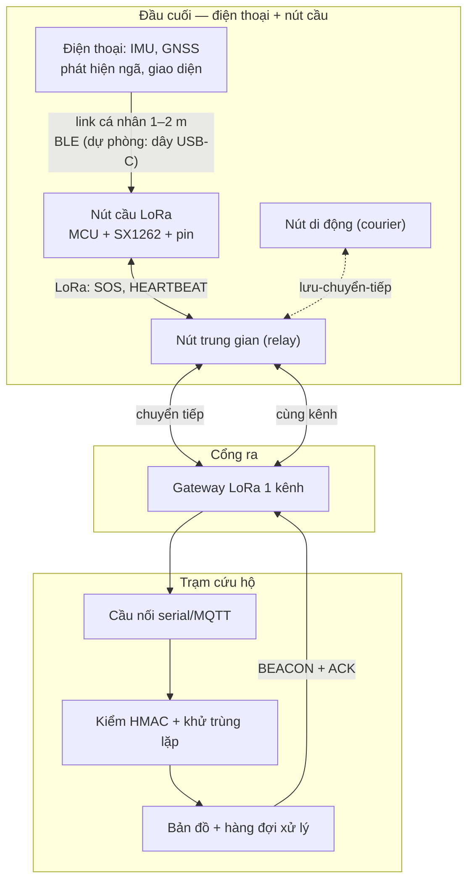
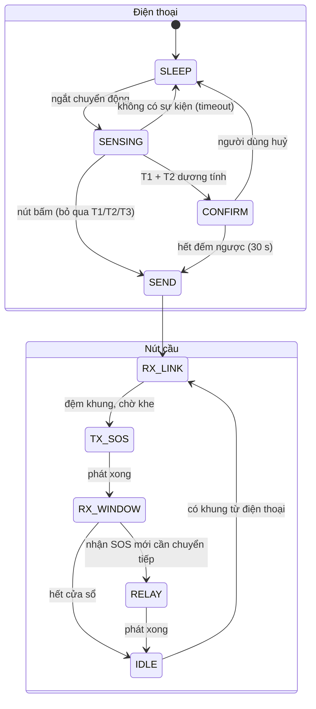

# Thiết kế hệ thống — RescueMesh-LoRa v2.0

**Ngày chốt:** 2026-10-01
**Trạng thái:** đặc tả khung đã đóng băng; codec, mô hình vật lý và ngân sách năng
lượng đã có mã tái lập; **chưa có kết quả `ĐO` nào**.
**Thay thế:** [Thiết kế BLE v1.0](thiet-ke-he-thong-chi-tiet.md) (lịch sử).
**Kế hoạch:** [Kế hoạch nghiên cứu RescueMesh-LoRa](ke-hoach-nghien-cuu-rescuemesh-lora.md)
**Nhật ký quyết định:** [nguồn đã xác minh & ma trận chọn sóng](xac-minh-nguon-lora-va-quyet-dinh-song.md)

Nhãn dùng trong tài liệu:

| Nhãn | Nghĩa |
|---|---|
| `NC` | Có nguồn sơ cấp/tiêu chuẩn đã mở |
| `TK` | Quyết định thiết kế của đề tài (không cần nguồn ngoài) |
| `SUY` | Suy ra từ công thức, tái lập được bằng script trong repo |
| `GIẢ ĐỊNH` | Giả định kỹ thuật, phải kiểm trước khi kết luận |
| `ĐO` | Chỉ có sau khi đo trên thiết bị thật |

---

## 1. Kiến trúc tổng thể

Năm vai trò logic. **Mạng cứu hộ nói đúng một loại sóng LoRa** trên **một kênh**;
điện thoại nối với nút cầu của chính nó bằng một **link cá nhân** 1–2 m không tham
gia chuyển tiếp:

| Vai trò | Nhiệm vụ | Ràng buộc |
|---|---|---|
| **Điện thoại (đầu cuối)** | Đọc IMU, phát hiện ngã/bất động, tạo SOS, giao diện, GNSS | Pin điện thoại; hạn chế chạy nền của Android |
| **Nút cầu LoRa** | Nhận khung từ điện thoại, phát vào mesh, chuyển tiếp, đệm khi mất link | Pin rất nhỏ; airtime; **không** có GNSS/IMU/màn hình |
| Trung gian thuần LoRa | Chuyển tiếp có kiểm soát, giữ cache khử trùng lặp | Không được phát thừa |
| Di động (courier) | Mang gói qua vùng chia cắt (DTN) | Không đảm bảo đường liên tục |
| Gateway | Cầu nối mesh ↔ trạm; phát BEACON/ACK | Một kênh, là nút thắt sức chứa |
| Trạm | Xác thực, khử trùng lặp, hiển thị | Không phụ thuộc Internet |

**Hai quyết định `TK` của kiến trúc:**

1. **Không dùng LoRaWAN.** LoRaWAN là hình sao-of-sao với gateway điều khiển toàn bộ
   lịch; ở đây cần **chuyển tiếp nhiều hop** và **lưu-chuyển-tiếp** khi không có
   đường tới gateway — việc LoRaWAN không làm ở tầng mạng. Vì vậy giao thức là tùy
   biến trên lớp vô tuyến LoRa thô.
2. **Link cá nhân không phải một phần của mạng.** Nó chỉ nối một điện thoại với nút
   cầu của chính nó trong tầm 1–2 m; nút cầu **không** chuyển tiếp lưu lượng của
   điện thoại khác. Nhờ vậy mạng vẫn thuần LoRa và không tái sinh vấn đề "tầm ngắn"
   đã loại BLE.

---

## 2. Đầu cuối: điện thoại và nút cầu

### 2.1 Khối phần cứng

**Điện thoại (đã có sẵn, không cần chế tạo):** IMU (gia tốc ± gyro), GNSS, màn hình,
loa/rung, nút bấm trên màn hình, pin. Vai trò: T1/T2/T3, tạo khung SOS, giao diện huỷ
báo động. **Đây là lý do chọn kiến trúc này:** không phải cấp phát thiết bị cho từng
người dân, và kho dữ liệu ngã công khai (thu bằng điện thoại) áp dụng trực tiếp.

**Nút cầu LoRa (chế tạo):**

| Khối | Chức năng | Ghi chú thiết kế |
|---|---|---|
| MCU + radio | ESP32-S3 + SX1262 (hoặc tương đương) băng 920–923 MHz | Ngủ sâu giữa các sự kiện |
| Link cá nhân | BLE tới điện thoại | Ăng-ten nhỏ; xem §2.3 |
| Nút bấm cứng | SOS thủ công **khi điện thoại chết/hết pin** | Độ dự phòng quan trọng, gần như miễn phí |
| Còi/LED | Phản hồi trạng thái (đã gửi / đã được ACK) | Giúp người dùng biết tin đã đi |
| Nguồn | Pin nhỏ (LiPo ~1.000–2.000 mAh) hoặc 18650 | Ngân sách ở §2.5 |
| **Không có** | GNSS, IMU, màn hình | Đã có trong điện thoại → giảm BOM và giảm dòng tiêu thụ |

### 2.2 Máy trạng thái

Trạng thái **phát hiện** chạy trên điện thoại; trạng thái **phát/chuyển tiếp** chạy
trên nút cầu. Hai máy trạng thái nối nhau qua link cá nhân:

Bốn quy tắc bắt buộc:

1. **Nút bấm không bao giờ bị chặn** bởi tầng phát hiện tự động — kể cả trên điện
   thoại, và có thêm một **nút bấm cứng trên nút cầu** để dự phòng khi điện thoại chết.
2. **Đếm ngược 30 giây có còi + rung** để người dùng huỷ; đây là đánh đổi có chủ đích
   giữa độ trễ và báo động giả, phải báo cáo riêng phần luật và phần máy.
3. **GNSS do điện thoại cung cấp**, bật theo sự kiện; nút cầu **không** có GNSS nên
   khung SOS gửi kèm toạ độ điện thoại lấy được (hoặc đánh dấu `has_gps_fix = 0`).
4. **Nút cầu đệm khung bền** (flash) ngay khi nhận từ điện thoại: nếu link cá nhân
   đứt vì Android tắt màn hình, SOS **không** bị mất mà được phát sau.

### 2.3 Link cá nhân: BLE hay dây USB-C

| Tiêu chí | BLE (mặc định) | Dây USB-C (dự phòng) |
|---|---|---|
| Thêm sóng thứ hai? | **Có** — nhưng chỉ 1–2 m, không chuyển tiếp | Không (dây không phải vô tuyến) |
| Có sẵn trên điện thoại? | Có, mọi máy | Không phải máy nào cũng có OTG, và phải cấp quyền USB |
| Độ trễ / độ tin cậy | Thấp nhưng **phụ thuộc chính sách chạy nền của Android** | Rất ổn định, nhưng phải cắm dây |
| Trải nghiệm người dùng | Nút cầu đeo trong túi, không cần thao tác | Vướng dây, dễ tuột khi chạy/ngã |
| Nguồn | Nút cầu tự có pin | Có thể lấy điện từ điện thoại (tốn pin điện thoại) |
| Rủi ro | Mất kết nối khi tắt màn hình, đông thiết bị BLE → **RQ6 đo** | Hỏng cổng/đứt dây khi va đập |
| Thông số AOSP (`NC`) | Connection interval (bội số 1,25 ms): HIGH **11,25–15 ms**, BALANCED 30–50 ms, LOW_POWER 100–125 ms; supervision timeout 5 s | Host mode cấp nguồn bus (khó sạc đồng thời); FTDI latency timer mặc định 16 ms |
| Độ trễ suy ra (`SUY`) | Một trao đổi ATT đo được **676,7 µs** (Gomez 2012); nếu thương lượng MTU lớn → 1 connection event ≈ **12–15 ms**; nếu MTU mặc định 23 B thì 36 B cần 2–3 gói ⇒ **≈ 25–45 ms** | USB-C: chưa có bài bình duyệt đo độ trễ/độ tin cậy trên Android |
| Ràng buộc chạy nền (`NC`) | Scan duty cycle 10 % (LOW_POWER) và **5 % khi tắt màn hình**; quota 5 lần startScan/30 s; scan timeout 30 phút (A13) → **10 phút (A14/15)**; FGS type `connectedDevice` (A14+) **không** bị timeout 6h/24h; kết nối **đóng khi process bị kill** | Phải dùng foreground service + nút cầu đệm bền |
| Đuôi trễ khi đông (`NC`) | Cấu hình 44 peripheral/4 master: **140–160 ms ở CCDF 10⁻⁴** (IEEE VTC2023) — dùng làm kịch bản xấu, không phải giá trị điển hình | Ảnh hưởng p95/p99 chứ không phải p50 |

**Khuyến nghị `TK`:** mặc định **BLE**, vì cự ly cần thiết chỉ 1–2 m nên lý do "tầm
ngắn" đã loại BLE khỏi vai trò mạng **không áp dụng**; đồng thời giữ đường USB-C như
phương án B để trả lời câu hỏi phản biện "tuyệt đối một công nghệ vô tuyến". RQ6 phải
đo cả hai đường trên cùng kịch bản.

### 2.4 Ba chính sách nghe của nút cầu (cơ sở của giả thuyết H5)

Vì chỉ có **một kênh**, nút không thể vừa ngủ vừa nhận lệnh xuống. Ba chính sách
phải được cài và đo:

| Chính sách | Mô tả | Nhận được gì | Mất gì |
|---|---|---|---|
| `tx_only` | Chỉ thức khi phát, không nghe | Không | Không ACK, không gradient (buộc dùng flooding) |
| `windowed` | Cửa sổ nghe ngắn sau khi phát + đồng bộ beacon thưa (ví dụ 1 trong N beacon) | ACK cho chính mình, hop count định kỳ | Bỏ lỡ beacon giữa hai cửa sổ |
| `continuous` | Nghe liên tục | Gần đủ ACK/beacon | Tuổi thọ pin giảm khoảng 80 lần (`SUY`) |

**Quyết định `TK`:** mặc định là `windowed`; `continuous` chỉ dùng ở gateway và ở
nút trung gian cắm điện; `tx_only` là nhánh đối chứng trong thí nghiệm.

**Hệ quả đã kiểm bằng `SIM` (E1) — phải đọc trước khi chốt chính sách:** `windowed`
chỉ thức 1,5–7,4 % thời gian nhưng **PDR rơi từ 0,762 xuống 0,029**, còn `tx_only`
cho **PDR = 0**. Nguyên nhân không chỉ là bỏ lỡ ACK/beacon: **nút ngủ không chuyển
tiếp được dữ liệu của người khác**, nên mạng mất luôn các đường relay. Vì vậy cửa sổ
nghe phải đủ để **tham gia chuyển tiếp**, không chỉ để nhận lệnh xuống. Việc phải làm
ở WP9/WP10: quét `rx_window_s` × `sync_window_s` × chu kỳ đồng bộ để tìm **cửa sổ nghe
tối thiểu** giữ được PDR chấp nhận được, rồi đo dòng thật để đổi thành tuổi thọ pin.

### 2.5 Ngân sách năng lượng của **nút cầu** (nhãn `SUY`, từ `rescuemesh/node_power.py`)

Pin 18650 3.000 mAh, dùng 80 %, tự xả 2 %/tháng, beacon 300 s. Nút cầu **không có
GNSS và không có IMU** (hai khối đó ở điện thoại), nên mô hình chạy với IMU = 0 và
GNSS = 0:

| Cấu hình | mAh/ngày | Tuổi thọ | mAh mỗi SOS | Khối chi phối |
|---|---:|---:|---:|---|
| SF7, chỉ phát | 2,84 | ≈ 846 ngày | 56,7 | tự xả pin |
| SF9, chỉ phát | 3,14 | ≈ 765 ngày | 62,7 | tự xả pin |
| SF12, chỉ phát | 5,68 | ≈ 423 ngày | 113,5 | phát beacon |
| SF9, **nghe liên tục** | 250,3 | **≈ 9,6 ngày** | — | nghe kênh |

Dòng nhận **10,3 mA** và phát **28 mA (13 dBm)** là `NC` từ datasheet SX1276 Rev.4.
Các dòng MCU/mạch nguồn vẫn là `GIẢ ĐỊNH`, **phải đo ở WP10** trước khi trích như
kết quả. **Chi phí GNSS thuộc pin điện thoại**, không thuộc nút cầu.

---

## 3. Lớp vô tuyến

| Tham số | Giá trị v2.0 | Nhãn | Lý do |
|---|---|---|---|
| Băng tần | 920–923 MHz | `NC` | Được miễn giấy phép tần số tại Việt Nam (Thông tư 08/2021/TT-BTTTT) |
| SF mặc định | **9** | `TK` | Cân bằng giữa tầm và airtime; SF12 tốn 24× airtime của SF7 (`SUY`) |
| SF dự phòng | 7 (đô thị dày), 12 (cứu hộ tầm xa, tải thấp) | `TK` | Phải đo ở WP10 |
| Băng thông | 125 kHz | `TK` | Mặc định LoRa; 250/500 kHz để dành cho chế độ tải cao |
| Coding rate | 4/5 | `TK` | Airtime thấp nhất |
| Công suất phát | **≤ 14 dBm e.r.p.** (QCVN 122:2020/BTTTT) | `NC` | Giới hạn luật, đã đọc bản công báo gốc. **Hệ quả:** PA_BOOST 17 dBm của SX1276 và board Meshtastic +20/+22 dBm **vượt giới hạn** → phải hạ công suất |
| Duty cycle | Đầu cuối **≤ 1 %**, gateway **≤ 10 %** (mỗi giờ) | `NC` | QCVN 122:2020 mục 2.4.4.2. **Hệ quả:** SF12 + beacon 60 s = 2,36 % → **không hợp quy** |
| Kênh | một kênh dùng chung | `TK` | Hệ quả của "một loại sóng" |
| Anten | 2–3 dBi, khớp băng 920–923 MHz | `TK` | Sai băng làm mất hiệu suất |

**Airtime (`SUY`, `lora.py` / `packets_lora.py`):** SF9/BW125/CR4-5 cho SOS 36 B
≈ **267 ms**; SF7 ≈ 77 ms; SF12 ≈ 1,97 s. Đây là lý do mọi quyết định phải quy về airtime.

---

## 4. Đặc tả khung v2.0 (đóng băng)

### 4.1 Header chung — 2 byte

| Byte | Bit | Trường | Ghi chú |
|---|---|---|---|
| 0 | 7–4 | `version` = 2 | Tăng khi đổi định dạng |
| 0 | 3–0 | `frame_type` | 1 = SOS, 2 = HEARTBEAT, 3 = BEACON, 4 = ACK |
| 1 | 0 | `fall_auto` | SOS do tầng tự động tạo |
| 1 | 1 | `manual_button` | SOS do người dùng bấm |
| 1 | 2 | `immobility_confirmed` | Đã qua luật bất động T3 |
| 1 | 3 | `low_battery` | Pin dưới ngưỡng |
| 1 | 4 | `has_gps_fix` | Có toạ độ hợp lệ |
| 1 | 5 | `is_relay` | Khung do nút trung gian phát lại |
| 1 | 6 | `ack_requested` | Yêu cầu ACK |
| 1 | 7 | dự trữ | Phải bằng 0 khi gói; bỏ qua khi mở |

### 4.2 SOS — đúng 36 byte

| Offset | Trường | Byte | Ghi chú |
|---:|---|---:|---|
| 0 | header | 2 | §4.1 |
| 2 | `src_id` | 4 | uint32, ID xoay theo ngày |
| 6 | `seq` | 2 | uint16 |
| 8 | `hop_count` | 1 | tăng mỗi lần chuyển tiếp |
| 9 | `ttl` | 1 | hết hạn thì dừng |
| 10 | `lat` | 3 | 24 bit, tái dùng `encode_lat` của codec v1 |
| 13 | `lon` | 3 | 24 bit, tái dùng `encode_lon` |
| 16 | `battery_pct` | 1 | 0–100, 255 = không biết |
| 17 | `severity` | 1 | 0–255 |
| 18 | `time_offset_min` | 2 | uint16, wrap 16 bit |
| 20 | `impact_g_x100` | 2 | uint16, gia tốc va đập ×100 |
| 22 | `immobility_s` | 2 | uint16 |
| 24 | `node_temp_c_x10` | 2 | int16 |
| 26 | dự trữ | 2 | phải bằng 0 |
| 28 | `tag` | 8 | HMAC-SHA256 cắt 64 bit |

**Vì sao 36 byte:** chứa đủ toạ độ 24 bit/trục, dấu hiệu phát hiện (`impact_g`,
`immobility_s`) và xác thực 64 bit, với airtime SF9 ≈ **267 ms** — nằm trong ngân
sách mà §7.2 của kế hoạch cho phép (≈ 242 nút/gateway ở beacon 60 s, ≈ 952 nút ở
beacon 300 s, mức dùng 80 % kênh). Mỗi byte cắt thêm phải chứng minh được lợi ích
airtime tương ứng (RQ5).

### 4.3 HEARTBEAT — đúng 14 byte

| Offset | Trường | Byte |
|---:|---|---:|
| 0 | header | 2 |
| 2 | `src_id` | 4 |
| 6 | `battery_pct` | 1 |
| 7 | `hop_count` | 1 |
| 8 | `time_offset_min` | 2 |
| 10 | `tag` | 4 |

### 4.4 BEACON — đúng 18 byte

| Offset | Trường | Byte |
|---:|---|---:|
| 0 | header | 2 |
| 2 | `gw_id` | 2 |
| 4 | `bseq` | 1 |
| 5 | `hop_limit` | 1 |
| 6 | `time_offset_min` | 2 |
| 8 | `load_pct` | 1 |
| 9 | dự trữ | 1 |
| 10 | `tag` | 8 |

`bseq` là bộ đếm modulo 256 của gateway; nút dùng nó để phát hiện beacon cũ và
hết hạn tuyến. **Bài học từ v1.0:** mô hình BLE cũ bỏ qua `bseq` so sánh modulo,
nên kết luận về hết hạn tuyến không đủ tin cậy; v2.0 bắt buộc cài `bseq` thật.

### 4.5 ACK — đúng 12 byte

| Offset | Trường | Byte | Ghi chú |
|---:|---|---:|---|
| 0 | header | 2 | |
| 2 | `bseq` | 1 | beacon đang trả lời |
| 3 | `token` | 3 | **24 bit** = 3 byte đầu HMAC(key, `src_id`‖`seq`) |
| 6 | dự trữ | 1 | |
| 7 | `tag` | 5 | HMAC cắt 40 bit |

**Quyết định `TK` có bằng chứng phủ định:** v1.0 dùng token 16 bit và phân tích
cho thấy nó sụp ở quy mô ≥ 1.000 nút. v2.0 dùng 24 bit; xác suất va chạm theo số
nút phải được in ra từ Monte Carlo trong `packets_lora.py` và đưa vào báo cáo (H4).

### 4.6 Khung v2.1 — bổ sung để ánh xạ được sang CAP (**đề xuất**, có nguồn chuẩn)

**Vì sao phải sửa:** khung v2.0 dành 2 byte dự trữ (offset 26–27) và **không mang
thông tin bất định của vị trí**, trong khi cả ba chuẩn liên quan đều mô tả sai số kèm
điểm: CAP v1.2 (`<circle>` có bán kính), PIDF-LO RFC 5491 (`gs:radius`, khuyến nghị
95 %) và 3GPP TS 23.032 (`uncertainty shape` + `confidence`). Ngoài ra CAP yêu cầu
`sender` **định danh toàn cầu**, còn `src_id` của đề tài **xoay theo ngày** nên không
thoả. Đây là **lỗ hổng thật**, không phải chi tiết nhỏ.

**Điểm được xác nhận bởi chuẩn (không cần sửa):** 3GPP **TS 23.032 V19.0.0 (2025-09)**
mã hoá **24 bit cho vĩ độ và 24 bit cho kinh độ** và công bố *"uncertainty of less
than 3 metres"*. Bước lượng tử hoá của chuẩn trùng với codec đề tài (vĩ độ ≈ 1,19 m;
kinh độ ≈ 2,39 m ở xích đạo) và **vượt xa** ngưỡng sai số mà cơ quan cứu hộ yêu cầu
(WEA: overshoot ≤ 0,1 dặm ≈ 161 m, phủ 100 % vùng đích — 47 CFR §10.450; E911 trong
nhà ≤ 50 m cho 80 % cuộc gọi — 3GPP TS 22.071 Annex A). ⇒ **giữ 24 bit/trục.**

**Đề xuất dùng trọn 2 byte dự trữ (big-endian uint16 tại offset 26):**

| Bit | Trường | Giá trị |
|---|---|---|
| 15–12 | `net_id` (4 bit) | Mã miền/triển khai, để ghép với `src_id` thành định danh toàn cầu theo yêu cầu CAP |
| 11–9 | `cap_severity` (3 bit) | 0 = Unknown · 1 = Extreme · 2 = Severe · 3 = Moderate · 4 = Minor |
| 8–6 | `cap_urgency` (3 bit) | 0 = Unknown · 1 = Immediate · 2 = Expected · 3 = Future · 4 = Past |
| 5–3 | `cap_certainty` (3 bit) | 0 = Unknown · 1 = Observed · 2 = Likely · 3 = Possible · 4 = Unlikely |
| 2–0 | `pos_accuracy_class` (3 bit) | 0 = không biết · 1 = < 10 m · 2 = < 30 m · 3 = < 100 m · 4 = < 300 m · 5 = < 1 km · 6 = < 3 km · 7 = không có fix |

**Không nhồi vào khung 36 byte:** văn bản tự do (WEA cho 360/90 ký tự), URL, đa ngôn
ngữ, đỉnh polygon, chữ ký 64 byte đầy đủ, phong bì EDXL, `hop_count`/`ttl`. Những thứ
đó thuộc **trạm** khi dựng thông điệp CAP đầy đủ.

**Trạng thái: ĐÃ CÀI (2026-10-01), tương thích ngược.** Codec `packets_lora.py` hỗ trợ
cả hai: khung không truyền `cap` vẫn là **v2.0** (version = 2, hai byte cuối = 0) và
giữ nguyên mọi hành vi cũ; khung truyền `cap` tự động thành **v2.1** (version = 3).
Version nằm trong vùng HMAC nên hai version không thể tráo cho nhau. `CapFields.pack()`
đã được kiểm bằng bố cục bit tuyệt đối (`0xA45D` cho net_id 10, severity 2, urgency 1,
certainty 3, accuracy 5) và `test_packets_lora.py` nay có **43/43 test xanh**.

**Ánh xạ đích khi lên trạm:** CAP v1.2 (OASIS Standard 01-07-2010; CAP 1.1 = ITU-T
X.1303), bọc trong EDXL-DE v2.0 nếu vào hệ thống EDXL. Cell Broadcast/PWS/ETWS chỉ là
**kênh phát cuối** (mạng → thiết bị), **không** phải kênh nút → trạm. Bản rút gọn
chính thức (không có "CAP-lite" — không tồn tại): ASN.1 + PER (CAP v1.2 §3.5), profile
WEA 5 phần tử (47 CFR §10.420), nén CBS (3GPP TS 23.042), ETWS Primary Notification
6 octet.

---

## 5. Định tuyến trên một kênh

### 5.1 Gradient tới gateway

- Gateway phát BEACON định kỳ; nút ghi `hop_to_gw = 1 + beacon.hop_count` và `bseq`.
- **Chế độ mặt phẳng điều khiển — quyết định `TK` có bằng chứng `SIM`:** mặc định v1
  dùng **chỉ gateway phát BEACON, KHÔNG relay**. Lý do: mô hình cho thấy relay beacon
  tốn **~17 lần airtime điều khiển** (1,9 % → 31,8 %) mà giao **ít hơn** (PDR 0,762 →
  0,719) ở vùng 1 km/100 nút, và ở vùng 3 km vẫn thua (0,597 so với 0,547). Hệ quả
  phải chấp nhận: nút ngoài tầm gateway có thể **không học được hop count** (chỉ 21 %
  ở vùng 3 km), nên gradient thoái hoá ở vùng xa. **Việc phải làm ở WP9:** tìm cấu
  hình mà relay trở nên cần thiết (vùng > 5 km, mật độ thấp, nhiều hop); nếu không
  tìm được thì **bỏ relay beacon** khỏi thiết kế v1.
- Nút chuyển tiếp SOS nếu `my_hop < sender_hop` (đang tiến gần gateway hơn).
- **Hết hạn tuyến:** nếu không nhận beacon mới trong `K` chu kỳ (mặc định 3), nút
  xoá `hop_to_gw` và quay về flooding cho tới khi đồng bộ lại.
- **Cold start:** khi mạng vừa dựng, chưa ai có gradient; mọi nút phải flooding.
  Mọi bảng kết quả phải ghi rõ cold hay warm start (bài học từ v1.0, nơi cold
  start làm gradient tệ hơn 5 lần).

### 5.2 Managed flooding và ức chế chuyển tiếp

- Cache khử trùng lặp theo `(src_id, seq, frame_type)`, TTL `cache_ttl_s`.
- Jitter phát lại để giảm chồng lấn: `T_jitter` ngẫu nhiên trong
  `[T_min, T_max]`, mặc định 200–2.000 ms (chọn theo airtime SF9 để không dồn kênh).
- Ức chế theo rank: nút có `hop_to_gw` tốt hơn phát trước; nút nghe được phát lại
  của nút tốt hơn thì huỷ lịch phát của mình.
- **Cấm phát thừa:** nút không bao giờ phát lại một khung đã có trong cache.
- **Giới hạn đã biết (nút ẩn và LBT):** thiết kế và simulator giả định nút **nghe
  được kênh trước khi phát** (CAD/LBT). Nút **ngủ theo lịch không nghe được kênh**,
  và tài liệu cho thấy **LBT không đáng tin khi có nút ẩn**
  (`10.1109/LWC.2024.3453788`). Đây là lý do H5 (ngủ/nghe) và G6 (nút ẩn) gắn với
  nhau: chính sách ngủ quyết định **cả** tuổi thọ pin **và** tỉ lệ va chạm. Phải đo
  ở WP10 và ghi vào phần giới hạn; **không** được phóng đại thành "LBT vô dụng".

### 5.3 Lưu-chuyển-tiếp (DTN)

- Nút courier (người đi cứu hộ, xe, drone) giữ SOS trong bộ nhớ tới `H` giờ.
- Khi vào vùng có gateway hoặc nút đã có gradient, courier phát lại theo hàng đợi
  ưu tiên (SOS mới nhất trước, nhưng có round-robin theo nguồn để tránh một nguồn
  chiếm hết airtime).

### 5.4 Hàng đợi ưu tiên

Thứ tự: **SOS > ACK > BEACON > HEARTBEAT**. Trong cùng mức SOS, round-robin theo
nguồn để đảm bảo công bằng (chỉ số Jain fairness phải báo cáo).

---

## 6. Trạm và gateway

| Bước | Việc | Kế thừa từ v1.0 |
|---|---|---|
| 1 | Gateway nhận khung, đẩy qua serial/MQTT | Mới (thay BLE advertisement) |
| 2 | Kiểm HMAC theo khoá mạng | Có |
| 3 | Khử trùng lặp theo `(src_id, seq)` | Có |
| 4 | Ghi JSONL + hiển thị bản đồ | Có |
| 5 | Sinh BEACON + ACK trong cùng kênh | Mới |

**Ngân sách ACK:** số ACK mỗi beacon bị giới hạn để không chiếm hết airtime; ACK
được chọn theo mức ưu tiên (SOS chưa được xác nhận lâu nhất trước). Bảng cấu hình
này phải được ghi vào phụ lục tái lập.

---

## 7. An ninh

| Hạng mục | Quyết định | Lý do |
|---|---|---|
| Xác thực | HMAC-SHA256 cắt ngắn (64/40/32 bit theo loại khung) | Chữ ký 64 B quá đắt airtime |
| Khoá | Khoá mạng dùng chung, nạp sẵn khi cấp phát nút | Không có kênh cấp khoá ngoài sóng |
| ID | Xoay theo ngày | Giảm theo dõi dài hạn |
| Chống phát lại | `seq` + `time_offset_min` + `bseq` cho ACK | Không chống được kẻ tấn công trong tầm sóng |
| **Byte định tuyến không nằm trong MAC** | `hop_count` (SOS offset 8, HEARTBEAT 7) và `ttl` (SOS 9) **được miễn xác thực** để relay sửa được mà không phải ký lại | **Rủi ro đã biết, cần đo:** kẻ tấn công trong tầm sóng có thể sửa `ttl`/`hop_count` để chặn chuyển tiếp (ví dụ đặt `ttl = 1`) **mà HMAC vẫn hợp lệ**. Đã kiểm chứng độc lập: sửa `hop_count`/`ttl` vẫn `verify == True`. Giảm thiểu đề xuất: đưa `ttl` ban đầu vào MAC một lần, hoặc thêm tag riêng cho trường định tuyến — nhưng phải tính chi phí airtime trước khi chọn (RQ5) |
| Mối đe dọa **không** chống được | Gây nhiễu, phân tích lưu lượng, phát lại trong cửa sổ hẹp, sửa byte định tuyến | Phải ghi vào phần giới hạn |

---

## 8. Tham số có nhãn nguồn gốc

| Tham số | Giá trị mặc định | Nhãn | Nguồn / cách kiểm |
|---|---|---|---|
| Băng tần | 920–923 MHz | `NC` | Thông tư 08/2021/TT-BTTTT |
| SF | 9 | `TK` | §7.1 kế hoạch |
| BW / CR | 125 kHz / 4-5 | `TK` | Datasheet LoRa |
| Airtime SOS | ≈ 267 ms | `SUY` | `lora.py` / `packets_lora.py` (công thức Semtech) |
| Độ nhạy receiver | SF6 −118 … SF12 −136 dBm (BW125) | `NC` | Datasheet SX1276 Rev.4, đã đọc trực tiếp. **SX1262 khác và chưa xác minh** |
| Dòng tiêu thụ các khối | Rx 10,3 mA · Tx 28 mA @13 dBm | `NC` | Datasheet SX1276 Rev.4. Các dòng MCU/mạch nguồn của **nút cầu** vẫn `GIẢ ĐỊNH`; GNSS/IMU nằm ở **điện thoại**, không tính vào nút cầu |
| Công suất phát tối đa | **14 dBm e.r.p.** | `NC` | QCVN 122:2020/BTTTT — đã đọc bản công báo gốc |
| Chu kỳ beacon | 300 s (nút), 60 s (thí nghiệm sức chứa) | `TK` | §7.3 kế hoạch |
| `K` hết hạn tuyến | 3 chu kỳ beacon | `TK` | Kế thừa v1.0, phải đo lại |
| Jitter phát lại | 200–2.000 ms | `TK` | Chọn theo airtime SF9 |
| Cache TTL | 10 phút | `TK` | Kế thừa v1.0 |
| Dòng tiêu thụ các khối | xem `node_power.py` | `GIẢ ĐỊNH` | Phải đo ở WP10 |
| Công suất phát tối đa | theo QCVN 122:2020 | *còn thiếu* | Đọc bản gốc trước WP10 |
| Số nút mỗi gateway | ≈ 242 (beacon 60 s) / ≈ 952 (beacon 300 s) | `SUY` | `lora.py` `gateway_capacity_mixed`, chưa tính collision |

---

## 9. Nguồn chính đã đối chiếu trong lần chốt

| Nội dung | Nguồn | Ngày truy cập |
|---|---|---|
| LPWAN 920–923 MHz thuộc danh mục miễn giấy phép tần số | Thông tư 08/2021/TT-BTTTT, cổng pháp luật Bộ TT&TT (`cspl.mic.gov.vn`, tintucid=138298) | 2026-09-30 |
| QCVN 122:2020/BTTTT cho thiết bị LPWAN 920–923 MHz, hiệu lực 01/07/2021 | Thông tư 38/2020/TT-BTTTT, cổng pháp luật Bộ TT&TT (tintucid=138249) | 2026-09-30 |
| Công thức airtime LoRa | Semtech AN1200.13 (đã kiểm bằng giá trị đã biết: SF7/24 B ≈ 57 ms, SF12/24 B ≈ 1,48 s) | — |
| Lý do loại WiFi mesh / HaLow / vệ tinh | [Nhật ký quyết định](xac-minh-nguon-lora-va-quyet-dinh-song.md) với DOI đã đối chiếu Crossref/OpenAlex | 2026-09-30 |

**Còn thiếu phải đọc trước khi trích:** datasheet **SX1262** (bảng độ nhạy — datashsheet
Semtech bị login-gate; bảng hiện tại chỉ đúng cho SX1276); **giá linh kiện** có ngày +
nguồn; ngày hiệu lực chính xác của Thông tư 08/2021 (hai nguồn ghi 18/11 và 28/11/2021).
